<div align="center">

# VidLens · 映知

Turn videos into a searchable knowledge base you can question, explore, and verify through playback.

[简体中文](README.md) · **English**

[](https://go.dev)
[](https://nextjs.org)
[](https://www.postgresql.org)

</div>

VidLens is a video knowledge base and agent-powered Q&A platform built with Go and Next.js. Upload a video or import a URL to process speech, visuals, and search indexes asynchronously. Ask questions directly, or let the agent retrieve passages, inspect frames, and compare videos—then follow citations back to the source.

## Core Features

- **Video and knowledge-base Q&A**: Chat answers through retrieval; Agent plans its next action from tool results, supporting follow-up questions, neighboring transcript passages, and comparisons across videos.
- **Multimodal evidence**: Combine vector and BM25 retrieval over transcripts, OCR, and visual descriptions, with reranking, video maps, and on-demand frame inspection. Citations retain video identity, source references, and timestamp precision, with context inspection and playback links.
- **Execution budgets and recovery**: Stream tool progress and configure call, time, token, and visual budgets per AI profile, reserving capacity for the final answer. Persist execution records and retrieve status and saved results after a stream interruption without automatically repeating execution.
- **Preferences and feedback**: Chat and Agent share bounded conversation context and consent-based, revocable response preferences. Answer feedback can become regression cases after human review.
- **Asynchronous media processing**: Resumable chunked uploads, URL downloads, overlapping audio segments, bounded concurrency, and transcript alignment and deduplication. RabbitMQ schedules processing stages with manual acknowledgments, retries, leases, and idempotency, reusing completed stages and ASR segments.
- **Data and access boundaries**: PostgreSQL stores application state and execution records; pgvector provides a rebuildable retrieval projection. MinIO stores media, while Redis handles caching, rate limits, and quotas. Retrieval, tool execution, and answer publication enforce user ownership and knowledge-base membership.
- **AI request governance**: Per-user ASR, LLM, Embedding, and Vision configuration with encrypted API keys. Shared timeout, retry, cancellation, quota, and usage handling distinguishes reported usage from estimates.
- **Observability and validation**: Structured logs, Prometheus, and Grafana; commands for retrieval and product evaluation, index rebuilding, and auditing, backed by execution contract, recovery, and browser interaction checks.

## Architecture

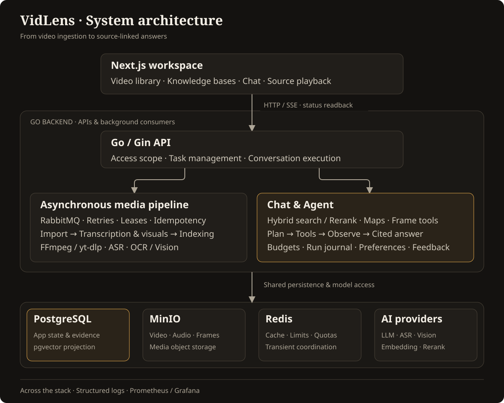

## Screenshots

**Cross-video Agent: compare sources and inspect tool execution and evidence coverage.**

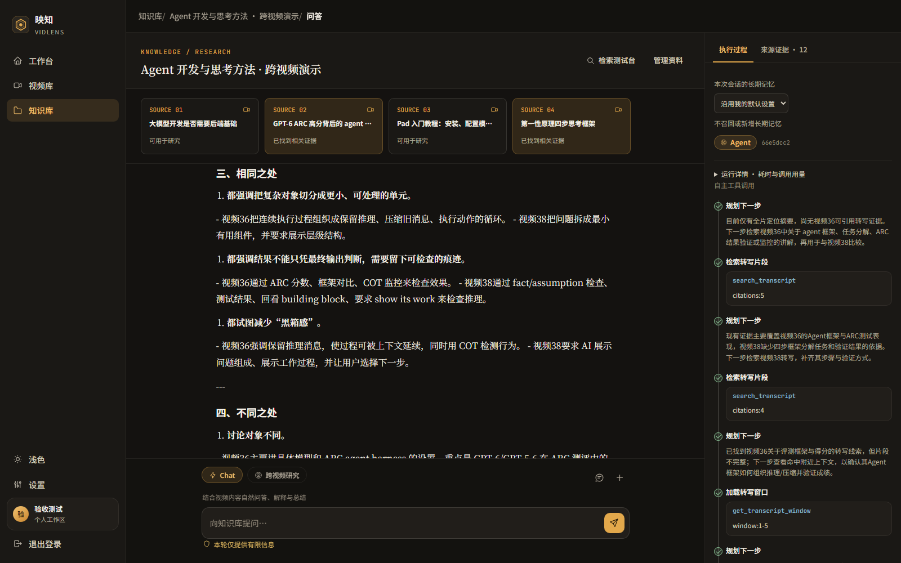

**Video library: browse and manage your videos.**

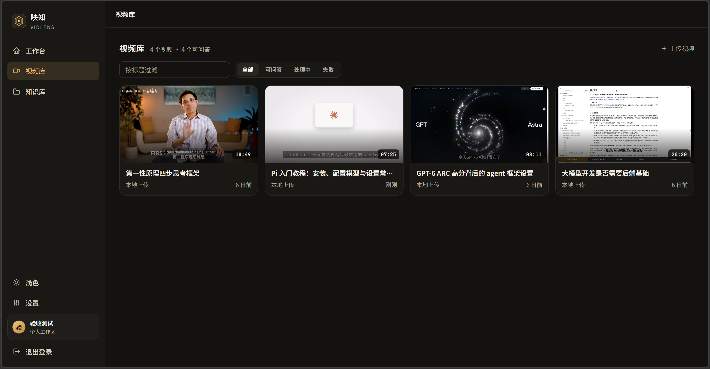

<details>
<summary>More product screens: login, dashboard, knowledge bases, and settings</summary>

**Login**

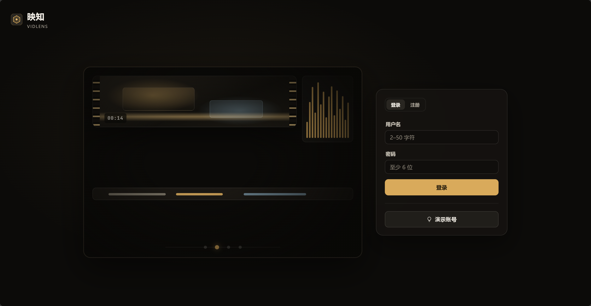

**Dashboard**

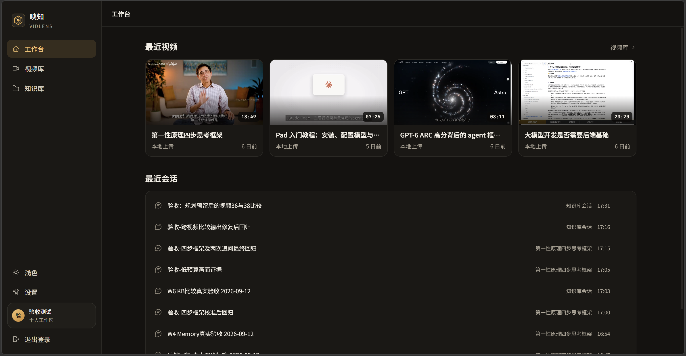

**Knowledge bases**

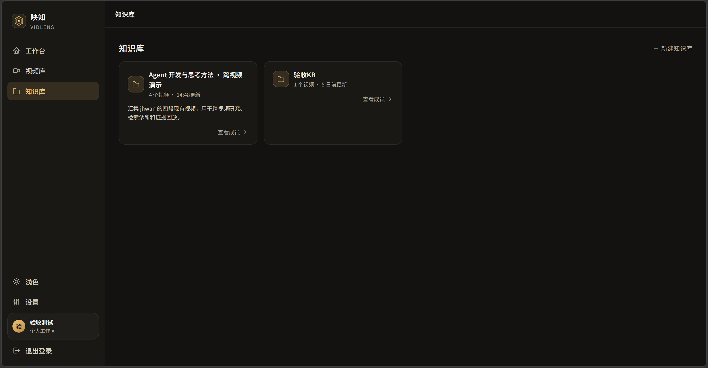

**Knowledge-base details**

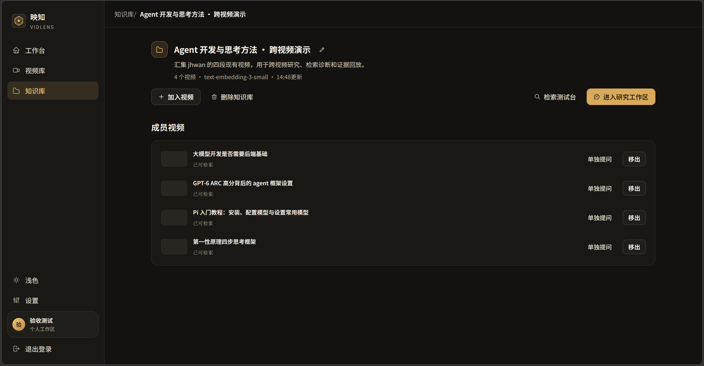

**AI service settings**

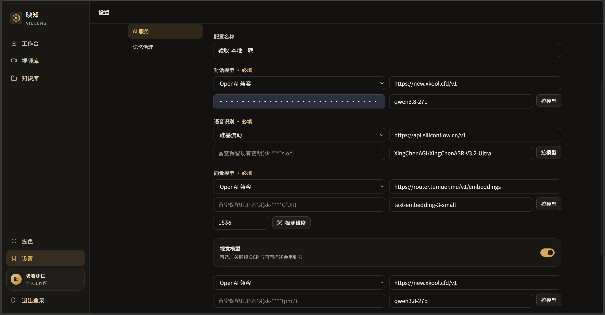

**Memory settings**

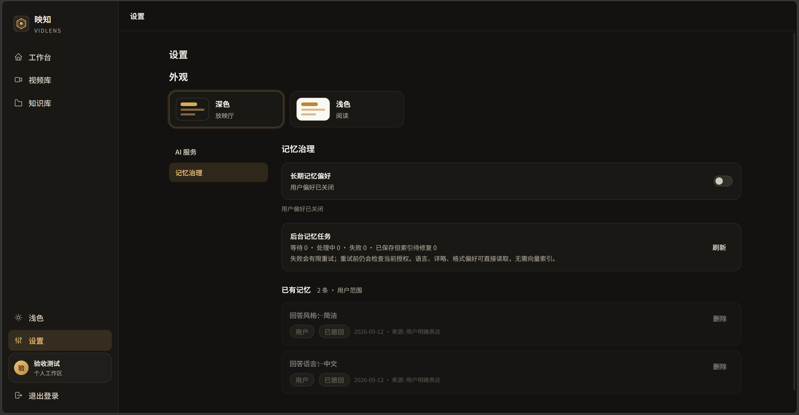

</details>

<details>
<summary>Evidence and execution details: playback, budgets, and retrieval testing</summary>

**Evidence details: inspect source context, modality, and timestamps, then jump to the relevant frame.**

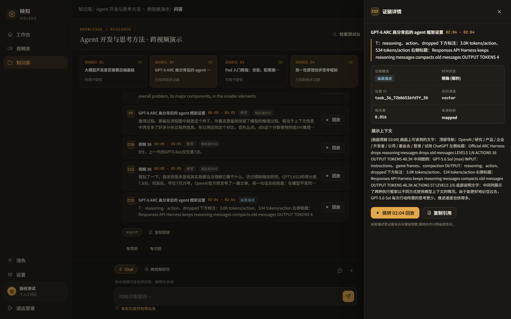

**Agent execution budgets**

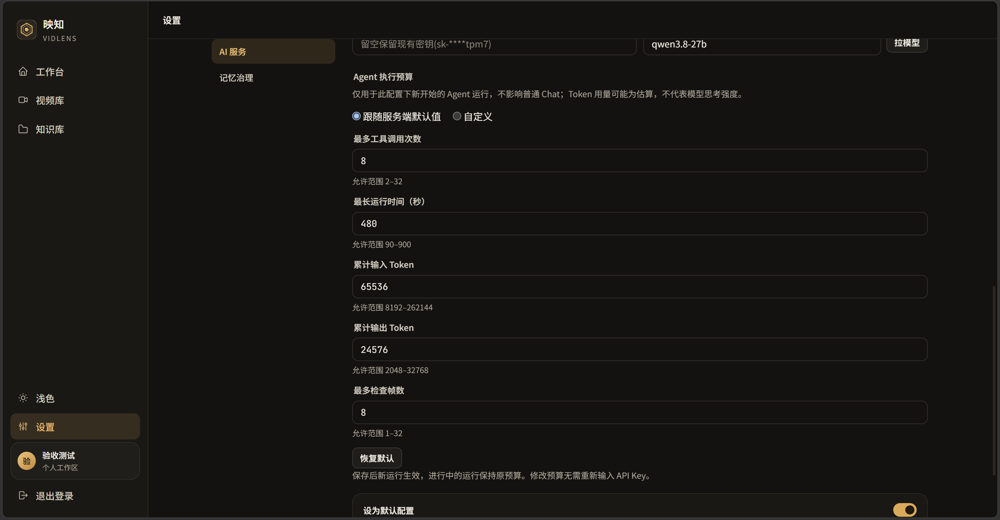

**Retrieval workbench**

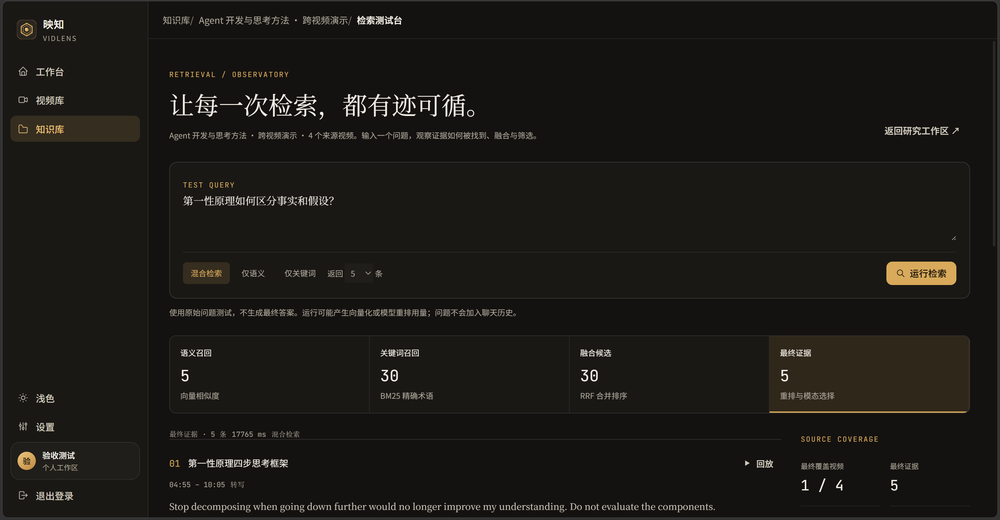

</details>

## Stack and Quick Start

**Go · Gin · GORM · PostgreSQL / pgvector · Redis · RabbitMQ · MinIO · FFmpeg / yt-dlp · Next.js**

Install Go 1.24+, Node.js 20+, Docker Compose, FFmpeg, and yt-dlp. Copy `.env.example` to `.env` and configure your connections and credentials. After signing in, configure models under **Settings → AI Services**.

```bash
# From the repository root: start dependencies and the backend
cp .env.example .env   # First-time setup only; skip if .env already exists
# Edit .env before continuing
docker compose up -d
go run ./cmd/server
```

Start the frontend in another terminal:

```bash
cd frontend
npm ci
npm run dev -- -p 5173
```

Open `http://127.0.0.1:5173`. The backend health endpoint is `http://127.0.0.1:8080/healthz`. On Windows, once the environment is configured, you can also use `make start` and `make status`; the startup script checks the local data directory.

## Engineering Documentation

[Architecture](docs/architecture/overview.md) · [Retrieval](docs/architecture/retrieval.md) · [Execution and recovery](docs/architecture/agent-streaming-contract.md) · [Reliability and idempotency](docs/architecture/reliability.md) · [Preference memory](docs/architecture/agent-memory.md) · [Feedback and product regression](docs/eval/product-feedback.md) · [Documentation index](docs/README.md)

Engineering documentation is primarily in Chinese.
