<div align="center">

# VidLens · 映知

Understand long videos by questioning them — and turn them into notes.

[简体中文](README.md) · **English**

[](https://go.dev)
[](https://vite.dev)
[](https://www.postgresql.org)

</div>

VidLens is a long-video understanding and learning platform built with Go and Vite + React. Upload a video or import a URL, and the system asynchronously produces three kinds of evidence — speech transcripts, on-screen OCR, and visual descriptions — and indexes them. Ask questions directly, or let the agent retrieve passages, extract frames to verify what is on screen, and then shape the material into a versioned study note that it keeps revising across the conversation.

## Core Features

- **Video and knowledge-base Q&A**: Chat answers through retrieval; the agent plans each next step from tool results, supporting follow-up questions, neighboring transcript windows, visual-evidence search, and on-demand frame extraction. Knowledge-base retrieval spans every video in the base, with results balanced per video.
- **Study notes revised by an agent**: Video material becomes a structured study note, and the agent revises it with block-level patches — correcting names, adding detail, restructuring headings. Every commit is checked against a block hash and the current version, and edits can be undone. Map and canvas views render the same note body rather than separate documents.
- **Multimodal evidence**: Transcripts, OCR, and visual descriptions share one index, recalled by hybrid vector and BM25 search and then reranked. Citations keep the video, source references, and timestamp precision — and stay empty rather than guess when a source time cannot be aligned.
- **Execution budgets and recovery**: Tool progress streams to the UI, and each AI profile configures call, time, token, and visual budgets with capacity reserved for the final answer. Execution records persist, so an interrupted stream can be queried for status and saved results without automatically re-running anything.
- **Asynchronous media processing**: Resumable chunked uploads, URL downloads, overlapping audio windows, bounded concurrency, and transcript alignment with deduplication. RabbitMQ schedules the stages with manual acknowledgments, retry backoff, leases, and idempotency, reusing completed stages and ASR segments.
- **Data and access boundaries**: PostgreSQL stores application state and execution records, and pgvector is a rebuildable retrieval projection. MinIO stores media while Redis handles caching and rate limiting. Retrieval, tool execution, and answer publication all enforce user ownership and knowledge-base membership.
- **Preferences and summary revision**: Chat and the agent share bounded conversation context plus revocable response preferences stored only after explicit consent (disabled by default, opt in through configuration). Summaries support renaming and terminology corrections through anchored edits instead of full regeneration.

## Implementation Notes

- **Hybrid retrieval**: pgvector cosine similarity runs alongside Okapi BM25 implemented in Go (k1=1.5, b=0.75); both result sets are fused with RRF and then handed to a model-based or heuristic reranker.
- **Layered summary reduction**: Segments are packed to fit the context window, intermediate parts are persisted, completed parts are reused after a failure, and merges that do not shrink the input are rejected so reduction always converges.
- **Structured patches**: Ten block-level edit operations, each carrying an `expected_hash` for optimistic concurrency. The server replays and validates the patch against the head version, and a database unique index makes duplicate versions impossible rather than merely unlikely.
- **Journaling and replay**: Plans and tool results are persisted by content fingerprint, so recovery replays recorded work instead of calling the model again.
- **Convergence and graceful degradation**: Repeated or already-covered retrieval windows are detected and force the run to conclude; when the budget is exhausted, the answer is written from the evidence already gathered with no extra model call.
- **Citation integrity**: A citation to anything no tool actually observed is rejected, so the generation step cannot invent sources.
- **Request governance**: A single Redis + Lua script atomically checks rate ceilings across user, operation, provider, and model (rate only, with no cost cap); API keys are sealed with AES-256-GCM and masked in responses.
- **Retrieval evaluation**: `cmd/rag-eval` reports Recall@K, MRR, nDCG, and answerability precision / recall / F1; `cmd/rag-audit` diffs the PostgreSQL and pgvector projections; `cmd/rag-reindex` rebuilds vectors from PostgreSQL.
- **Observability**: Structured logs carry trace, task, user, and stage fields with secrets and content redacted, and Prometheus metrics feed three Grafana dashboards covering AI usage, multimodal retrieval, and task overview.

## Architecture

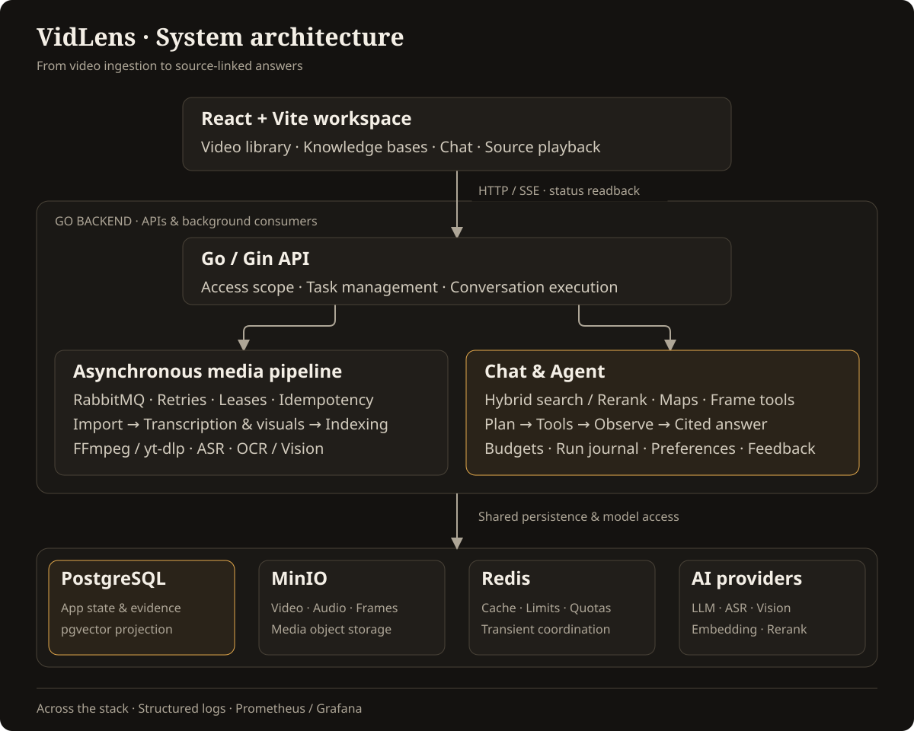

## Screenshots

**Agent planning and execution: each step states why it is planning that way, calls a tool, and can be expanded to show the call details.**

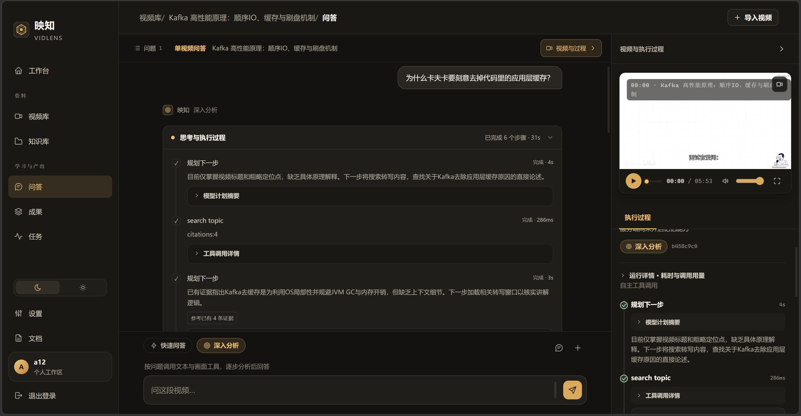

**Answers and citations: each citation keeps its time range and evidence modality, and can replay the matching passage.**

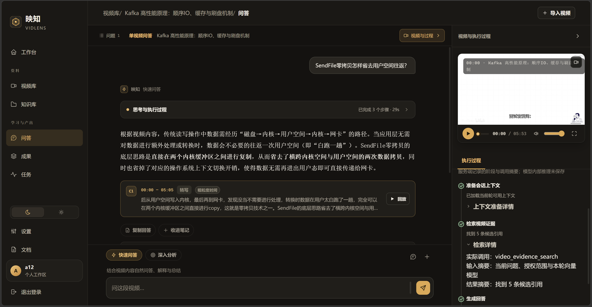

**Knowledge canvas: nodes organize the concepts, and the side panel lists the evidence behind each conclusion with a way back to the video.**

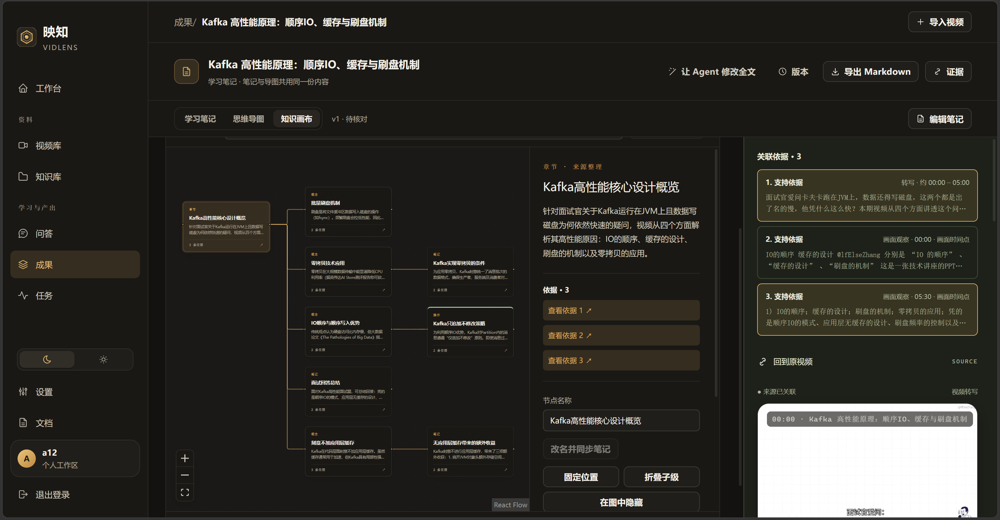

<details>
<summary>Execution cost and answer shape</summary>

**Run details: elapsed time, tool calls against the ceiling, model and retrieval calls, input / output tokens, and per-step timings.**

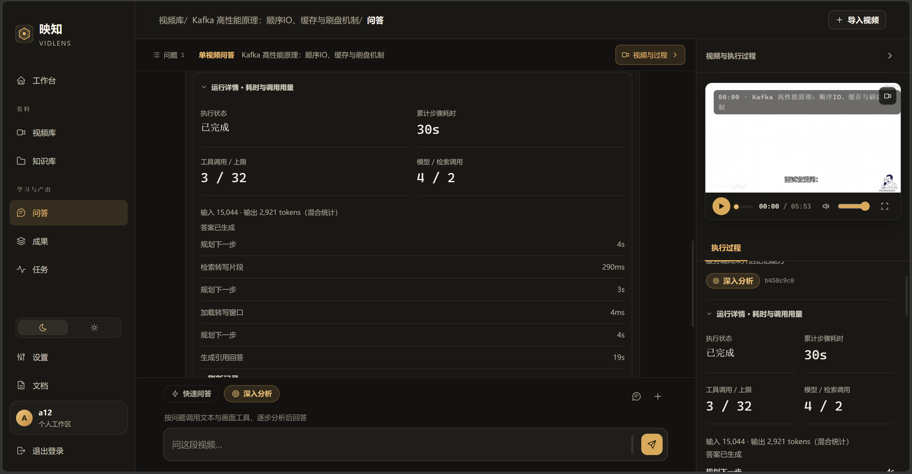

**Deep analysis answer: organized by point, with conclusions drawn from retrieved transcript evidence.**

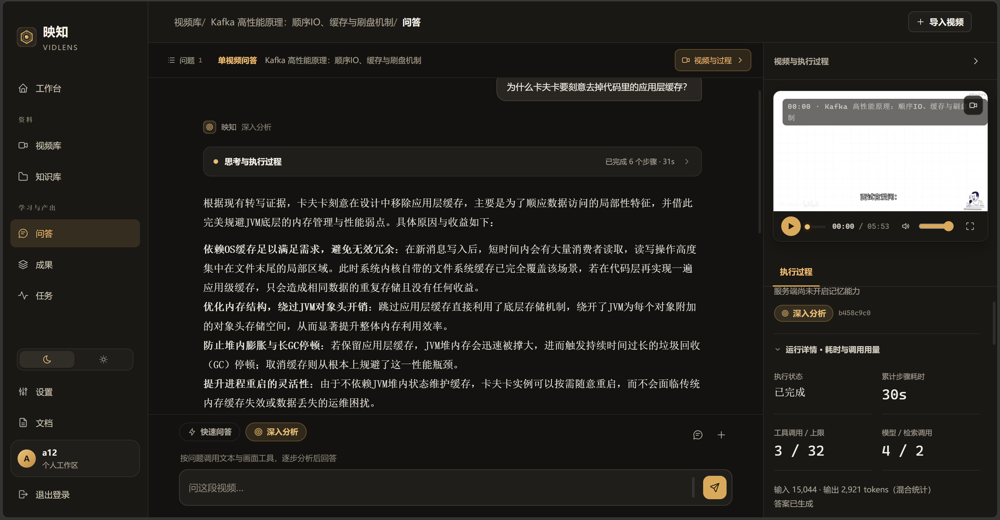

</details>

<details>
<summary>Video details and multimodal evidence</summary>

**Transcript timeline: colored by speech transcript, on-screen OCR, and visual description, and clicking a block jumps to that moment.**

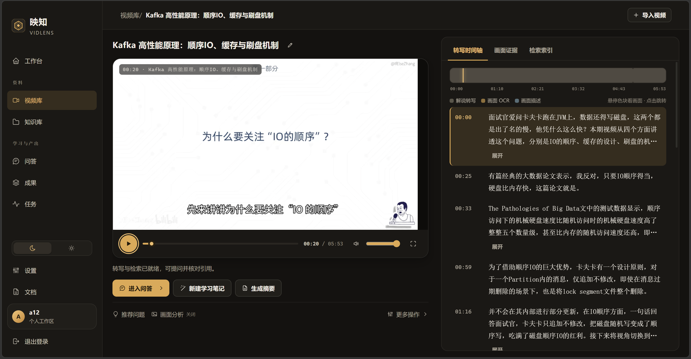

**Visual evidence: keyframes with their visual descriptions and on-screen text.**

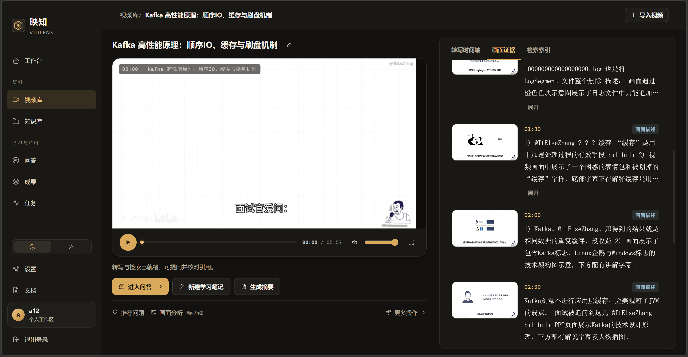

**Tasks: video processing advances through ingestion, transcription, visual analysis, and indexing, with note generation listed alongside.**

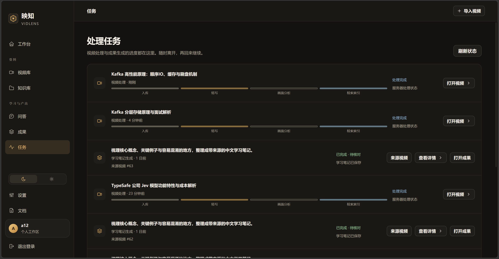

</details>

<details>
<summary>Study notes, mind map, and canvas</summary>

**Study note: chaptered body text, where each section can show its evidence, be questioned, or be revised by the agent; the page carries its own needs-review and sampling notices.**

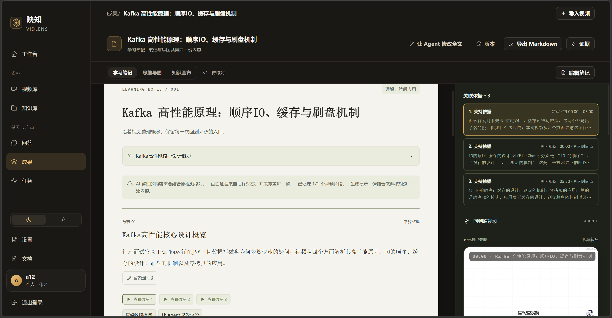

**Mind map: the same note body rendered as a map, not a second document.**

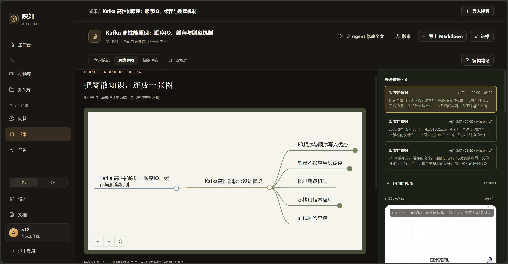

</details>

<details>
<summary>Dashboard, Q&A scopes, and settings</summary>

**Dashboard: resume the video you were learning, with counts for material, saved conversations, and pending work.**

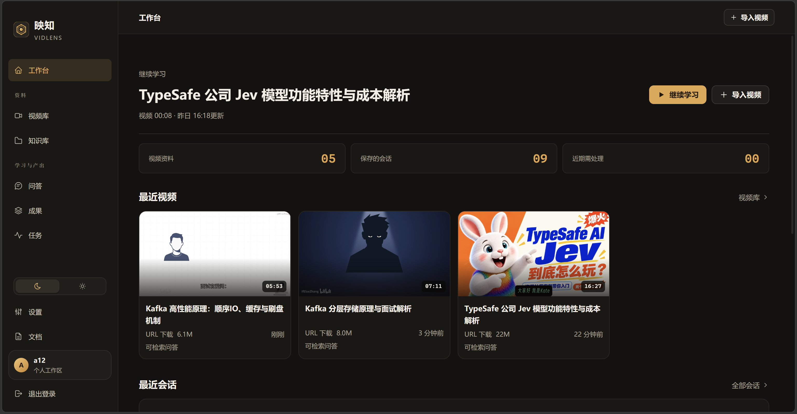

**Dashboard: recent conversations and recent study outputs.**

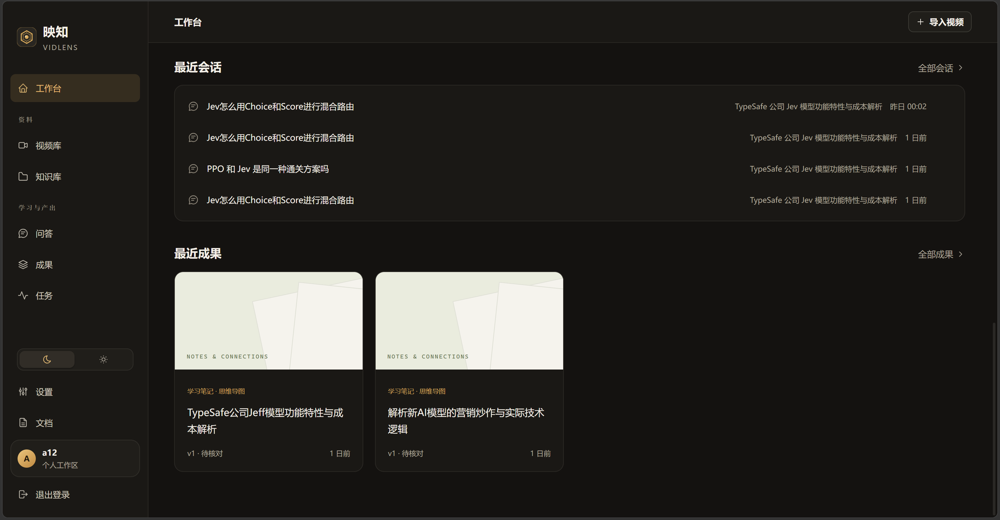

**Q&A scopes: three entries — the whole video library, one knowledge base, or a single video.**

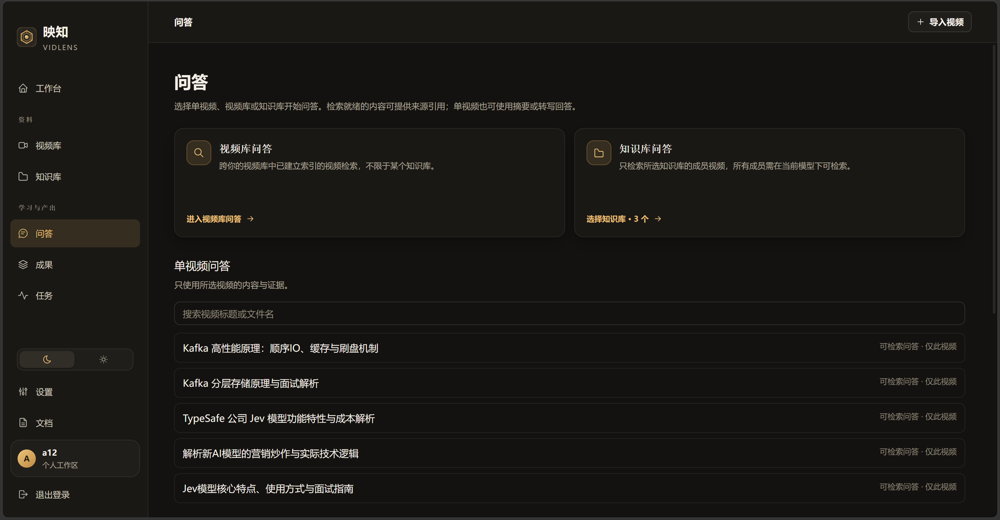

**Knowledge bases: narrow questions and retrieval to a topic.**

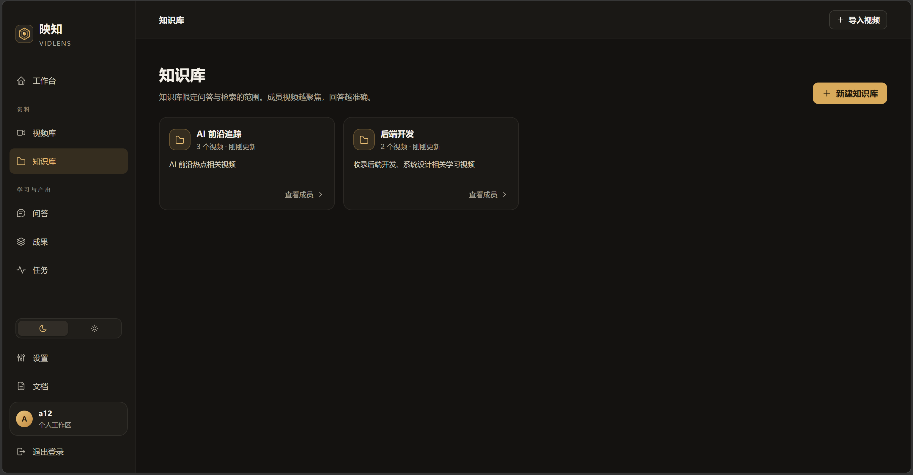

**Settings: appearance themes, and the dialogue, vision, speech, embedding, and rerank models inside one AI profile.**

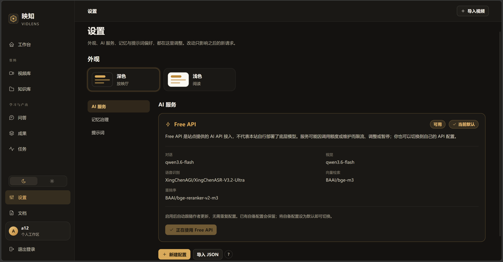

</details>

## Stack and Quick Start

**Go · Gin · GORM · PostgreSQL / pgvector · Redis · RabbitMQ · MinIO · FFmpeg / yt-dlp · Vite + React**

Install Go 1.24+, Node.js 20+, Docker Compose, FFmpeg, and yt-dlp. Copy `.env.example` to `.env` and configure your connections and credentials. After signing in, configure models under **Settings → AI Services**. When the OCR binary is missing, the visual OCR stage is skipped automatically and transcripts and visual descriptions remain available.

```bash
# From the repository root: start dependencies and the backend
cp .env.example .env   # First-time setup only; skip if .env already exists
# Set independent stable VIDLENS_JWT_SECRET / VIDLENS_API_KEY_SECRET in .env
docker compose up -d
go run ./cmd/server
```

Start the frontend in another terminal:

```bash
cd frontend
npm ci
npm run dev -- -p 5173
```

Open `http://127.0.0.1:5173`. The backend health endpoint is `http://127.0.0.1:8080/healthz`. On Windows, once the environment is configured, you can also use `make start` and `make status`; the startup script checks the local data directory.

## Engineering Documentation

[Architecture](docs/architecture/overview.md) · [Retrieval](docs/architecture/retrieval.md) · [Execution and recovery](docs/architecture/agent-streaming-contract.md) · [Evidence and citations](docs/architecture/agent-evidence.md) · [Note editing contract](docs/architecture/artifact-editing-contract.md) · [Note generation contract](docs/architecture/study-generation-v3-contract.md) · [Media understanding pipeline](docs/architecture/media-understanding-pipeline.md) · [Reliability and idempotency](docs/architecture/reliability.md) · [Preference memory](docs/architecture/agent-memory.md) · [Feedback and product regression](docs/eval/product-feedback.md) · [Documentation index](docs/README.md)

Engineering documentation is primarily in Chinese.
