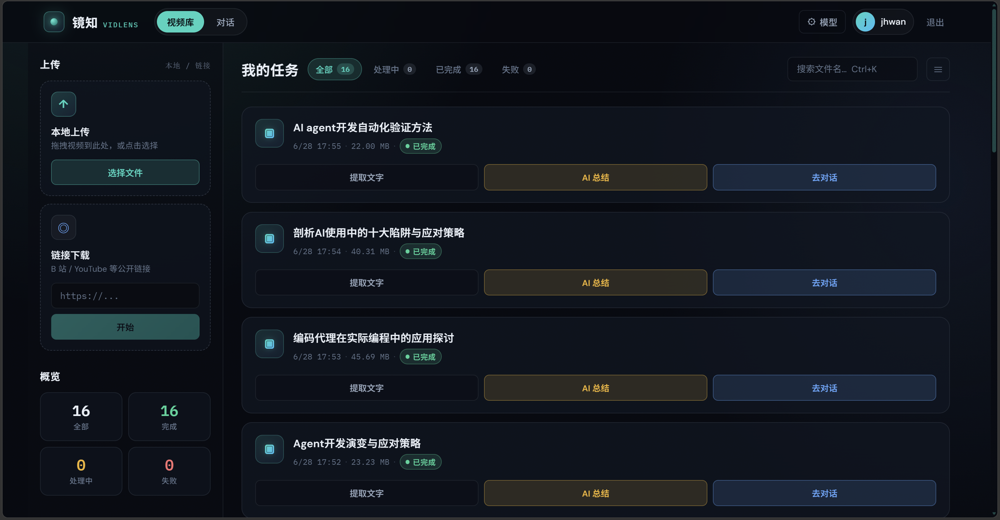
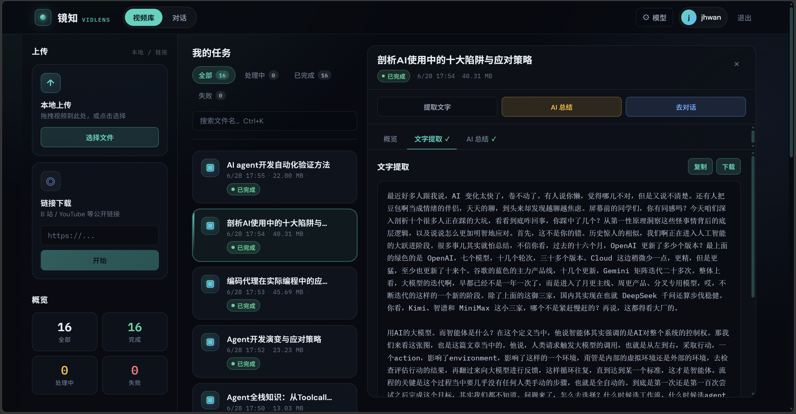
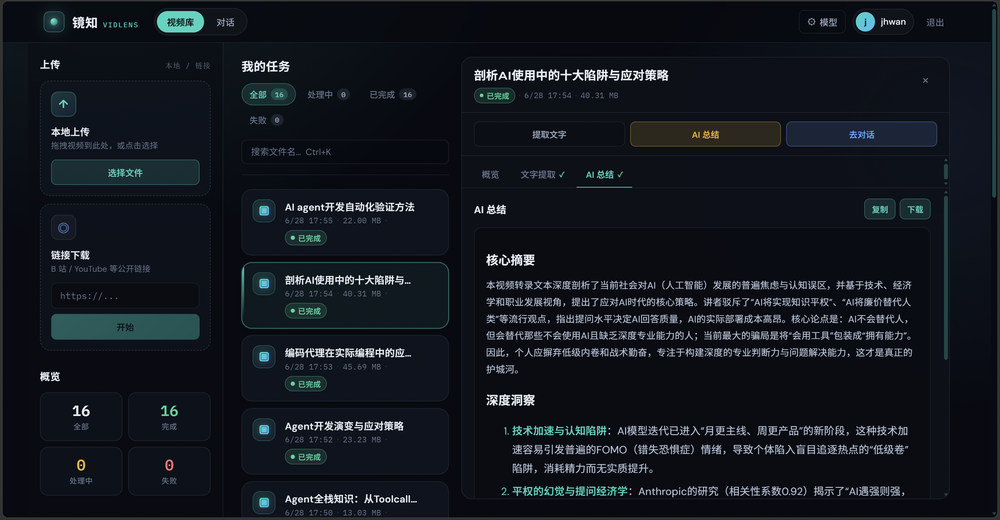
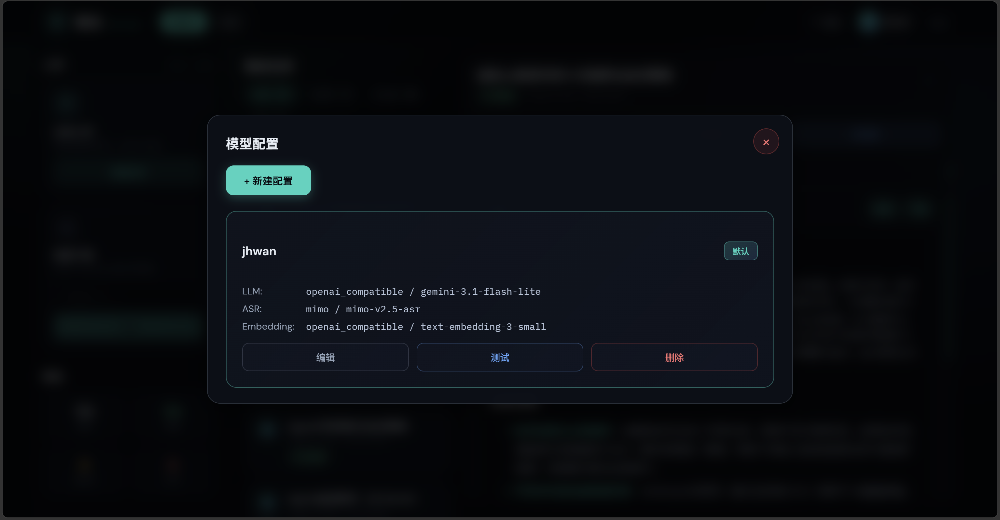
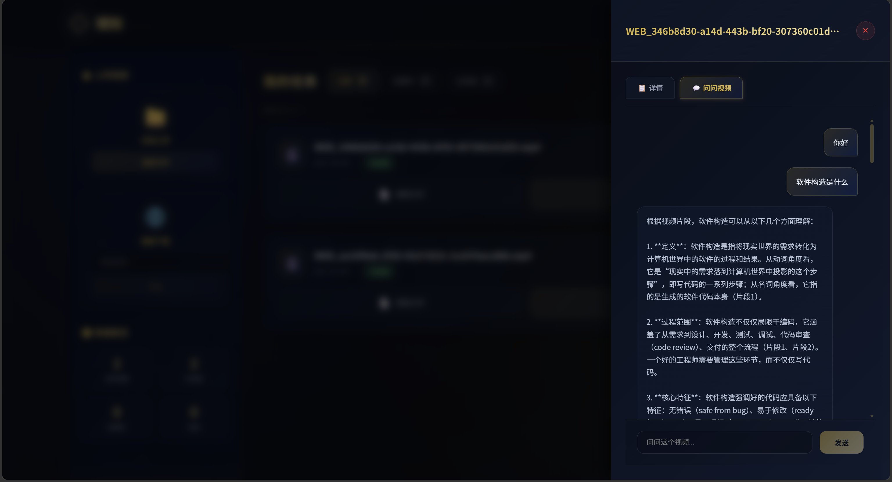
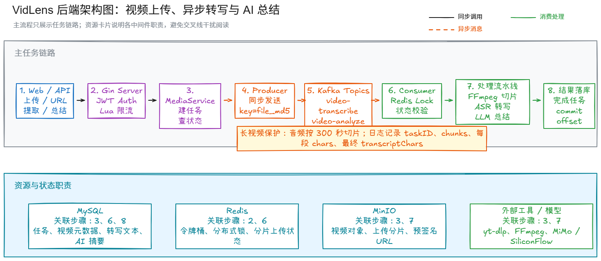

<div align="center">

# 镜知 · VidLens

**以镜观视，以知见意** — 面向长视频内容理解的 AI 视频处理平台

[](https://go.dev)
[](https://vuejs.org)
[](LICENSE)

</div>

---

## 📖 项目简介

VidLens 是一个以 Go 为主的 AI 视频处理后端，支持视频上传、长视频分段 ASR、AI 摘要和带引用的视频问答。项目重点不在于简单调用模型，而是围绕长耗时任务、大文件传输、处理失败恢复和检索结果可追溯性，搭建一条可观察、可重试的处理链路。

视频处理任务通过 Kafka 异步调度，处理阶段和结果落库到 MySQL；MinIO 负责对象存储，Milvus 与关键词检索共同支撑视频 RAG 问答。

## 🖼️ 项目截图

| 工作台 | ASR 文字提取 |
|---|---|
|  |  |

| AI 摘要 | 用户 AI 配置 |
|---|---|
|  |  |

| 视频 RAG 问答 |
|---|
|  |

## ✨ 核心功能

- **异步任务与失败恢复**：Kafka 调度 ASR、摘要和 RAG 索引任务，MySQL 记录阶段状态，失败任务按退避策略重试。
- **长视频分段 ASR**：分段转写并持久化结果，失败时只重试对应片段，已完成片段可以复用。
- **分片上传与断点续传**：Redis 记录分片状态，MinIO 保存分片并进行服务端合并，避免中断后整文件重传。
- **视频 RAG 问答**：以 ASR 转写为知识源，使用 Milvus 向量检索与 BM25 关键词检索，通过 RRF 融合并返回引用片段。
- **AI 服务配置**：支持按用户配置 ASR、LLM、Embedding 服务，密钥加密保存。
- **访问与调用治理**：Redis Lua 令牌桶限制高成本接口，并记录 AI 调用与任务处理指标。
- **可观测性**：输出结构化日志，提供 Prometheus 指标和 Grafana 看板，便于定位任务阶段、重试和外部服务错误。

## 🏗️ 技术架构



典型处理流程：

```text
视频上传 → Kafka 任务 → 分段 ASR → MySQL 持久化转写
                              ├→ LLM 摘要
                              └→ Embedding → Milvus / BM25 → 引用式问答
```

## 🛠️ 技术栈

| 类别 | 技术 |
|---|---|
| 后端 | Go、Gin、GORM |
| 数据与中间件 | MySQL、Redis、Kafka |
| 存储与检索 | MinIO、Milvus、BM25、RRF |
| AI 接入 | OpenAI-compatible API、用户级 ASR / LLM / Embedding 配置 |
| 前端 | Vue 3、Vite |
| 音视频处理 | FFmpeg（音频提取与切片） |
| 监控 | Prometheus、Grafana |

## 🚀 快速开始

### 1. 准备环境

- Go 1.24+
- Docker / Docker Compose
- FFmpeg，并在 `config.yaml` 中配置 `tools.ffmpeg_path`
- 可用的 ASR、LLM、Embedding 服务

### 2. 启动中间件

```bash
docker compose up -d
```

默认启动 MySQL、Redis、MinIO、Kafka、Milvus，以及 Prometheus、Grafana 和 Kafka UI。首次启动 Milvus 相关镜像可能需要较长时间，数据会写入项目下的 `data/` 目录。

### 3. 配置密钥与本地参数

不要把真实 API Key 提交到 Git。启动后端前设置用于加密用户 AI 配置的密钥：

```powershell
$env:VIDLENS_API_KEY_SECRET="change-this-secret"
```

根据本机环境修改 `config.yaml` 中的数据库、Redis、MinIO、Kafka、Milvus 和 FFmpeg 配置。登录后可在“模型配置”页面填写自己的 ASR、LLM、Embedding 服务。

### 4. 启动后端

```bash
go run ./cmd/server
```

健康检查：`http://localhost:8080/health`

### 5. 启动前端（可选）

```bash
cd web
npm install
npm run dev
```

开发页面：`http://127.0.0.1:5173`

## 📁 项目结构

```text
vid-lens/
├── cmd/server/       # 服务入口与运行时组装
├── internal/ai/      # AI 客户端、Provider 和调用治理
├── internal/handler/ # HTTP 接口层
├── internal/mq/      # Kafka 生产者、消费者、重试与租约
├── internal/service/ # 媒体、任务、RAG、聊天等业务服务
├── internal/repository/ # 数据访问层
├── internal/storage/ # MinIO 对象存储
├── internal/vector/  # Milvus 适配
├── internal/eval/    # RAG 数据集、指标与评测产物
├── web/              # 展示界面
├── deploy/           # Prometheus / Grafana 配置
├── docs/images/      # README 截图
├── docker-compose.yml
└── config.yaml
```

## 📄 License

MIT License
