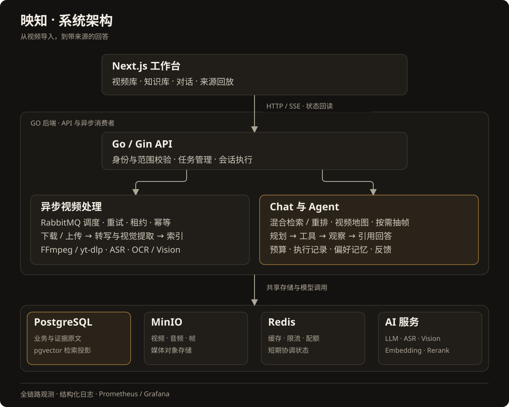

<div align="center">

# 映知 · VidLens

**观之以映，释之以知**

让视频成为可检索、可追问、可回放验证的知识库。

**简体中文** · [English](README.en.md)

[](https://go.dev)
[](https://nextjs.org)
[](https://www.postgresql.org)

</div>

映知是一个基于 Go 与 Next.js 的视频知识库与 Agent 问答平台。上传视频或导入链接后，系统异步处理语音、画面与索引；用户可以直接提问，也可以让 Agent 检索片段、查看画面、跨视频比较，沿着回答中的引用回到原视频。

## 核心能力

- **单视频与知识库问答**：Chat 直接检索回答；Agent 根据工具结果持续规划，支持多轮追问、相邻片段读取和跨视频比较。
- **多模态证据**：融合转写、OCR、画面描述的向量与 BM25 检索，支持重排、全片定位地图及按需抽帧调查；引用保留视频、来源和时间精度，可查看上下文并跳转回放。
- **可控执行与恢复**：流式展示工具进度，按 Profile 配置调用、时间、Token 和视觉预算，为最终回答预留额度；执行记录持久化，断流后查询状态与已保存结果，避免自动重复执行。
- **偏好与反馈**：Chat / Agent 共享有界对话和用户授权的长期回答偏好，支持撤回；答案反馈可经人工核对转成回归用例。

- **异步媒体流水线**：分片上传、断点续传、URL 下载；长音频重叠分片、有界并发与对齐去重。RabbitMQ 调度处理阶段，结合手动确认、重试、租约与幂等控制，复用已完成阶段和 ASR 分片。
- **数据与权限边界**：PostgreSQL 保存业务状态与执行记录，pgvector 作为可重建检索投影；MinIO 保存媒体，Redis 承担缓存、限流与配额。检索、工具调用和发布均校验用户及知识库成员范围。
- **AI 调用治理**：按用户配置 ASR / LLM / Embedding / Vision，密钥加密保存；统一处理超时、重试、取消、配额和用量记录，区分实际用量与估算。
- **可观测与验证**：结构化日志、Prometheus / Grafana；提供检索与产品评估、索引重建和审计命令，覆盖执行契约、故障恢复及浏览器交互验证。

## 系统架构



## 界面预览

**跨视频 Agent：比较多个来源，查看工具执行过程与证据覆盖。**


**视频库：浏览与管理视频资料。**


<details>
<summary>更多产品界面：登录、工作台、知识库与设置</summary>

**登录**


**首页工作台**


**知识库列表**


**知识库详情**


**AI 服务设置**


**记忆设置**


</details>

<details>
<summary>证据与执行细节：来源回放、预算与检索测试</summary>

**证据详情：查看原始上下文、模态和时间，跳转对应画面。**


**Agent 执行预算**


**检索测试台**


</details>

## 技术栈与启动

**Go · Gin · GORM · PostgreSQL / pgvector · Redis · RabbitMQ · MinIO · FFmpeg / yt-dlp · Next.js**

准备 Go 1.24+、Node.js 20+、Docker Compose、FFmpeg 和 yt-dlp。复制 `.env.example` 为 `.env`，按环境填写连接信息与密钥；登录后可在「设置 → AI 服务」配置模型。

```bash
# 仓库根目录：启动依赖与后端
cp .env.example .env   # 首次配置；已有 .env 时跳过
# 编辑 .env 后继续
docker compose up -d
go run ./cmd/server
```

另开终端启动前端：

```bash
cd frontend
npm ci
npm run dev -- -p 5173
```

访问 `http://127.0.0.1:5173`；后端健康检查为 `http://127.0.0.1:8080/healthz`。Windows 配好环境后也可使用 `make start` / `make status`，启动脚本会检查本地数据目录。

## 工程文档

[架构总览](docs/architecture/overview.md) · [检索链路](docs/architecture/retrieval.md) · [执行与恢复](docs/architecture/agent-streaming-contract.md) · [可靠性与幂等](docs/architecture/reliability.md) · [偏好记忆](docs/architecture/agent-memory.md) · [反馈与产品回归](docs/eval/product-feedback.md) · [文档导航](docs/README.md)
