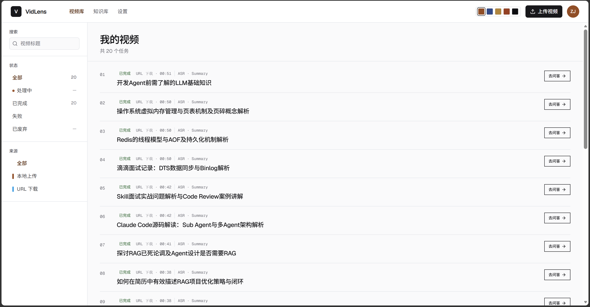
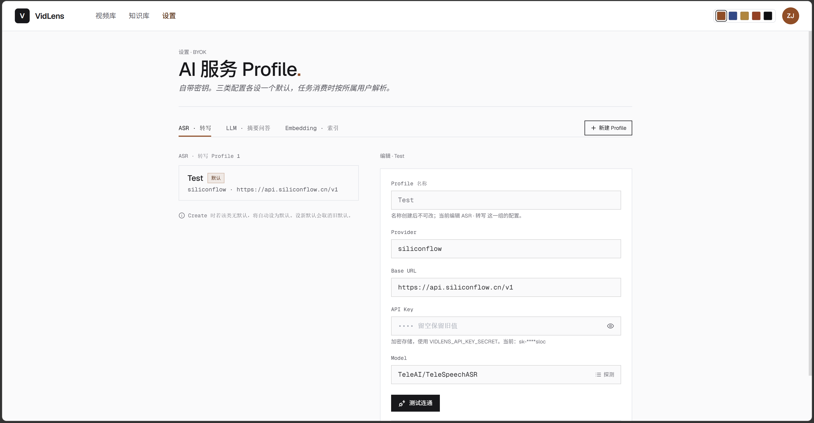
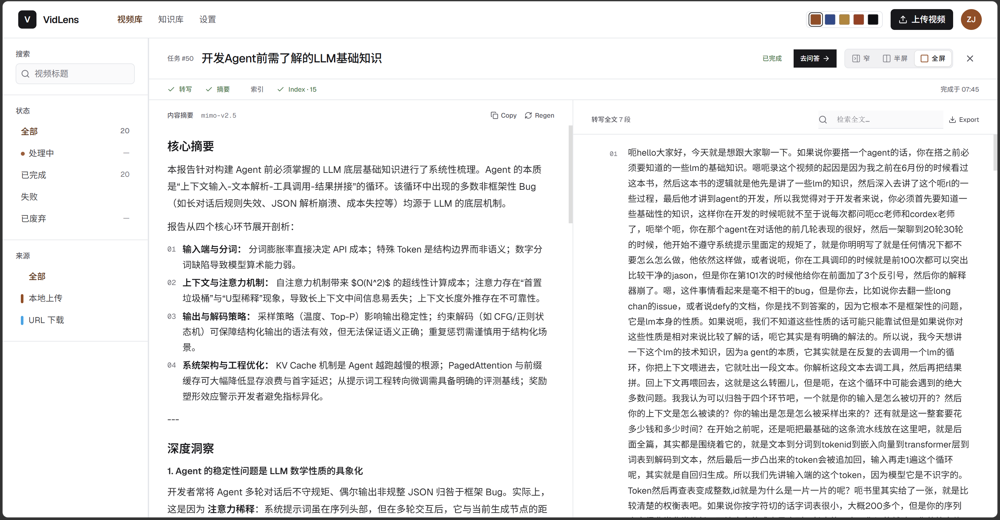
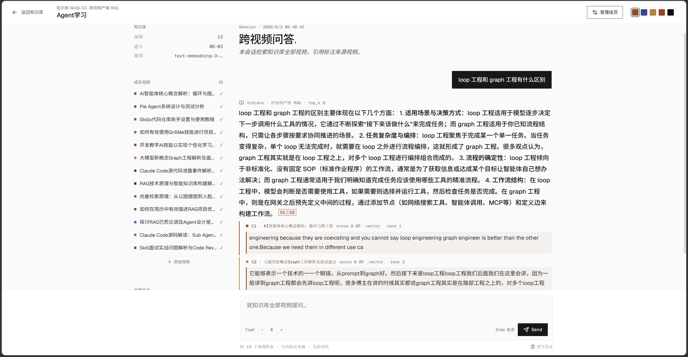

<div align="center">

# 映知

**观之以映，释之以知** — 面向视频的 AI 知识库与问答平台

[](https://go.dev)
[](https://www.postgresql.org)
[](https://redis.io)
[](https://www.rabbitmq.com)
[](https://min.io)
[](https://ffmpeg.org)
[](https://nextjs.org)
[](LICENSE)

</div>

---

## 📖 项目简介

映知是一个面向视频的 AI 知识库与问答平台：上传视频并将视频音频转写为文字后，把长视频变成可检索、可引用的文本知识；多个视频归入知识库后，可直接跨视频提问，回答带引用片段、可回溯到原始视频。

项目重点不在于简单调用模型，而是围绕长耗时任务、大文件传输、处理失败恢复和检索结果可追溯性，搭建一条可观察、可重试的处理链路。

视频处理任务通过 RabbitMQ 异步调度，处理阶段、转写分片和聊天记录统一落库到 PostgreSQL；MinIO 负责对象存储，PostgreSQL 内的 pgvector 与关键词检索共同支撑视频 RAG 问答。

## 🖼️ 项目截图

| 工作台总览 | 用户 AI 配置 |
|---|---|
|  |  |

| ASR 转写与 AI 摘要 | 跨视频 RAG 问答 |
|---|---|
|  |  |

## ✨ 核心功能

- **视频知识库**：上传视频，分段 ASR 转写生成可检索文本，支持分片上传与断点续传
- **引用式问答**：以知识库内全部视频的转写为知识源，跨视频 pgvector 检索并带引用片段返回，支持 query rewrite / model rerank
- **异步任务与失败恢复**：RabbitMQ 调度转写/摘要/索引，失败分片重试、已完成片段复用
- **AI 服务配置**：用户 BYOK，ASR / LLM / Embedding 密钥加密保存
- **可观测性**：结构化日志 + Prometheus 指标 + Grafana 看板

## 🏗️ 技术架构


典型处理流程：

```text
视频上传 → RabbitMQ 任务 → 分段 ASR → PostgreSQL 持久化转写
                              ├→ LLM 摘要
                              └→ Embedding → pgvector（可选 rewrite/rerank）→ 跨视频引用式问答
```

## 🛠️ 技术栈

| 类别 | 技术 |
|---|---|
| 后端 | Go、Gin、GORM |
| 数据与存储 | PostgreSQL + pgvector（主库与向量库）、Redis、MinIO |
| 消息队列 | RabbitMQ |
| 检索 | pgvector（向量检索）、BM25（关键词检索） |
| AI 接入 | OpenAI-compatible API、用户级 ASR / LLM / Embedding 配置 |
| 前端 | Next.js 14（`web-next`） |
| 音视频处理 | FFmpeg（音频提取与切片） |
| 监控 | Prometheus、Grafana |

## 🚀 快速开始

### 1. 准备环境

- Go 1.24+
- Docker / Docker Compose
- FFmpeg，并在 `config.yaml` 中配置 `tools.ffmpeg_path`
- 可用的 ASR、LLM、Embedding 服务

### 2. 启动中间件

```bash
docker compose up -d
```

默认启动 PostgreSQL + pgvector、Redis、RabbitMQ、MinIO；`--profile observability` 额外启动 Prometheus 与 Grafana。容器数据落在项目下的 `data/` 目录。

### 3. 配置本地参数

按本机环境修改 `config.yaml` 中的 PostgreSQL、Redis、MinIO、RabbitMQ 与 FFmpeg 配置，确认 `rag.store: pgvector`。配置加载会拒绝未知字段，拼写错误会导致启动失败。登录后可在“模型配置”页面填写自己的 ASR、LLM、Embedding 服务。

### 4. 启动后端

```bash
go run ./cmd/server
```

存活检查：`http://localhost:8080/healthz`（`/health` 保留兼容）；依赖就绪检查：`http://localhost:8080/readyz`。

### 5. 启动前端（可选）

前端（Next.js 14）：

```bash
cd web-next
npm install
npm run dev -p 5173
```

开发页面：`http://127.0.0.1:5173`（`/api` 改写代理到 `:8080`）。

## 📁 项目结构

```text
vid-lens/
├── cmd/server/       # 服务入口与运行时组装（main / wiring / router）
├── internal/
│   ├── ai/           # AI 客户端、Provider 与调用治理
│   ├── handler/      # HTTP 接口层
│   ├── mq/           # RabbitMQ 生产者、消费者、重试与租约
│   ├── service/      # 媒体、任务、RAG、聊天等业务服务
│   ├── repository/   # 数据访问层
│   ├── storage/      # MinIO 对象存储
│   └── vector/       # 向量存储接口（pgvector）
├── web-next/         # Next.js 14 前端
├── docs/             # 文档与设计说明
├── docker-compose.yml
└── config.yaml
```

## 📄 License

MIT License
