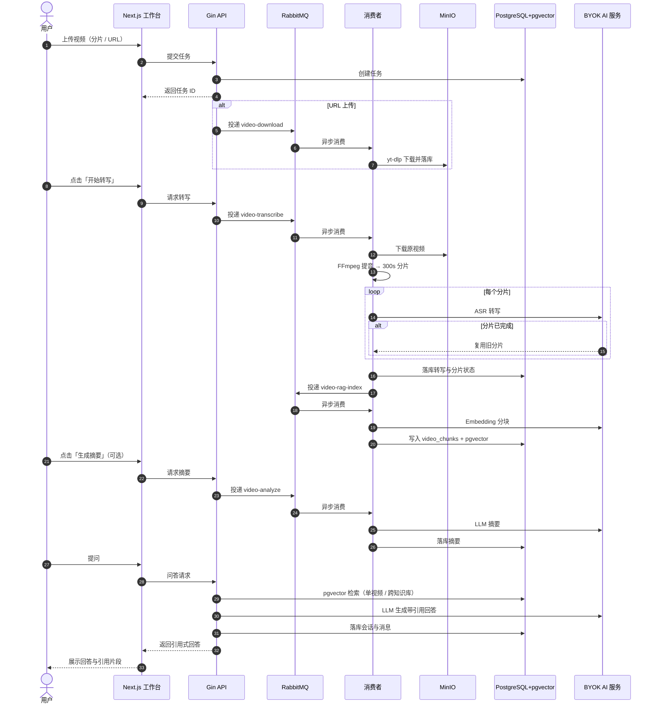

<div align="center">

# 映知

**观之以映，释之以知** — 面向视频的 AI 知识库与问答平台

[](https://go.dev)
[](https://www.postgresql.org)
[](https://redis.io)
[](https://www.rabbitmq.com)
[](https://min.io)
[](https://ffmpeg.org)
[](https://nextjs.org)

</div>

---

## 📖 项目简介

映知是一个面向视频的 AI 知识库与问答平台：上传视频并将视频音频转写为文字后，把长视频变成可检索、可引用的文本知识；多个视频归入知识库后，可直接跨视频提问，回答带引用片段、可回溯到原始视频。

项目重点不在于简单调用模型，而是围绕长耗时任务、大文件传输、处理失败恢复、外部 AI 调用的成本与稳定性，以及 RAG 检索的召回与排序质量，搭建一条可观察、可重试的处理链路。

视频处理任务通过 RabbitMQ 异步调度，处理阶段、转写分片和聊天记录统一落库到 PostgreSQL；MinIO 负责对象存储，PostgreSQL 内的 pgvector 与关键词检索共同支撑视频 RAG 问答。检索侧以 query rewrite 提升召回，并支持 deterministic rerank；model rerank 只在显式配置或评测实验中启用，配合意图路由，跨视频检索保证每个回答都带引用、可回溯到原始视频。

## 🖼️ 项目截图

| 工作台总览 | 用户 AI 配置 |
|---|---|
|  |  |

| ASR 转写与 AI 摘要 | 跨视频 RAG 问答 |
|---|---|
|  |  |

## ✨ 核心功能

- **视频知识库**：上传视频，分段 ASR 转写生成可检索文本，支持分片上传与断点续传
- **引用式问答**：以知识库内全部视频的转写为知识源，跨视频 pgvector 检索并带引用片段返回，支持 query rewrite / deterministic rerank；model rerank 可显式配置
- **异步任务与失败恢复**：RabbitMQ 调度转写/摘要/索引，失败分片重试、已完成片段复用
- **AI 服务配置**：用户 BYOK，ASR / LLM / Embedding 密钥加密保存
- **可观测性**：结构化日志 + Prometheus 指标 + Grafana 看板

## 🏗️ 技术架构


系统流程：


```mermaid
sequenceDiagram
    autonumber
    actor User as 用户
    participant Web as Next.js 工作台
    participant API as Gin API
    participant MQ as RabbitMQ
    participant Worker as 消费者
    participant Store as MinIO
    participant PG as PostgreSQL+pgvector
    participant AI as BYOK AI 服务

    User->>Web: 上传视频（分片 / URL）
    Web->>API: 提交任务
    API->>PG: 创建任务
    API-->>Web: 返回任务 ID

    alt URL 上传
        API->>MQ: 投递 video-download
        MQ->>Worker: 异步消费
        Worker->>Store: yt-dlp 下载并落库
    end

    User->>Web: 点击「开始转写」
    Web->>API: 请求转写
    API->>MQ: 投递 video-transcribe
    MQ->>Worker: 异步消费
    Worker->>Store: 下载原视频
    Worker->>Worker: FFmpeg 提音 → 300s 分片
    loop 每个分片
        Worker->>AI: ASR 转写
        alt 分片已完成
            AI-->>Worker: 复用旧分片
        end
    end
    Worker->>PG: 落库转写与分片状态
    Worker->>MQ: 投递 video-rag-index
    MQ->>Worker: 异步消费
    Worker->>AI: Embedding 分块
    Worker->>PG: 写入 video_chunks + pgvector

    User->>Web: 点击「生成摘要」（可选）
    Web->>API: 请求摘要
    API->>MQ: 投递 video-analyze
    MQ->>Worker: 异步消费
    Worker->>AI: LLM 摘要
    Worker->>PG: 落库摘要

    User->>Web: 提问
    Web->>API: 问答请求
    API->>PG: pgvector 检索（单视频 / 跨知识库）
    API->>AI: LLM 生成带引用回答
    API->>PG: 落库会话与消息
    API-->>Web: 返回引用式回答
    Web-->>User: 展示回答与引用片段
```

## 🛠️ 技术栈

| 类别 | 技术 |
|---|---|
| 后端 | Go、Gin、GORM |
| 数据与存储 | PostgreSQL + pgvector（主库与向量库）、Redis、MinIO |
| 消息队列 | RabbitMQ |
| 检索 | pgvector（向量检索）、BM25（关键词检索） |
| AI 接入 | OpenAI-compatible API、用户级 ASR / LLM / Embedding 配置 |
| 前端 | Next.js 14（`frontend`） |
| 音视频处理 | FFmpeg（音频提取与切片） |
| 监控 | Prometheus、Grafana |

## 🚀 快速开始

### 1. 准备环境

- Go 1.24+
- Docker / Docker Compose
- 本地开发默认只监听 `127.0.0.1:8080`；如需让反向代理或局域网访问，可在 `.env` 设置 `VIDLENS_SERVER_HOST`
- FFmpeg 和 yt-dlp，并确保它们在 PATH 中，或在 `.env` 中配置 `VIDLENS_FFMPEG_PATH` / `VIDLENS_YTDLP_PATH`
- 可用的 ASR、LLM、Embedding 服务

### 2. 启动中间件

```bash
docker compose up -d
```

默认启动 PostgreSQL + pgvector、Redis、RabbitMQ、MinIO。

默认 Compose 项目名为 `vid-lens-core`，只包含运行项目所需的四个核心服务。Prometheus 与 Grafana 使用独立的 `docker-compose.observability.yml`，需要时单独启动：

```bash
docker compose -f docker-compose.observability.yml up -d
```

默认数据目录为当前项目的 `data/`。本机如果存在历史目录 `../vid-lens-727/data/`，`make start` 会自动优先复用它；也可以通过 `VIDLENS_DATA_ROOT` 显式指定数据根目录。不要使用 `docker compose down -v` 清理数据卷。

### 3. 配置本地参数

复制 `.env.example` 为 `.env`，填写本地 AI 配置；程序会在加载 `config.yaml` 时自动读取同目录 `.env`。已有的 Windows/进程环境变量优先于 `.env`，所以 CI 或部署环境不受本地文件影响。`.env` 已被 Git 忽略，不能提交真实密钥。

`config.yaml` 不再包含机器专属的 FFmpeg、yt-dlp 或 cookies 路径。默认从 PATH 查找 `ffmpeg` 和 `yt-dlp`；Windows 本机若使用固定安装目录，将实际路径写入 `.env` 的 `VIDLENS_FFMPEG_PATH`、`VIDLENS_YTDLP_PATH` 和可选的 `VIDLENS_COOKIES_PATH`。

```powershell
Copy-Item .env.example .env
# 编辑 .env 后启动
go run ./cmd/server
```
仍需按本机环境修改 `config.yaml` 中的 PostgreSQL、Redis、MinIO、RabbitMQ 与 FFmpeg 配置，确认 `rag.store: pgvector`。配置加载会拒绝未知字段，拼写错误会导致启动失败。登录后可在“模型配置”页面填写自己的 ASR、LLM、Embedding 服务。

AI 相关的 `.env` 配置项如下：

| 变量 | 用途 |
| --- | --- |
| `VIDLENS_AI_PROVIDER` | 服务端默认配置标签：所有标签都走 OpenAI-compatible 协议，仅用于观测记录 |
| `VIDLENS_AI_BASE_URL` / `VIDLENS_AI_API_KEY` | 单中转部署时的通用 fallback；多中转部署请使用下面的按能力配置 |
| `VIDLENS_LLM_BASE_URL` / `VIDLENS_LLM_API_KEY` / `VIDLENS_LLM_MODEL` | 对话 Chat 根地址、Key、模型 |
| `VIDLENS_ASR_BASE_URL` / `VIDLENS_ASR_API_KEY` / `VIDLENS_ASR_MODEL` | ASR 根地址、Key、模型 |
| `VIDLENS_EMBEDDING_ENDPOINT` / `VIDLENS_EMBEDDING_API_KEY` / `VIDLENS_EMBEDDING_MODEL` | Embedding 完整 endpoint、Key、模型 |
| `VIDLENS_EMBEDDING_DIM` | Embedding 维度；用于 smoke test / 默认 Profile 维度校验 |
| `VIDLENS_RAG_EMBEDDING_DIM` | RAG 向量库目标维度，必须与实际 Embedding 返回维度一致 |
| `VIDLENS_RERANK_ENDPOINT` / `VIDLENS_RERANK_API_KEY` / `VIDLENS_RERANK_MODEL` | Rerank 完整 endpoint、可选独立 Key、模型 |
| `VIDLENS_VISION_BASE_URL` / `VIDLENS_VISION_API_KEY` / `VIDLENS_VISION_MODEL` | Vision 根地址、Key、模型 |
| `VIDLENS_API_KEY_SECRET` | 加密用户模型配置 API Key 的服务端密钥 |
| `VIDLENS_QUOTA_REDIS_DEFAULT_POLICY` | Redis 不可用时的默认配额策略 |
| `VIDLENS_QUOTA_REDIS_AI_POLICY` | Redis 不可用时的 AI 配额策略 |

除服务端默认策略外，用户登录后在“模型配置”页面保存的 ASR、LLM、Embedding、Vision 配置属于用户级 BYOK 配置，会覆盖默认 AI 策略。

AI 调用按能力使用独立的协议适配：LLM/Vision 使用 `chat/completions`，Embedding 使用 `embeddings`，常见 ASR 使用 `audio/transcriptions`；Rerank 是独立的 `/rerank` 协议，不假设所有 OpenAI-compatible 中转都支持。一个中转是否同时提供这些能力，以实际 endpoint 和模型为准。

当 Chat、ASR、Embedding、Rerank、Vision 使用不同中转时，分别填写对应的 `VIDLENS_*_BASE_URL`、`VIDLENS_*_API_KEY` 和模型变量即可。Chat/ASR/Vision 填 `/v1` 根地址；Embedding 填完整的 `/embeddings`；Rerank 填完整的 `/rerank`。需要测试真实上游时，可运行：

```powershell
go run ./cmd/ai-smoke --config config.yaml --image D:/path/to/test.png
```

不传 `--image` 会跳过 Vision；不传 `--audio` 会跳过 ASR。该命令直接调用协议适配器，不连接数据库、不写业务数据。

### 4. 启动后端

```bash
go run ./cmd/server
```

存活检查：`http://localhost:8080/healthz`（`/health` 保留兼容）；依赖就绪检查：`http://localhost:8080/readyz`。

### 5. 启动前端（可选）

前端（Next.js 14）：

```bash
cd frontend
npm install
npm run dev -p 5173
```

开发页面：`http://127.0.0.1:5173`（`/api` 改写代理到 `:8080`）。

### 6. Windows 一键启动

本机安装 Make 后，可以在项目根目录使用：

```powershell
make start       # 核心 Docker + 后端 + 前端
make status      # 查看核心容器和应用端口
make stop        # 停止本次开发环境，不删除数据
make obs-up      # 可选：单独启动 Prometheus/Grafana
```

`make start` 会先确认选定的 PostgreSQL/MinIO 数据目录存在，再启动 `vid-lens-core`，然后分别打开后端和前端窗口。它不会启动历史 Kafka、Milvus、MySQL 容器，也不会执行 `down -v`。

如果使用其他本地数据目录，可以在当前 PowerShell 会话中设置：

```powershell
$env:VIDLENS_DATA_ROOT = 'D:/path/to/vidlens-data'
make start
```

## 📁 项目结构

```text
vid-lens/
├── cmd/server/       # 服务入口与运行时组装（main / wiring / router）
├── internal/
│   ├── ai/           # AI 客户端、Provider 与调用治理
│   ├── handler/      # HTTP 接口层
│   ├── mq/           # RabbitMQ 生产者、消费者、重试与租约
│   ├── service/      # 媒体、任务、RAG、聊天等业务服务
│   ├── repository/   # 数据访问层
│   ├── storage/      # MinIO 对象存储
│   └── vector/       # 向量存储接口（pgvector）
├── frontend/         # Next.js 14 前端
├── docs/             # 文档与设计说明
├── docker-compose.yml
└── config.yaml
```
