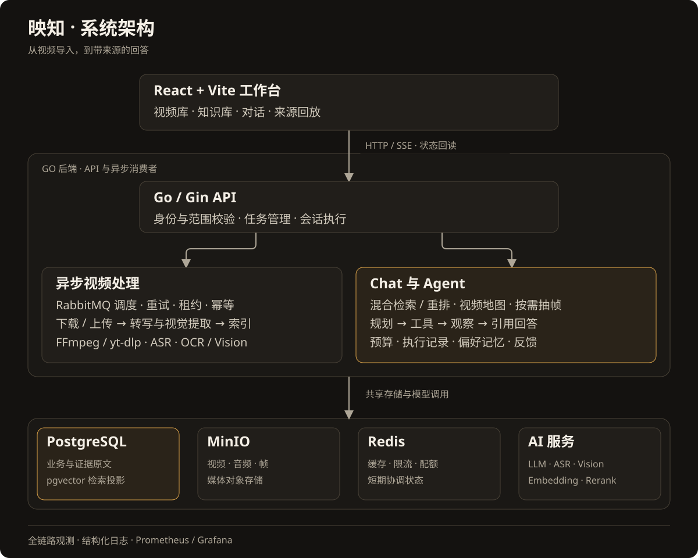

<div align="center">

# 映知 · VidLens

**观之以映，释之以知**

让长视频既能被追问，也能被学成笔记。

**简体中文** · [English](README.en.md)

[](https://go.dev)
[](https://vite.dev)
[](https://www.postgresql.org)

</div>

映知是一个基于 Go 与 Vite + React 的长视频理解与学习平台。上传视频或导入链接后，系统异步产出语音转写、画面 OCR 与画面描述三类证据并建立索引；用户可以直接提问，也可以让 Agent 检索片段、按需抽帧复核画面，再把内容整理成版本化的学习笔记，并沿对话持续修订。

## 核心能力

- **长视频与知识库问答**：Chat 经检索直接回答；Agent 依据工具结果逐步规划下一步，支持多轮追问、读取相邻转写窗口、检索视觉证据与按需抽帧复核。知识库检索覆盖库内全部视频，结果按视频均衡呈现。
- **学习笔记与 Agent 修订**：视频内容可生成结构化学习笔记，Agent 以区块级补丁完成纠错、补充与结构调整；提交前校验区块哈希与当前版本，修订可撤销。笔记另有导图与画布两种视图，同一份内容，视图只是投影。
- **多模态证据检索**：转写、OCR 与画面描述统一入索引，向量与 BM25 混合召回后重排；引用保留视频、来源与时间精度，源时间未对齐时留空而不猜测。
- **可控执行与恢复**：流式展示工具进度，按 Profile 配置调用、时间、Token 与视觉预算，为最终回答预留额度；执行记录持久化，断流后查询状态与已保存结果，不自动重复执行。
- **异步媒体流水线**：分片上传、断点续传、URL 下载；长音频重叠分片、有界并发与对齐去重。RabbitMQ 调度处理阶段，结合手动确认、退避重试、租约与幂等控制，复用已完成阶段和 ASR 分片。
- **数据与权限边界**：PostgreSQL 保存业务状态与执行记录，pgvector 作为可重建检索投影；MinIO 保存媒体，Redis 承担缓存与限流。检索、工具调用和结果发布均校验用户及知识库成员范围。
- **偏好与摘要修订**：Chat 与 Agent 共享有界对话上下文，用户显式授权后保留可撤回的回答偏好（默认关闭，需在配置中启用）；摘要支持改名与术语纠正，修订带锚点且不重新生成全文。

## 实现要点

- **混合检索**：pgvector 余弦相似度与 Go 内实现的 Okapi BM25（k1=1.5、b=0.75）并行召回，经 RRF 融合后交给模型或启发式重排。
- **分段摘要逐层合并**：按上下文窗口打包分段，中间结果持久化，失败后复用已完成分段，并拒绝不收缩的合并以保证收敛。
- **结构化补丁**：10 种区块级编辑操作，每个操作携带 `expected_hash` 做乐观并发；服务端重放补丁并校验头版本，重复版本由数据库唯一索引兜底。
- **执行日志与重放**：计划与工具结果按内容指纹持久化，恢复时重放已有记录而不重复调用模型。
- **收敛与降级**：识别到重复或已被覆盖的检索窗口后强制收尾；预算耗尽时用已收集证据直接作答，不再追加模型调用。
- **引用可信**：未被工具实际观测到的引用一律拒绝，避免生成阶段编造来源。
- **调用治理**：Redis + Lua 单脚本原子校验用户、操作、供应商与模型四个维度的速率上限（限速，不含成本上限）；密钥以 AES-256-GCM 加密保存，响应中脱敏。
- **检索评测**：`cmd/rag-eval` 计算 Recall@K、MRR、nDCG 与 answerability 的精确率 / 召回率 / F1；`cmd/rag-audit` 比对 PostgreSQL 与 pgvector 的投影漂移；`cmd/rag-reindex` 从 PostgreSQL 重建向量。
- **可观测**：结构化日志携带 trace、任务、用户与阶段字段并对密钥与正文脱敏；Prometheus 指标与三份 Grafana 面板覆盖 AI 用量、多模态检索与任务总览。

## 系统架构



## 界面预览

**Agent 规划与执行：每一步先给出规划理由，再调用工具，并可展开工具调用详情。**


**回答与引用：引用卡保留时间范围与证据模态，可直接回放对应片段。**


**知识画布：节点组织概念，右侧列出每个结论的关联依据并可回到原视频。**


<details>
<summary>执行用量与回答形态</summary>

**运行详情：累计耗时、工具调用与上限、模型与检索调用、输入输出 Token 和逐步耗时。**


**深入分析的回答：按要点组织，结论来自检索到的转写证据。**


</details>

<details>
<summary>视频详情与多模态证据</summary>

**转写时间轴：按解说转写、画面 OCR、画面描述着色，点击跳到对应时刻。**


**画面证据：关键帧与对应的画面描述、屏幕文字。**


**任务：视频处理按入库、转写、画面分析、检索索引四阶段推进，学习笔记生成同列。**


</details>

<details>
<summary>学习笔记、思维导图与画布</summary>

**学习笔记：章节化正文，每段可查看依据、围绕这段提问或让 Agent 修改这段；页面自带「待核对」与抽样声明。**


**思维导图：同一份笔记内容渲染成图，不是另一份文档。**


</details>

<details>
<summary>工作台、问答范围与设置</summary>

**工作台：继续上次学习的视频，以及资料、会话与待处理统计。**


**工作台：最近会话与最近成果。**


**问答范围：视频库问答、知识库问答与单视频问答三种入口。**


**知识库：按主题限定问答与检索的范围。**


**设置：外观主题，以及一份 AI 配置中对话、视觉、语音识别、向量检索与重排序各自的模型。**


</details>

## 技术栈与启动

**Go · Gin · GORM · PostgreSQL / pgvector · Redis · RabbitMQ · MinIO · FFmpeg / yt-dlp · Vite + React**

准备 Go 1.24+、Node.js 20+、Docker Compose、FFmpeg 和 yt-dlp。复制 `.env.example` 为 `.env`，按环境填写连接信息与密钥；登录后可在「设置 → AI 服务」配置模型。缺少 OCR 二进制时，画面 OCR 阶段自动跳过，仅保留转写与画面描述。

```bash
# 仓库根目录：启动依赖与后端
cp .env.example .env   # 首次配置；已有 .env 时跳过
# 编辑 .env，配置独立稳定的 VIDLENS_JWT_SECRET / VIDLENS_API_KEY_SECRET 后继续
docker compose up -d
go run ./cmd/server
```

另开终端启动前端：

```bash
cd frontend
npm ci
npm run dev -- -p 5173
```

访问 `http://127.0.0.1:5173`；后端健康检查为 `http://127.0.0.1:8080/healthz`。Windows 配好环境后也可使用 `make start` / `make status`，启动脚本会检查本地数据目录。

## Star History

<a href="https://www.star-history.com/?repos=junnhwan%2Fvid-lens&type=date&legend=top-left">
 <picture>
   <source media="(prefers-color-scheme: dark)" srcset="https://api.star-history.com/chart?repos=junnhwan/vid-lens&type=date&theme=dark&legend=top-left" />
   <source media="(prefers-color-scheme: light)" srcset="https://api.star-history.com/chart?repos=junnhwan/vid-lens&type=date&legend=top-left" />
   
 </picture>
</a>

## 社区
本项目的发布与讨论都在 [linux.do](https://linux.do/) —— 使用问题、踩坑经验、改进建议都欢迎到那里聊。提 issue 也可以，但在社区里通常回得更快。

## 工程文档

[架构总览](docs/architecture/overview.md) · [检索链路](docs/architecture/retrieval.md) · [执行与恢复](docs/architecture/agent-streaming-contract.md) · [证据与引用](docs/architecture/agent-evidence.md) · [笔记编辑契约](docs/architecture/artifact-editing-contract.md) · [笔记生成契约](docs/architecture/study-generation-v3-contract.md) · [媒体理解流水线](docs/architecture/media-understanding-pipeline.md) · [可靠性与幂等](docs/architecture/reliability.md) · [偏好记忆](docs/architecture/agent-memory.md) · [反馈与产品回归](docs/eval/product-feedback.md) · [文档导航](docs/README.md)
