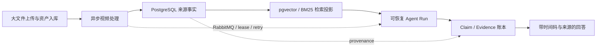

# VidLens 两条项目主线、能力地图与演进路线

> 日期：2026-09-02  
> 基线：`933c7d9 feat(memory): add user consent and session policy controls`  
> 文档性质：基于当前源码、架构文档和本地验证结果形成的规划快照，不是当前功能清单、上线证明或性能报告。  
> 目标岗位：后端开发、Agent 开发、AI 应用开发。

## 1. 项目定位

简历和面试叙事建议只保留两条主线：

1. **后端主线：可靠的大文件上传与异步视频处理平台。**
2. **AI 应用主线：可恢复、可审计、引用可回放的视频研究 Agent。**

两条主线不是两个独立项目，而是同一条数据与执行链路的上下层：



- 后端主线保证视频、任务状态、处理中间产物和来源事实可靠地进入系统。
- AI 应用主线只在这些可靠事实之上检索、调用工具、形成 Claim，并输出可回放引用。
- 中间件不是技术栈罗列，而是解决大文件、长任务、重复投递、外部模型不稳定和成本治理的手段。
- Agent 不是“多调用几次 LLM”，而是具有持久 Run、受控工具、预算、恢复、证据校验和停止条件的执行系统。

## 2. 状态与表述约定

本文使用以下状态，避免将规划误写成现状：

| 状态 | 含义 |
|---|---|
| 已有 | 当前源码或当前文档可定位到实现 |
| 缺口 | 代码检查发现的正确性、可靠性、安全性或工程化不足 |
| 建议改造 | 建议修改现有实现，不代表已经完成 |
| 建议新增 | 当前没有、但适合沿现有架构扩展的能力 |
| 待验证 | 需要测试、故障演练、压测或真实数据才能下结论 |

任何简历数字都应来自保存了 commit、配置、环境、数据集和原始结果的报告。没有证据时使用“实现、设计、支持、验证了某个具体场景”，不要写生产容量、可用性百分比或性能提升比例。

---

## 3. 后端主线：可靠的大文件上传与异步视频处理平台

### 3.1 大文件接入与 Upload Session

#### 已有

- 支持直接上传和分片上传。
- 使用 MinIO 保存视频对象，Redis 保存短期分片进度。
- 文件资产与用户任务分离，同一资产可以被多个任务复用。
- 上传大小和单分片大小已经有基础限制。

#### 缺口

- 分片上传和进度查询使用客户端提交的 `file_md5` 作为会话标识，没有绑定 owner。见 [`MediaHandler.UploadChunk`](../../internal/handler/media.go) 和 [`MediaService.UploadChunk`](../../internal/service/media_chunk_upload.go)。
- MinIO 临时对象键为 `chunks/<md5>/<index>`，不同用户不能形成独立上传会话。
- 合并完成后只校验文件大小，没有由服务端重新计算内容哈希。
- Go HTTP 进程需要接收完整分片字节；更大规模部署时，API 带宽、内存和连接数会成为瓶颈。

#### 建议改造：深模块 `UploadSession`

把上传规格校验、owner 隔离、幂等、状态机、对象晋升和清理放进一个深模块，调用方只需要理解少量接口：

```text
Begin(owner, filename, size, expected_sha256) -> upload_id
PutPart(owner, upload_id, part_no, bytes/etag)
Complete(owner, upload_id) -> asset_id
Abort(owner, upload_id)
```

模块内部隐藏：

- PostgreSQL `upload_sessions` / `upload_parts` 权威状态。
- 随机高熵 `upload_id` 和 owner 校验。
- `initiated → uploading → verifying → completed/failed/expired` 单调状态机。
- MinIO staging key、合并、SHA-256 流式校验、正式对象晋升。
- 并发分片幂等、规格冲突、过期接管与孤儿对象清理。

#### 建议新增

- **S3/MinIO Presigned Multipart Upload**：后端只签发受限 part URL、校验完成请求和管理状态，浏览器直传对象存储；保留服务端代理作为本地兼容 adapter。
- 上传配额和并发限制：按用户限制活跃 Session、总字节、分片并发和失败重试。
- 上传结果事件：为前端提供可恢复进度，但不把 Redis 当权威事实源。

#### 验收与简历证据

- 两个用户使用同一声明哈希时不能互相读取、覆盖或完成对方会话。
- 任意分片损坏、乱序、重复和缺失都得到确定性结果。
- 合并后的 SHA-256 与声明不一致时不会创建正式 Asset。
- 记录不同文件大小和并发度下的 API RSS、P95、对象存储吞吐和失败恢复结果。

### 3.2 资产指纹、结果复用与内容工作协调

#### 已有

- `VideoAsset` 以内容指纹复用底层视频对象。
- 转写和摘要支持按文件 MD5 查询既有结果。
- Redis 中存在内容级 `SETNX` 锁的基础实现。

#### 缺口

- 内容锁目前主要在“已经找到结果”后调用；首次 cache miss 的两个并发请求仍可能同时进入 ASR/LLM 队列。见 [`content_dedup.go`](../../internal/service/content_dedup.go) 和 [`media_tasks.go`](../../internal/service/media_tasks.go)。
- 结果键没有完整表达 provider、model、语言、prompt/chunker/处理版本；同一字节内容在不同 BYOK 配置下不一定可安全复用。
- 当前注释允许跨用户查找既有成功结果，但缺少明确的共享策略和产品契约。

#### 建议改造：深模块 `ContentWorkCoordinator`

建议将计算身份定义为：

```text
work_key = SHA-256(content)
         + capability
         + provider/model fingerprint
         + language
         + prompt/chunker/pipeline version
```

由 PostgreSQL 保存 `pending/running/completed/failed` 权威状态和 owner lease；Redis 只能作为减少争抢的加速层。模块支持：

- 第一个请求取得执行权。
- 后续请求等待、订阅或复用同一结果。
- owner 崩溃后由新 worker 接管过期 lease。
- `force` 创建新的 generation，而不是破坏旧结果。
- 跨用户复用必须经过显式策略；默认至少隔离用户级模型和私有派生产物。

#### 建议新增

- 记录 `dedup_hit_total`、节省的 ASR 秒数、LLM token 和估算成本。
- 为处理版本建立 manifest，使旧结果可读但不会伪装成当前 pipeline 的产物。
- 支持“源对象复用、派生结果不复用”“组织内复用”“全局公开素材复用”等策略 adapter。

### 3.3 RabbitMQ 任务投递、幂等与崩溃恢复

#### 已有

- RabbitMQ 持久消息、mandatory publish、手动 ACK/NACK。
- PostgreSQL 任务阶段、dispatch lease、processing lease、CAS 和重试调度。
- 消费者 Message ID 去重、AI 重试预算、poison message 隔离。
- ASR 分片完成结果可以复用。

#### 缺口

- 当前 Redis 去重键在业务 handler 前通过 `SETNX` 创建。进程若在占位后、业务持久完成前崩溃，重投消息会把该键视为“已处理”并 ACK。见 [`dedupHandler`](../../internal/mq/consumer_lifecycle.go)。
- Message ID 当前主要是 `jobType:taskID`；新的 dispatch generation 仍可能撞到旧的 Redis 键。见 [`Producer.publish`](../../internal/mq/producer.go)。
- 当前机制不能表述为 Exactly Once；正确目标应是 at-least-once delivery + durable idempotent effects。

#### 建议改造

优先选择下面一种清晰语义，不要继续叠加多个相互不一致的去重层：

1. **PostgreSQL Inbox**：`processing(owner, lease, generation) → completed(result_digest)`，重复投递读取终态，过期 processing 可接管。
2. **直接依赖业务状态机/lease/CAS**：如果每个 handler 的业务效果已经能按 generation 幂等提交，则移除“SETNX 等于已完成”的前置门禁。

同时建议：

- Message ID 包含 dispatch token/generation；同一次 broker redelivery ID 不变，新 dispatch ID 改变。
- 业务结果持久化成功后才 ACK。
- 若“创建任务状态”和“产生待投递消息”必须原子化，引入 PostgreSQL Outbox，并由 dispatcher 使用 `FOR UPDATE SKIP LOCKED` 领取。
- 明确 DLQ、最大重试次数、不可重试错误和人工重放接口。
- 需要高可用部署证据时再验证 quorum queue；本地 Compose 不等于高可用。

#### 必做故障矩阵

- Inbox/去重占位后 kill worker。
- 业务提交前、提交后、ACK 前分别 kill worker。
- publish 已到 broker 但 confirm 未到 producer 时断开连接。
- Redis 暂时不可用、PostgreSQL 短暂断连、RabbitMQ 重启。
- Provider 429/5xx/timeout 与用户主动取消同时发生。
- 同一任务收到重复、乱序和过期 generation 消息。

### 3.4 Worker 并发、背压与外部 Provider 治理

#### 已有

- ASR 单任务使用有界 worker 数。
- 有用户、operation、provider/model 维度的配额和 AI 重试预算。
- Provider 按能力拆分 Chat、ASR、Embedding、Rerank、Vision adapter。

#### 建议完善

- 建立统一 `AdmissionController` 深模块，隐藏用户公平性、provider 并发、速率、成本和熔断细节。
- 使用 bulkhead 隔离 ASR、Embedding、Vision，避免一种慢调用耗尽全部 worker。
- 对队列 backlog、任务年龄和 provider 429 动态降低领取速度。
- 区分排队超时、调用超时和业务 deadline；取消必须传播到 FFmpeg、对象存储和 AI 请求。
- 对长视频分片采用公平调度，避免一个超长任务长期占满所有并发槽。

#### 建议新增

- Provider circuit breaker 和 half-open 探测。
- 多 provider 健康分数与显式降级策略；切换前必须检查模型能力、维度和数据兼容性。
- 每个任务冻结 provider/model/pipeline 版本，恢复时不能静默换模型后继续写入同一结果。

### 3.5 PostgreSQL 状态、事务与版本化迁移

#### 已有

- PostgreSQL 是任务、Agent、Evidence、Memory 和检索来源行的权威事实源。
- pgvector/Milvus 被定义为可重建投影，而不是第二套事实源。
- 多个状态更新使用 lease token、version CAS 和唯一约束。

#### 缺口

- 服务每次启动都会执行 GORM `AutoMigrate` 和数据规范化。见 [`openServerDatabase`](../../cmd/server/database.go) 与 [`model.Migrate`](../../internal/model/model.go)。
- 当前仓库没有版本化在线 migration 目录、schema version 记录和多实例迁移锁。

#### 建议改造

- 使用版本化 SQL migration，采用 expand → backfill → switch → contract。
- 部署前单独执行 migration；服务启动只检查 schema compatibility。
- 使用 PostgreSQL advisory lock 保证多实例不会并发迁移。
- 大表回填、embedding 重建和 provenance 修复使用可恢复离线 job，不塞进启动路径。
- 对 Agent/Event/Inbox 等追加式表设计保留策略和归档任务。

### 3.6 MinIO 对象生命周期与数据一致性

#### 已有

- 视频、音频和视觉对象存放在 MinIO。
- Asset 有生命周期字段，删除链路已有 owner job 概念。

#### 建议完善

- 明确 staging object、active asset、deleting tombstone、deleted 的状态转换。
- 事务内只记录“需要创建/删除对象”的意图，对象存储副作用由可重试 job 完成。
- 建立 reconciliation job：扫描数据库孤儿引用、MinIO 孤儿对象、超时分片和删除失败。
- 对派生产物记录 source asset、pipeline version 和 checksum，便于重建与审计。
- 备份/恢复演练必须同时覆盖 PostgreSQL 和对象存储，不能只备份数据库。

### 3.7 HTTP、安全与租户边界

#### 当前缺口

- 主业务 `http.Server` 未配置 `ReadHeaderTimeout`、`IdleTimeout` 和 `MaxHeaderBytes`。见 [`cmd/server/main.go`](../../cmd/server/main.go)。
- CORS 当前允许所有 Origin。见 [`internal/middleware/cors.go`](../../internal/middleware/cors.go)。
- 登录、注册和上传等入口需要单独确认限流、请求体和认证策略。
- JWT 目前更接近基础 access token，需要根据部署目标决定 refresh、撤销、密钥轮换和会话管理。

#### 建议完善

- 配置 HTTP header/read/write/idle timeout；对 SSE 使用独立 write 策略。
- CORS 使用部署环境 allowlist。
- 上传、登录、AI 调用分别配置限流、配额和审计事件。
- 所有 Asset、Upload、Task、KB、Session、Agent Run 查询都在 repository 层强制 owner/scope 条件。
- 日志、trace 和错误响应不记录 API Key、原始 prompt、完整私有内容或高基数敏感 ID。

### 3.8 可观测性、SLO 与故障定位

#### 已有

- Prometheus 指标、Grafana 看板、结构化日志、readiness/health check。
- AI 调用有 token、cost、latency 和结果来源记录。

#### 缺口

- 当前业务 correlation context 不是 OpenTelemetry span context。
- HTTP → RabbitMQ producer → consumer → PostgreSQL/MinIO → AI Provider 尚未形成一条分布式 trace。
- 部分指标仍沿用 Kafka 历史命名，容易让读者误判实际中间件。

#### 建议新增

- OpenTelemetry Go SDK 和 W3C Trace Context。
- 在 RabbitMQ header 注入 message creation context；consumer process span 关联 producer span。
- Agent run、step、tool、retrieval、provider call 形成分层 span；敏感内容不进入 attribute。
- SLO：任务成功率、任务年龄、队列积压、P95 处理时间、Provider 错误预算、引用生成失败率。
- Alert：老化任务、lease 反复接管、DLQ 增长、对象清理积压、成本异常和评测回归。

参考：[RabbitMQ Reliability Guide](https://www.rabbitmq.com/docs/reliability)、[OpenTelemetry Messaging Spans](https://opentelemetry.io/docs/specs/semconv/messaging/messaging-spans/)。

### 3.9 构建、交付与可复现性

#### 当前缺口

- 当前 checkout 没有 `.github/workflows`、Dockerfile、Makefile、版本化 migrations 或 OpenAPI 文件。
- Compose 使用 `redis:latest`，并挂载旧仓库 `../vid-lens-727` 的数据目录，与 README 的默认启动说明不一致。

#### 建议完善

- `make verify`：格式、lint、unit、race、integration、build、shell test。
- CI service containers：PostgreSQL + pgvector、RabbitMQ、Redis、MinIO。
- 多阶段 backend/frontend Dockerfile、非 root 运行、固定依赖版本和 health check。
- OpenAPI 作为 HTTP 契约，并生成或验证客户端类型。
- SBOM、依赖漏洞扫描和容器镜像扫描作为加分项，但不能替代业务测试。
- 每次发布保存 migration version、镜像 digest 和关键非秘密配置快照。

### 3.10 后端主线建议验收指标

| 领域 | 指标/证据 |
|---|---|
| 上传 | 不同文件大小与并发下的成功率、P95、API RSS、损坏检测率 |
| 幂等 | 重复投递次数、重复业务副作用数、过期 lease 接管成功率 |
| MQ | publish/consume/ACK 故障矩阵、DLQ、backlog drain time |
| Provider | 429/5xx/timeout 重试结果、熔断状态、预算停止次数 |
| 数据 | migration 前后校验、对象/数据库 reconciliation 差异数 |
| 性能 | HTTP P50/P95/P99、任务端到端时间、队列等待和执行时间拆分 |

### 3.11 后端主线暂时不要声称

- Exactly Once。
- 已验证生产级高可用。
- 已证明某个 QPS、TB/PB 数据规模或可用性百分比。
- Redis 是业务事实源。
- 当前 Compose 等于可复制的生产部署。

---

## 4. AI 应用主线：可恢复、可审计、引用可回放的视频研究 Agent

### 4.1 多模态视频知识构建

#### 已有

- ASR 长音频切片、有界并发、相邻重叠拼接和稳定 segment source ref。
- OCR 与 Vision caption 独立入索引，保留 frame、时间范围、modality 和采样 provenance。
- 支持 transcript-only、visual-only 和 mixed RAG build。
- PostgreSQL 保存来源事实，向量库只保存可重建投影。

#### 建议完善

- 为每次处理冻结 `pipeline_version`：FFmpeg 参数、ASR model、OCR/Vision model、chunker、embedding 维度。
- 建立 Processing Manifest，记录输入 checksum、每阶段产物、失败原因和重建关系。
- 增加 ASR 时间漂移、重叠重复、静音、多人说话、语言切换的质量集。
- 为关键帧采样、感知哈希阈值和 OCR/Vision 结果建立消融实验。
- 视觉产物晚到时的索引 replace 必须验证不会制造重复关系行或短暂错误引用。

#### 建议新增：查询时按需 VLM

增加受约束的 `inspect_frame_window`，但只能：

- 检查前序检索已定位的合法时间窗。
- 使用固定最大窗口、帧数、并发和成本预算。
- 对相邻帧做感知去重。
- 把观察结果保存为新的 Evidence，而不是覆盖原 transcript/OCR。
- 对未调用 VLM 的问题禁止声称“已经查看画面”。

适用场景：图表、幻灯片、界面操作、字幕缺失、声画冲突和需要核对具体视觉事实的问题。

### 4.2 混合检索、排序与回答约束

#### 已有

- Query rewrite。
- pgvector + BM25 混合召回与 RRF。
- Model rerank。
- 单视频/知识库 scope。
- Citation 带视频、chunk、时间范围、modality 和 source refs。
- 检索失败、来源缺失和时间未知时存在安全降级语义。

#### 建议完善

- 将检索阶段拆成可单独评测的 contract：rewrite、candidate generation、fusion、rerank、diversity、context packing。
- 任何 rerank/provider 失败都记录 fallback path，不能把降级结果当完整链路。
- 加入按视频和模态的候选多样性，避免一个长视频或大量 transcript 片段占满 TopK。
- 将“问题是否可回答”和“答案生成”分开；证据不足时明确 abstain。
- Context packing 按 token budget、来源覆盖和相邻时间窗合并，避免重复片段浪费上下文。
- 所有检索结果保留配置和索引 revision，保证离线重放。

#### 建议新增

- Query decomposition：只对确实需要多个子问题的复杂问题使用，并设置最大子查询数。
- 跨模态冲突检索：至少保留一条 transcript 和一条 visual evidence，再交给 verifier。
- Retrieval cache 以 query、scope、index revision、model fingerprint 为键，避免错误复用。

### 4.3 Durable AgentRun Engine

#### 已有

- Template、Research 和 Evidence Funnel 三种策略。
- `agent_runs`、`agent_steps`、`agent_tool_calls` 权威表。
- lease、CAS、attempt、checkpoint、budget snapshot 和单调终态。
- 对不可安全重放的模糊调用采用 fail-closed。
- Research loop 有最大步骤和重规划次数。

#### 缺口

- Agent 仍主要由 HTTP 请求上下文驱动；没有完整的后台 Run worker、状态查询、取消和事件重放入口。
- 模板 Agent 有 SSE；Research/Evidence Funnel 仍主要是非流式实验入口。
- Agent 答案当前是在完整生成后按字符切片，不是 provider token streaming。见 [`agent-streaming-contract.md`](../architecture/agent-streaming-contract.md)。

#### 建议改造：一个深模块、三个策略

不要新增第四套执行循环。把三个策略放在统一 `AgentRunEngine` 后面：

```text
AgentRunEngine
├── Strategy adapter
│   ├── Template
│   ├── Research
│   └── EvidenceFunnel
├── ExecutionJournal
├── EventStore
├── ToolRegistry
├── BudgetPolicy
└── ClaimVerifier
```

对调用方暴露少量稳定接口：创建/取得 Run、取消、订阅事件；lease、checkpoint、恢复、终态幂等和事件序列全部藏在模块内部。生产 adapter 使用 PostgreSQL + RabbitMQ，行为测试使用确定性的 in-memory adapter。

#### 建议新增接口

- `POST /agent-runs`：创建持久 Run，快速返回 `run_id`。
- `GET /agent-runs/:id`：读取状态、预算、停止原因和结果摘要。
- `GET /agent-runs/:id/events?after_seq=`：按单调序列读取事件。
- `POST /agent-runs/:id/cancel`：幂等取消。
- SSE 支持 `Last-Event-ID`，重连时先回放再追实时事件。

#### 关键验收

- API 进程和 worker 分别重启后，同一 `run_id` 能恢复且不重复不可重放副作用。
- 重复创建请求使用 idempotency key 得到同一 Run。
- 取消可以传播到 planner、tool、retrieval 和 provider 请求。
- 已完成 Run 再次读取只返回冻结结果，不重新调用模型。

### 4.4 类型化 Tool Registry 与执行治理

#### 已有

- Research Agent 使用白名单工具注册表。
- runtime 注入 user/task scope，Planner 不能传任意路径或 URL。
- 工具调用与 Evidence ID、耗时、token/cost 和 checkpoint 关联。

#### 缺口

- `VideoAgentToolDefinition` 当前主要只有 `name` 和 `description`。见 [`video_agent_registry.go`](../../internal/service/video_agent_registry.go)。
- 参数解码、scope、成本、超时、可重放性和是否产生 Evidence 没有完全统一为声明式 contract。

#### 建议改造

每个工具声明：

- Input/Output JSON Schema。
- `read_only`、`destructive`、`idempotent`、`replay_safe`。
- 允许的 scope 和 capability。
- timeout、cost class、最大结果大小。
- 是否生成 Evidence、如何 canonicalize Evidence。
- 版本和结果 digest。

执行器统一完成 schema 校验、权限、预算、超时、日志脱敏、checkpoint 和错误分类；具体工具 adapter 只负责领域动作。这样新增工具不会在多个 switch 中复制策略。

参考：[MCP 2026-07-28 规范发布说明](https://blog.modelcontextprotocol.io/posts/2026-07-28/)。MCP 适合作为该注册表的外部 adapter，而不是另建一套工具系统。

### 4.5 Claim/Evidence 账本与校验

#### 已有

- Claim、Evidence 和关系表独立持久化。
- Evidence 保存稳定 ID、引用文本哈希、视频/文档定位、时间范围和 source revision 状态。
- 支持、反驳、上下文关系与 Claim revision。
- `verified` 只表示引用绑定和来源可回放，不冒充客观真理或自然语言蕴含证明。
- Evidence Funnel 在校验成功前使用不可用占位消息，避免未校验答案进入正常聊天历史。

#### 建议完善

- 将回答拆成原子 Claim，再分别绑定 Evidence，避免一条引用为整段复杂陈述背书。
- 增加 unsupported、contradicted、insufficient、stale source 等细分状态。
- 对来源内容发生 revision 的 Evidence 执行重新校验，而不是静默保留 verified。
- 建立 Claim verifier 的人工标注集；LLM judge 只能在与人工标签校准后使用。
- 前端展示“来源可回放”“证据不足”“存在冲突”，不要只显示统一绿色已验证标志。

#### 建议新增

- 跨视频 Claim 聚合：相同、补充和冲突关系。
- 报告导出时附带 Evidence appendix 和可点击时间码。
- 对公开素材可增加 source artifact checksum/manifest；这仍不等于证明自然语言 Claim 为真。

### 4.6 真正的流式执行与断线恢复

#### 当前缺口

- 回答内容在完整生成后按 80 字符切片发送，并非 provider token 级流式。
- Research/Evidence Funnel 尚未共享完整流式事件契约。

#### 建议改造

- 在 `internal/ai` 增加 `ChatStreamClient` port；不同 provider 使用独立 adapter。
- 流式处理 cancellation、backpressure、usage terminal event 和 provider 中途失败。
- assistant message 使用 `pending/draft/final/unavailable` 状态，不把半截答案当终态历史。
- EventStore 为每个事件分配单调 `seq`，SSE 重连按序回放。
- 只输出安全的步骤摘要、工具开始/结束和证据结果，不输出原始 Chain-of-Thought。

### 4.7 长期记忆与个性化

#### 已有

- 长期 Memory 与普通聊天历史区分。
- 用户授权、会话策略、owner/scope、有限召回、冲突、撤回和删除语义。
- embedding 是可删除的投影，关系 item/event 是权威事实。
- 异步 MemoryWriter 失败不会回滚主回答。

#### 建议完善

- 将进程内异步 writer 升级为持久队列或可恢复 job，避免进程退出丢失待写事件。
- 评测“有记忆/无记忆”对任务成功率、错误个性化和 token 成本的影响。
- 明确哪些内容永不自动记忆：密钥、敏感身份、视频中的第三方信息、未经用户确认的推断。
- 提供“本轮使用了哪些记忆”“为什么召回”“一键撤回”的用户可见说明。
- KB Agent 接入 memory 时仍需分别校验 memory scope 与 KB/video scope。

长期记忆不是 Agent：它不负责目标分解、工具选择、验证或停止条件。

### 4.8 旗舰新增功能：知识库级跨视频 Research Agent

这是现有能力最自然的产品扩展，也是 Agent 岗最有辨识度的新功能。

#### 目标问题

- “比较这五个视频对同一技术方案的观点与差异。”
- “找出所有视频中支持或反驳某个结论的片段。”
- “按时间线整理一组课程，并标注每个知识点来自哪个视频。”
- “生成一份研究报告，同时列出证据不足和视频之间的冲突。”

#### 建议工具

- `search_kb_evidence`：scope-aware 混合召回，返回多视频候选。
- `inspect_video_window`：在授权视频的合法时间窗内补充证据。
- `get_video_overview`：低成本读取视频摘要、元数据和处理状态。
- `compare_claims`：合并同义 Claim，标记支持、补充和冲突。
- `build_research_report`：只消费本 Run 已观察的 canonical Evidence。

#### 必须处理的工程问题

- 每个视频的最低/最高候选配额和全局 TopK。
- KB 成员在 Run 执行期间变化时的 scope snapshot。
- 部分视频未索引、处理失败或权限失效时的 partial result。
- Planner 不能伪造 `task_id`、video title、时间码或 Evidence 内容。
- 总步骤、并发工具、token、视觉调用和 wall-clock 预算。
- 跨视频 Evidence 的引用 UI 和报告导出。

#### 验收

- 越权视频的 Evidence 永远不能进入候选、tool result、账本或答案。
- 单个视频失败时，Run 明确标记 partial，不把缺失视频当作“没有相关证据”。
- 跨视频答案的每个事实 Claim 都能定位到至少一个 canonical Evidence，或明确标记 unsupported/uncertain。
- 与普通 KB RAG 做相同数据集的效果、成本和延迟对比。

### 4.9 可选扩展：MCP Server

在 Tool Registry 类型化并稳定后，可以增加只读 MCP adapter：

- 列出当前用户可访问的知识库和已处理视频。
- 搜索视频证据。
- 查看时间线和指定窗口。
- 读取 Claim/Evidence 账本。
- 获取 Agent Run 状态和最终报告。

约束：

- 复用同一 owner/scope、预算、审计和 schema 校验。
- 默认只读；写工具需要单独授权、幂等和审批设计。
- 远程 MCP 必须有资源受众校验，不能透传上游 token。
- MCP 是互操作 adapter，不应反向主导项目内部领域模型。

### 4.10 Agent/RAG 评测与成本治理

#### 已有

- 数据集 schema、sealed split、单变量消融配置。
- 评测登记包含 dataset version、commit、配置哈希和证据哈希。
- 已规划 Recall/MRR/nDCG/Complete Evidence Recall 等检索指标。

#### 最大缺口

真实数据和报告位于本地忽略目录，当前仓库没有可供面试官复现的公开结果。见 [`docs/eval/README.md`](../eval/README.md)。压测文档也只有方法和空白模板，见 [`stress-testing.md`](../operations/stress-testing.md)。

#### 建议新增公开 Evidence Pack

- 使用有许可的公开视频构建小型、版本化、可提交的数据集。
- 包含典型、边缘和对抗案例：字幕缺失、画面问题、多视频冲突、不可回答、长上下文、错误时间码诱导。
- CI 跑快速 smoke eval；完整 eval 手动或定时运行，并提交脱敏汇总报告。
- 保留 baseline 和每个单变量消融结果：vector only、BM25 only、RRF、rerank、modality fusion、Agent。

#### 指标建议

| 层次 | 指标 |
|---|---|
| Retrieval | Recall@K、MRR、nDCG、Complete Evidence Recall、跨视频覆盖 |
| Citation | citation precision/recall、时间范围正确率、来源回放成功率 |
| Answer | answerability/abstention、unsupported claim rate、冲突识别率 |
| Agent | task success、invalid tool args、steps、replan、budget stop、recovery success |
| Cost | input/output token、VLM frame、单任务费用、去重节省 |
| Runtime | end-to-end P50/P95、first event/token latency、恢复时间 |

自动 grader 必须用人工标注校准；优先使用 pass/fail、分类或成对比较，而不是只给模糊总分。参考：[OpenAI Evaluation Best Practices](https://developers.openai.com/api/docs/guides/evaluation-best-practices)。

### 4.11 AI 应用主线暂时不要声称

- 已实现知识库 Agent；当前普通知识库 RAG 不等于 KB Agent。
- 已实现查询时在线 VLM；当前只读取持久化 OCR/Vision observation。
- 已实现 provider token streaming。
- `verified` Claim 已被证明为客观事实或完成自然语言蕴含证明。
- Evidence Ledger 保存或输出原始 Chain-of-Thought。
- 多 Agent；目前三条路径是同一视频领域下的不同受控策略，不需要包装成多 Agent 系统。

---

## 5. 两条主线之间的能力映射

| 后端能力 | AI/Agent 消费方式 | 共同验收点 |
|---|---|---|
| Upload Session + SHA-256 | 稳定视频身份与来源 provenance | 错误内容不能生成可信 Evidence |
| ContentWorkCoordinator | 避免重复 ASR/Embedding/VLM 成本 | 同一 work key 只有一个有效 generation |
| Inbox/lease/CAS | Agent step/tool 崩溃恢复 | 重复投递无重复业务副作用 |
| Processing Manifest | Evidence source revision 与离线重放 | 旧处理版本不会冒充新版本 |
| Provider Admission | Agent token/视觉预算和公平性 | 429/timeout 下可预测降级 |
| OTel trace | 解释一次 Agent 的延迟、成本和失败 | HTTP→MQ→tool/provider 可关联 |
| Versioned migration | Run/Event/Evidence schema 可演进 | 升级和回滚不破坏历史 Run |
| Reconciliation | 修复对象、任务、索引投影不一致 | PostgreSQL 事实可重建外部投影 |

这也是为什么两个主线应放在同一项目里：后端机制直接决定 Agent 的来源可信度、恢复语义和成本上限；Agent 场景则为中间件与数据一致性设计提供真实压力。

---

## 6. 推荐推进顺序与交付门槛

### 阶段 A：建立可信基线

- [ ] 修复当前跨平台 FFmpeg 测试。
- [ ] 建立 CI 和 `make verify`。
- [ ] 固定 Compose 镜像并移除旧仓库硬编码 volume。
- [ ] 清理 Agent 状态文档矛盾和 Kafka 历史指标命名。
- [ ] 提交第一份公开、无虚构数字的 baseline 报告。

**完成门槛**：干净 checkout 能按 README 启动；CI 对核心 Go/前端链路给出明确通过、失败或阻塞状态。

### 阶段 B：修复后端正确性与数据边界

- [ ] Upload Session + owner + SHA-256 服务端校验。
- [ ] ContentWorkCoordinator 接入首次 cache miss 的真实请求链路。
- [ ] 修复 MQ 前置 SETNX 崩溃窗口，确定 Inbox 或业务状态机方案。
- [ ] 增加进程 kill、重复消息、Redis/Provider 故障矩阵。
- [ ] 引入版本化 migration。

**完成门槛**：上述故障场景都有可重复测试；没有重复业务副作用、越权上传状态或未校验资产晋升。

### 阶段 C：形成生产形态的 Agent Runtime

- [ ] AgentRun 后台 worker、状态查询、取消和事件回放。
- [ ] Template/Research/Evidence Funnel 共享统一运行生命周期。
- [ ] Tool Registry 类型化和统一执行治理。
- [ ] Provider token streaming、SSE `Last-Event-ID`。
- [ ] HTTP→MQ→Agent→Provider OpenTelemetry trace。

**完成门槛**：重启 API/worker、断开 SSE、重复 Run 请求后仍能得到同一冻结终态；不重复不可重放调用。

### 阶段 D：实现旗舰 KB Research Agent

- [ ] Scope-aware 多视频检索与候选多样性。
- [ ] 跨视频 Claim merge/conflict。
- [ ] partial-index/permission-change/budget 行为。
- [ ] 报告与 Evidence appendix。
- [ ] 与普通 KB RAG 的效果、成本、延迟对照实验。

**完成门槛**：版本化测试集上有可复现指标；引用权限、时间码和 unsupported Claim 通过人工抽检。

### 阶段 E：选择性扩展

- [ ] 查询时按需 VLM。
- [ ] Presigned multipart upload。
- [ ] 只读 MCP adapter。
- [ ] 持久 MemoryWriter 与记忆效果评测。

这些能力只有在前序模块稳定后才增加；不要为了技术名词同时铺开。

### 推荐拆分的前五个改动集

1. **基线可信度**：FFmpeg test、CI、Compose、文档与指标命名。
2. **安全上传会话**：Upload Session、SHA-256、owner、对象晋升与清理测试。
3. **可靠异步任务**：Inbox/lease/message generation 和 crash matrix。
4. **可公开评测包**：小型数据集、baseline、RAG 消融和故障报告。
5. **Durable AgentRun**：后台执行、事件存储、取消、重连和统一 Tool Registry。

---

## 7. 简历与面试表述建议

### 7.1 当前已经可以安全表述

#### 后端方向

> 构建 Go 视频知识处理后端，使用 RabbitMQ 拆分下载、ASR、摘要和 RAG 索引阶段，以 PostgreSQL 保存任务状态和处理来源、MinIO 保存大对象，并通过任务 lease、CAS、手动确认和有界重试支持长任务恢复。

该表述不要扩张成 Exactly Once 或生产级高可用。

#### Agent/AI 应用方向

> 实现单视频受控 Research Agent 与固定 Evidence Funnel，使用 PostgreSQL 持久化 Run/Step/ToolCall checkpoint、预算和停止原因，并以 Claim/Evidence 账本保存可回放时间码引用；Planner 只能消费白名单工具和当前 Run 已观察的 canonical Evidence。

应明确“单视频、实验入口”，不要写成知识库 Agent、多 Agent 或在线 VLM。

#### RAG/多模态方向

> 构建面向视频的混合检索链路，将 ASR、OCR 和 Vision observation 统一为带 modality、时间范围和稳定 source ref 的关系事实，通过 pgvector、BM25/RRF、rerank 生成可跳转原视频的引用式回答。

### 7.2 完成后端阶段后可使用的模板

> 设计基于 RabbitMQ at-least-once、PostgreSQL Inbox/lease/CAS 的异步视频处理链路，在 `[故障场景数]` 类可重复故障注入中实现任务恢复，重复业务副作用为 `[实测值]`，积压恢复 P95 为 `[实测值]`。

> 设计 owner 隔离的分片 Upload Session 与服务端 SHA-256 校验，支持 `[实测文件大小/并发]` 下的断点续传、幂等分片和对象晋升，将 API 峰值内存或重复上传成本降低 `[实测值]`。

### 7.3 完成 Agent 阶段后可使用的模板

> 构建可恢复的视频研究 Agent Runtime，统一三种执行策略的 Run/Step/ToolCall checkpoint、事件回放、预算和取消语义；在 API/worker 重启及 SSE 断连场景下保持同一 Run 幂等终态，恢复成功率为 `[实测值]`。

> 实现知识库级跨视频 Research Agent，通过多视频混合检索、Claim 冲突合并和 Evidence 校验生成带时间码研究报告，在版本化评测集上将完整证据召回提升 `[实测值]`，unsupported claim rate 降至 `[实测值]`。

### 7.4 面试讲解顺序

1. 为什么视频任务不能同步 HTTP 完成。
2. PostgreSQL、RabbitMQ、Redis、MinIO 各自保存什么，谁是事实源。
3. 消息重复、worker 崩溃和外部 AI 超时如何恢复。
4. RAG citation 如何回到真实视频时间范围。
5. Agent Run 如何持久化、恢复、限制工具和预算。
6. 如何证明改造有效：测试、故障演练、评测和成本数据。

---

## 8. 当前本地验证快照

本节只记录 2026-09-02 当前 checkout 的本地结果，不代表 CI、部署或生产状态。

| 检查 | 状态 | 结果 |
|---|---|---|
| `git status --short --branch` | 通过 | 检查前为 `main...origin/main`，无既有修改 |
| `go vet ./...` | 通过 | 当前本地执行通过 |
| 主要后端命令 build | 通过 | `server`、`rag-eval`、`rag-reindex`、`rag-audit` 构建通过 |
| `go test ./...` | 失败 | `internal/pkg/ffmpeg` 的 Windows 路径测试在 macOS 失败 |
| 前端 `npm test` | 通过 | 8 passed，0 failed |
| 前端 typecheck/build | 阻塞 | 当前 checkout 未安装 `frontend/node_modules`，`tsc` 不存在 |

FFmpeg 失败定位：[`ffmpeg.go`](../../internal/pkg/ffmpeg/ffmpeg.go) 使用宿主系统 `filepath` 解析路径，而 [`ffmpeg_test.go`](../../internal/pkg/ffmpeg/ffmpeg_test.go) 在 macOS 上直接断言 Windows 反斜杠路径。

### 当前源码检查得到的重点证据

- MQ 前置 Redis 去重门禁：[`consumer_lifecycle.go`](../../internal/mq/consumer_lifecycle.go)、[`idempotency.go`](../../internal/mq/idempotency.go)。
- 静态 Message ID：[`producer.go`](../../internal/mq/producer.go)。
- 内容锁与实际请求链路：[`content_dedup.go`](../../internal/service/content_dedup.go)、[`media_tasks.go`](../../internal/service/media_tasks.go)。
- 分片状态与对象键：[`media.go`](../../internal/handler/media.go)、[`media_chunk_upload.go`](../../internal/service/media_chunk_upload.go)。
- 启动时 AutoMigrate：[`database.go`](../../cmd/server/database.go)、[`model.go`](../../internal/model/model.go)。
- Agent 执行入口：[`conversation_execution.go`](../../internal/service/conversation_execution.go)。
- 工具定义当前表面：[`video_agent_registry.go`](../../internal/service/video_agent_registry.go)。
- 当前字符分片流式边界：[`agent-streaming-contract.md`](../architecture/agent-streaming-contract.md)。
- Agent/Memory/KB Agent 当前范围：[`agent-evolution.md`](../architecture/agent-evolution.md)、[`agent-memory.md`](../architecture/agent-memory.md)。
- 公开评测与压测现状：[`eval/README.md`](../eval/README.md)、[`stress-testing.md`](../operations/stress-testing.md)。

---

## 9. 后续实施前需要明确的产品决策

这些选择会改变数据模型或复用语义，不能在编码时临时猜测：

1. 相同视频的 ASR/摘要是否允许跨用户复用？不同 BYOK provider/model 下如何隔离？
2. 上传目标是本地单机演示、普通云主机，还是需要浏览器直传对象存储？
3. API 与 worker 是否准备拆进独立进程/容器？若拆分，部署和 trace 要同步设计。
4. Agent Run 是否允许后台继续执行，用户离开页面后如何通知完成？
5. KB Research Agent 首个明确任务是什么：比较、时间线、证据收集，还是报告生成？
6. 哪些公开视频和标注可以合法进入公开 benchmark？
7. 预算以用户、Run、provider、组织还是日维度控制？
8. Memory 默认关闭还是按用户显式开启？哪些内容永不自动写入？

在这些问题确定前，可以先完成不依赖产品选择的基线、故障复现和数据边界修复。

## 10. 最终建议

如果只选最能提升项目含金量的三个方向：

1. **可靠任务链路**：Upload Session、ContentWorkCoordinator、Inbox/lease/CAS 和故障矩阵。
2. **Durable Agent Runtime**：后台 Run、统一事件、类型化工具、取消/恢复和真实流式。
3. **公开评测证据**：RAG/Agent 指标、成本、延迟和故障演练报告。

在此基础上再实现知识库跨视频 Research Agent，它会成为两条主线汇合后的旗舰功能：既需要可靠的中间件、状态和数据来源，也能集中展示 Agent 工具调用、证据校验、预算、恢复和评测能力。
