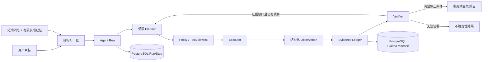

# VidLens Video Research Agent：总体设计与实施路线

状态：设计核验稿

核验时间：2026-08-29（Asia/Shanghai）

本文根据历史会话 `codex://threads/01a00d09-b46e-7ab1-997a-bf56cec51604`、VidLens 当前主分支源码，以及 `D:\dev\agent-learn\other` 下四个本地 checkout 重新整理。历史会话可以读取；它给出的核心判断是：VidLens 当时是“模板驱动的工具型视频 RAG”，下一步应演进为“可验证、受控、可恢复的 Video Research Agent”。本文保留这个方向，但以当前代码重新核验了“已经存在”和“仍然只是设计”的边界。

## 设计结论

- 默认问答仍然走标准 RAG；Agent 是显式、受控的补充路径，不接管默认聊天。
- 长期记忆是 Agent 的上下文基础设施，不是 Agent。它负责保存、召回和治理有限的历史信息，不负责决定下一步行动。
- 证据漏斗是固定的检索/核验策略，不是自主 Agent。只有当有限状态、预算和工具白名单允许时，Agent 才能在漏斗节点之间选择下一步。
- VidLens 保留“受控 Agent”：目标、状态、有限工具、硬预算、验证器和停止条件都由 Go 代码约束。不引入无限制 ReAct，不暴露原始 Chain-of-Thought。
- 证据账本是研究结果的可审计边界：结论必须关联到视频、时间范围、模态和可重放的证据；记忆不能替代当前视频证据。
- `chat_messages.retrieval_snapshot` 继续承担历史兼容和结果快照职责；Run/Step/ToolCall 与 Claim/Evidence 已使用独立 PostgreSQL 领域模型，执行恢复不读取聊天快照。

## 当前 VidLens 基线

| 能力 | 当前实现事实 | 结论 |
|---|---|---|
| 默认聊天 | `ChatService` 组织查询改写、关键词/向量召回、RRF、上下文扩展、重排和引用校验；只从检索上下文生成答案 | 已实现，继续作为默认路径 |
| 证据身份 | `RetrievedChunk` 有稳定 `EvidenceID`，公开 `Citation` 带视频、chunk、分数和来源 | 已实现，是账本的可复用基础 |
| 模板 Agent | `video_agent.go` 的 `direct_qa`、`summarize_topic`、`compare_topics`、`critique_topic` 由 Go 固定工具顺序编排 | 已实现，但不是自主研究 Agent |
| Agent 工具 | `video_agent_registry.go` 只允许 `search_transcript`、`get_transcript_window`、`summarize_segments`、`compare_segments`、`build_cited_answer` | 已实现白名单和参数入口 |
| Agent 流式事件 | `video_agent_stream.go` 有 `run_start`、步骤、工具调用/结果、检索命中、答案、引用、完成/错误事件 | 已实现事件外壳；答案仍是在执行完后按 80 字切片，不是 Provider token stream |
| Agent 快照 | `video_agent_snapshot.go` 将安全执行元数据写入既有 `retrieval_snapshot`，兼容旧的 `template+citations+trace` | 已实现兼容快照，但不参与执行恢复 |
| Agent 执行账本 | `agent_runs`、`agent_steps`、`agent_tool_calls` 冻结 scope/profile/policy/budget，以 attempt 唯一键、lease 和 CAS 持久化模板工具与 research planner/tool 动作 | 已实现单视频执行持久化；不可重放调用中断时 fail-closed |
| 受控研究循环 | `video_research_loop.go` 有 LLM planner、工具注册表、observe、`MaxSteps=8`、`MaxReplans=2`、证据绑定校验，并从 PostgreSQL checkpoint 恢复已完成动作 | 已实现 opt-in、单视频的可恢复 loop；仍无视觉核验 |
| 研究入口 | `video_research_service.go` 的 `mode=research` 只接受单视频；知识库范围被拒绝 | 已实现实验入口，不应误称为完整产品 Agent |
| 固定证据漏斗 | `mode=evidence_funnel` 固定执行全局摘要/元数据、transcript、时间窗、既有视觉/OCR 和 Evidence/Claim 校验；两个 Planner 节点只能选择有限候选 ID 或结束 | 已实现 opt-in 单视频漏斗；不调用开放工具、不新增视觉 provider 调用、不接入知识库 |
| 短期上下文 | `ChatMemoryStore` 只提供最近消息读取/保存；`RecentTurns` 是有限会话上下文 | 已实现短期记忆，不是长期语义记忆 |
| 长期记忆 | 已有 owner-scoped item/event、四类 scope、受限 snapshot、冲突/撤回/删除语义、异步写入和可选 Agent 注入；在线语义排序与公开治理 API 尚未实现 | 最小切片已实现，见 [agent-memory.md](agent-memory.md) |
| 证据账本 | 已有独立 Claim、Evidence、Claim-Evidence PostgreSQL 模型；模板 Agent 与 research Agent 将检索命中和回答事实写入账本，状态覆盖 hypothesized、verified、corrected、unsupported、uncertain | 最小纵向切片已实现，见 [agent-evidence.md](agent-evidence.md) |
| 跨视频研究 | 标准 RAG 可按请求检索知识库；Agent 研究路径不接受 KB | 未实现 Agent 级跨视频研究 |

上述判断以源码为准，架构背景见 [overview.md](overview.md)、[retrieval.md](retrieval.md) 和 [data-model.md](data-model.md)。

## 术语和边界

### 什么才算 VidLens Agent

本文把 Agent 定义为：针对明确目标，读取当前状态，选择一个受白名单约束的动作，接收结构化观察，更新状态，并在验证器允许时结束或有限重规划。

因此，下列能力单独存在时都不等于 Agent：

- 有向量召回的 RAG；
- 根据模板依次调用几个工具；
- 保存对话或用户偏好的长期记忆；
- 按固定顺序执行“全局摘要→局部召回→窗口扩展→视觉核验”的证据漏斗；
- 输出带时间戳的答案。

它们是 Agent 可以使用的上下文、工具和策略。Agent 的增量在于“有限决策 + 反馈 + 状态转移 + 停止”。

### 三条不混淆的边界

| 概念 | 负责什么 | 不负责什么 |
|---|---|---|
| 长期记忆 | 保存经治理的用户/视频/知识库上下文，在运行开始时提供有限召回 | 不规划工具、不验证当前证据、不自主循环 |
| 证据漏斗 | 规定从便宜、粗粒度信号逐步收窄到可核验证据的路径 | 不自己理解目标、不自己重规划、不代表 Agent |
| 受控 Agent | 在上述上下文和策略上决定有限动作，观察结果，验证并停止 | 不拥有任意代码执行、任意网络访问或无限循环 |

## 外部参考核验

本节把“源码事实”和“对 VidLens 的推断”分开。所有本地仓库在核验时工作树干净；commit 是本次核验的可复现基线。

### AGI-saber / AGI-saber-go：长期记忆基础设施

来源身份需要特别说明：用户指定的公开地址 [AGI-saber/AGI-saber-go](https://github.com/AGI-saber/AGI-saber-go) 在核验时不可访问；本地目录 `D:\dev\agent-learn\other\AGI-saber-go` 的 `origin` 实际是 [wujingle488-crypto/AGI-saber](https://github.com/wujingle488-crypto/AGI-saber)，checkout `f85a1da776de76dafbf9302d147a18ad0ea0bdaf`，提交时间 2026-06-28。以下结论严格针对这个本地 checkout，不把仓库身份差异隐去。

| 真正解决的问题 | 核心实现 | 对 VidLens 的借鉴 | 不直接照搬 |
|---|---|---|---|
| 让多轮 Agent 在会话外保留可召回的用户上下文，并将短期、长期、偏好和可选图关系分层 | `internal/memory/memory.py` 的 `ShortTerm` 滑动窗口、`LongTerm` 重要性/余弦相似度召回、去重与衰减、`Preference`；`memory_writer.py` 异步串行写入并从回复抽取记忆；`restore.py` 负责尽力恢复；`graph_memory.py` 提供可选 Neo4j 一跳扩展 | 分层内存接口；将写入与请求主链路解耦；有限 top-k、阈值、TTL/衰减、去重、可删除；在运行开始形成 memory snapshot | 初期不引入 Neo4j、图规划、通用工具沙箱、任意异步 Agent runtime；它的 `Item` 元数据较少，数据库同步部分存在 best-effort/占位实现，不能当成完整生产记忆规范 |

该项目还提供 `internal/agent/planner.py` 和 `graph_runtime.py`：有工具计划、依赖/竞态组、并行、重试和快照恢复。这些是 Run/Step 恢复的启发，但其中的工具面和通用编排范围明显大于 VidLens 当前需要。这里“初期只采用分层记忆和治理，不采用图运行时”是基于 VidLens 单视频、读路径和 PostgreSQL 约束的设计推断。

### Microsoft/DeepVideoDiscovery：长视频的多粒度证据检索

来源：[官方仓库](https://github.com/microsoft/DeepVideoDiscovery)、[论文](https://arxiv.org/abs/2505.18079)。本地 checkout 为 `64414b2f35d26809a39740a5a319889f46e29b94`，提交时间 2025-11-03。

| 真正解决的问题 | 核心实现 | 对 VidLens 的借鉴 | 不直接照搬 |
|---|---|---|---|
| 在超长视频中先粗定位、再按需要检查局部内容，降低一次性把所有帧交给模型的成本 | `dvd/build_database.py` 建立带时间、caption、subject registry、fps 的向量数据库；`global_browse_tool` 以 clip 描述做全局浏览；`clip_search_tool` 语义召回 clip 并按时间排序；`frame_inspect_tool` 对指定时间段均匀采样帧并调用 VLM | 将“全局→clip/摘要→时间窗口→帧/视觉”的粒度递进固化为有限证据漏斗；视觉检查必须由已有时间范围触发；保留 lite/transcript-first 降级路径 | 它是动态 function-call loop，依赖 OpenAI 工具调用和内存消息列表，没有 VidLens 所需的 Claim/Evidence 账本、持久 Run/Step 或业务权限；不能把其 THINK→ACT→OBSERVE 文案作为输出 CoT，也不能把任意多轮 loop 原样放入线上 |

索引构建中的 `frame_caption.py` 会将多帧和 transcript 汇总为 clip caption，并合并 subject registry；这是离线视觉索引，不是在线 Agent 证据结论。`dvd/dvd_core.py` 的 Agent 工具集合和 `max_iterations` 说明它提供的是“受迭代上限约束的研究式工具循环”，不是无限自主能力。这里把它映射为“多粒度检索工具设计”是事实到 VidLens 的架构推断。

### mupozg823/timecode-agent：时间码 Claim 与追加式证据账本

来源：[官方仓库](https://github.com/mupozg823/timecode-agent)。本地 checkout 为 `02f7c5a9ce1c09b4ba49177d2a4dc8e9ee1bbc03`，版本提交时间 2026-08-07。

| 真正解决的问题 | 核心实现 | 对 VidLens 的借鉴 | 不直接照搬 |
|---|---|---|---|
| 让“视频中发生了什么”的判断能定位到时间范围，并可在后续观察中修订 | `src/video_agent/checkpoint_schema.py` 定义 `hypothesized → verified/corrected` 的有向状态约束、有限时间 span、confidence 和 typed observation；`checkpoint_store.py` 以 JSONL 锁定追加并投影 latest；`transcript_evidence.py` 用稳定 segment identity 与时间重叠判断支持；`verification.py` 审计 transcript/visual provenance；`ask_types.py` 将 partial/unobserved 与“没有证据证明为零”分开 | 在 VidLens 建立 Claim、Evidence、关系和时间重叠校验；让更正追加而不是覆盖历史；把“无证据”作为明确不确定性；将 transcript/OCR/视觉 provenance 作为不同模态记录 | 它的 ledger 是本地文件、CLI 和外部 coding-agent harness；状态枚举原生只有 `hypothesized`、`verified`、`corrected`，`unsupported` 主要出现在审计/问答层；不能直接替换 VidLens PostgreSQL、权限、会话和 SSE 模型 |

“Claim 状态机在 VidLens 采用更细的产品状态”属于设计推断：可保留参考项目的 `hypothesized`、`verified`、`corrected` 语义，同时为 VidLens 的报告审计增加 `unsupported`/`contradicted` 投影，但必须定义合法迁移和来源，而不能声称这些状态都已在 timecode-agent 中实现。

### DOVideo-AI：视频分析、去重和工具化闭环

来源：[官方仓库](https://github.com/Xiaoc7r/DOVideo-AI)。本地 checkout 为 `caed156914e4cb4fc76e729f8fd79004674a1c75`，提交时间 2026-07-27。

| 真正解决的问题 | 核心实现 | 对 VidLens 的借鉴 | 不直接照搬 |
|---|---|---|---|
| 把长视频处理成可检索、可追踪、可恢复的结构化分析任务 | `VideoContext` 统一 ASR/OCR/frame/timestamp；`VideoEvidenceRetrievalService` 将 embedding、关键词和 OCR 相关性融合；`LongVideoContextService` 按 5 分钟 chunk 做相关选择并限制上下文字符数 | 统一时间轴上下文；检索分数中保留模态来源；对上下文大小设置硬上限；视觉与语音分开降级 | VidLens 已有 PostgreSQL/pgvector/RAG 投影，不能复制其 MySQL+Redis+Qdrant 全套；其 5 分钟和 24,000 字符是实现参数，不是通用标准 |
| 让 Agent 产物可重试、可恢复、可评估 | `AgentLoopService` 的 Planner→Executor→Critic→定向补证据，`AgentState` 保存 goal/plan/result/critique/round；`AgentCheckpointService` 持久化 plan、execution、critic、result；预算有轮次、时长、估算 token 和成本；`AgentTelemetry` 与 `TaskEventService` 发送进度 | 受控重规划；Critic 只提出结构化反馈和 required timestamps；每个关键边界保存 Checkpoint；把 cost/latency/token/round 作为策略输入；用事件协议连接 UI | 它的 Checkpoint 是目标键下的可变 payload，不是 Claim/Evidence 追加账本；它的 `EvidenceVerificationService` 仍以 ASR/OCR 文本匹配为主，不能代替来源级视觉核验；其业务异步链和多模式体系不应先引入 VidLens |
| 处理成本和重复视频 | 分片上传、Redis 恢复、MinIO、内容指纹+目标锁、用户/全局 token bucket、有限重试；相邻帧 perceptual hash 去重，scene-change keyframe 与 30 秒 fallback | 借鉴内容指纹、相邻帧去重、有限重试和用户/全局预算的思想；在未来视觉工具中记录采样策略和 dedup 结果 | 基础设施已经是 VidLens 明确边界外的扩展；视频内容 hash 不能自动证明两个视频语义等价，perceptual hash 也不能用于 Claim 支持 |

因此，DOVideo-AI 最值得借鉴的是“上下文模型 + 受控 Critic 闭环 + 可恢复边界”，不是其具体中间件组合。

## VidLens 目标架构



每一层的责任如下：

| 层 | 责任 | 关键限制 |
|---|---|---|
| 目标归一化 | 确定 scope、问题类型、所需输出和可接受不确定性 | 不自行扩大视频/知识库范围 |
| Run | 固定 user、session、视频/KB scope、profile、policy snapshot 和预算 | 一个 Run 不跨越授权 scope |
| Planner | 只返回受约束的 `Decision`：有限动作、理由摘要、参数和停止意图 | Go 校验 schema、工具名、参数、步数和重规划数 |
| Executor | 调用已注册 read-only 工具，注入服务端 scope | 不接受任意代码、URL、SQL、文件路径或工具名 |
| Observation | 返回命中、时间范围、模态、证据引用、未解决问题和成本 | 不把模型自由文本当成事实 |
| Ledger | 记录 Claim、Evidence、支持关系、版本和校验结果 | 追加/修订有状态迁移，不覆盖历史 |
| Verifier | 检查时间重叠、来源存在、Claim-Evidence 关系和冲突 | 验证失败只能降级或有限补检 |
| Answer | 只渲染已验证或明确标注不确定性的内容 | 不输出隐藏推理、内部 prompt 或原始 CoT |

标准 RAG 和 Agent 的路由仍由请求模式决定：标准问答继续使用 [retrieval.md](retrieval.md) 的一次检索与后处理；只有显式 research/agent profile 才创建 Agent Run。KB Agent、跨视频 Claim 合并和写入报告都必须经过单独的 scope/capability 设计。

## 证据漏斗：固定策略，不是自主 Agent

显式 `mode=evidence_funnel` 先使用便宜且可重放的信号，再按证据缺口读取更细粒度的已有模态：

```text
全局视频摘要/元数据
  → transcript 检索
  → 相关 transcript window 与时间范围扩展
  → 目标时间范围的既有视觉帧/OCR 确认
  → Claim 绑定与时间码校验
  → Verifier 决定支持、冲突、不支持或继续补检
```

这是一个固定八步的有限状态工作流：每个箭头、输入/输出 schema、预算和失败语义由 Go 定义。两个 Planner 动作分别只从 transcript 命中和视觉/OCR 帧的有限候选 ID 中选择补哪个缺口或结束；它们不能选择工具、改变顺序、提供自由参数或调用候选外资源。Planner 输入只保存摘要 digest 和候选 digest，输出 checkpoint 只保存校验后的候选 ID；prompt、自由草稿和 Chain-of-Thought 不落盘。

每一级都复用同一 Run/Step/ToolCall 的 lease、CAS、attempt 和 checkpoint：`metrics` 记录命中与覆盖范围，ToolCall 自带耗时，`evidence_refs` 记录该级观察，`final_evidence_refs` 投影最终是否引用。最后一步同步写入并读取 Evidence Ledger 完成 Claim/Evidence 校验。视觉确认只读取当前视频已经完成的 OCR/视觉索引；在线 VLM 帧检查仍未启用，vision budget 固定为零。细节见 [agent-evidence.md](agent-evidence.md)。

空 transcript 命中不会改变上述状态机：后续时间窗、视觉候选、视觉确认、答案构建和校验动作仍按固定顺序留下空 checkpoint，最终返回无引用的明确“不确定/无法确认”结果。视觉候选只有在持久化 ASR segment 提供真实 `start/end` 后才能生成；`0/0 + unknown` 不会退化为从整段视频任意取帧。最终答案先以不可用占位消息取得稳定 `message_id`，只有 Evidence/Claim 校验完成后才原位发布；校验失败不会把普通未验证答案留在聊天历史，Run/Step 表仍是恢复事实源。

## 受控 Agent 的运行规则

### 工具白名单

现有 `research` 注册表继续保留五个工具，均为单视频、读路径或答案构建：

`search_transcript`、`get_transcript_window`、`summarize_segments`、`compare_segments`、`build_cited_answer`。

`evidence_funnel` 不把新动作加入这个通用注册表，而是使用服务端固定的八动作列表。Planner 只看到候选 evidence ID，不看到或返回工具名；因此漏斗不会扩大既有 research 工具白名单。

后续可以在同一注册表机制上增加有限工具，但每个工具必须声明 scope、输入 schema、输出 schema、估算成本、是否产生证据以及是否允许在当前 profile 使用。候选包括：

- `browse_video_summary`：读取预计算的全局摘要/目录；
- `search_visual_evidence`：查找已存在的视觉/OCR 索引；
- `inspect_visual_window`：只对已绑定的有限时间窗口做视觉检查；
- `extract_claims`、`verify_evidence`：生成或核验结构化 Claim；
- `build_cited_answer`：只消费账本中可展示的证据；
- `create_report`：未来的受审批写工具，默认关闭。

禁止工具包括任意 shell/exec、任意浏览器和网络访问、任意 SQL、任意文件写入、用户提供的外部 URL 抓取，以及绕过 scope 的视频/知识库搜索。长期记忆写入也不应成为 Agent 任意调用的工具，而应由策略控制的异步副作用。

### 成本限制

当前可复用的硬限制是 `VideoResearchPolicy{MaxSteps: 8, MaxReplans: 2}`，以及请求 `TopK` 最大 10；模板 Agent 流本身没有独立的 Run budget。后续 Run policy 至少要固定并持久化：

| 预算 | 作用 |
|---|---|
| `max_steps` / `max_replans` | 防止工具循环和反馈震荡 |
| `max_retrieval_calls` | 防止重复召回 |
| `max_visual_calls` / `max_frames` | 控制最贵的视觉检查 |
| `max_llm_calls`、输入/输出 token | 可解释的模型成本上限 |
| `max_cost`、`max_duration_ms` | 用户/全局限额与请求时延上限 |
| `max_context_chars` | 防止观察结果反向膨胀 prompt |

预算应采用“到达上限即停止”，在 Run 中记录实际计数和 `stop_reason`。已有 AI call/配额设施和 Redis 协调能力可以提供用户级/全局限流，但 PostgreSQL 应保存 Run 的最终计数，避免只依赖缓存。

### 停止条件

正常完成需要同时满足：目标范围已覆盖；每条展示性 Claim 都有可解析 Evidence；时间范围有效且有重叠；冲突已解决或明确呈现；没有待处理的关键问题。以下情况必须停止并标明原因：

- 验证器判断目标已满足；
- `max_steps`、`max_replans`、调用数、token、成本或时延耗尽；
- 用户取消、scope 失效或视频索引不可用；
- 工具连续失败、Planner 输出无效或预算内没有新的证据增益；
- 继续观察只会重复已看过的时间范围，且没有足够的价值预期；
- 证据不足：输出 `unsupported`/不确定性，而不是把“没有找到”写成“没有发生”。

Planner 可返回安全的 `reason` 或 `stop_reason` 摘要，用于 UI 和审计；这不是原始思维过程。持久化只保留 action、参数摘要、观察摘要、证据增量、验证结果和错误分类，不保留隐藏 Chain-of-Thought。

## Agent Run / Step 持久化

### 当前与目标的区别

当前 `AgentSnapshot` 适合聊天历史恢复：它保存 `run_id`、mode、template、步骤安全元数据、citations 和 legacy trace。它不能表达并发/重试、lease、Claim 状态迁移、工具成本、证据修订或中途恢复，因此不应继续扩展成万能 JSON。

当前模型以 PostgreSQL 为权威：

| 记录 | 最小字段 | 规则 |
|---|---|---|
| `agent_runs` | id、user/session、scope、goal、profile、policy snapshot、status、budget counters、stop reason、created/updated/finished | Run 创建时冻结 scope 和策略；终态不可被普通重试覆盖 |
| `agent_steps` | run id、step id、attempt、action、status、safe reason、input/output refs、started/finished、error、cost | 每次动作一条；重试增加 attempt，不覆盖历史；可用 lease/CAS 恢复 |
| `agent_tool_calls` | step id、call kind、tool/action name、validated args digest、result digest、latency、token/cost/usage source、metrics、evidence ids、final evidence ids | 只存脱敏参数摘要和安全 checkpoint；普通工具名来自注册表，固定漏斗动作来自服务端常量 |
| `agent_claims` | run id、claim id、text、kind、status、confidence、current revision、created/updated | Claim 修订追加新 revision；当前投影可查询，历史仍可审计 |
| `agent_evidence` | evidence id、task/video、start/end、modality、content ref、source revision、provenance、retrieval step | Evidence 必须可重放、可定位；当前索引是投影，不是唯一账本 |
| `agent_claim_evidence` | claim revision、evidence id、relation、verification result、reason | 多对多关系显式记录支持、反驳、上下文和验证失败 |

Run/Step 当前采用状态行加版本号：Run 终态单调，Step attempt 保留历史，ToolCall 与 Step attempt 一一对应。终态回答继续写入 `retrieval_snapshot` 供历史 UI 快速读取，但它是派生快照，不是恢复依据。

### 恢复和幂等

工具执行前写 `running`，执行后以 `(run_id, step_id, attempt)` 幂等落盘；进程重启时只接管 lease 已过期且没有终态结果的只读步骤。Planner、LLM 和未来视觉调用记录调用 digest，若 lease 过期但没有持久终态则进入 `ambiguous` 并 fail-closed，同一 attempt 不自动重放；显式新 attempt 受冻结预算约束。Planner 是独立 `planner_llm` ToolCall，完成与失败都会保存调用状态和可用 usage 元数据；现有 ChatClient 没有 provider usage 时 token 明确标记为估算，cost 不伪造。已完成的 research 或 funnel checkpoint 可重建内存状态，Evidence/Claim revision 不因恢复而删除。

## 记忆和证据的关系

长期记忆可以告诉 Agent“用户通常关注哪些主题”或“某视频曾经有一项已确认的摘要”，但它不能直接支持当前答案。当前视频的 Claim 必须由当前 Run 的 Evidence 支持；历史记忆若被引用，必须先转成可追溯的 context reference，并明确它不是当前视频观测。

记忆写入建议在答案成功后异步、best-effort 地进行：抽取范围有限、来源可追溯、默认带 TTL/重要性和 scope；冲突时保留版本并降低置信度，不静默覆盖。具体 schema、召回与隐私边界见 [agent-memory.md](agent-memory.md)。

## 实施路线（按能力依赖组织，不使用阶段编号）

### 契约与边界固化

保留默认 RAG；将 Agent profile、scope、tool definition、budget、stop reason 和安全 reason 变成明确契约。补充取消、错误、空结果和超预算测试；保持 SSE 事件不泄漏 prompt/CoT。

### 长期记忆最小闭环

已在 PostgreSQL 建立带 scope/source/importance/expiry/status 的 memory item 和事件模型，并覆盖 user、video、knowledge_base、run 四类隔离；现有 `ChatMemoryStore` 仍只表示短期消息。写入采用非阻塞 best-effort 队列，召回受 top-k/字符/token 限制，模板 Agent 可选注入并持久化 snapshot identity。后续增强在线 pgvector 语义排序、持久队列和公开治理 API。

### Evidence Ledger 与验证器

已建立 Claim/Evidence/关系表，将现有 `EvidenceID`、引用原文、内容哈希、transcript/视觉来源和可解析时间范围写入统一证据引用。`EvidenceID` 是检索证据标识而非 source revision；没有真实处理版本时 revision 明确为空并标记 `unavailable`。模板 Agent 与 research Agent 在保存回答后同步追加账本；research Planner 只能选择本轮已观察证据，服务端在工具执行和 observation 两个边界 canonicalize 完整引用并拒绝跨视频 evidence，因此 API、聊天快照和账本不会采用 Planner 改写的 task/chunk/content/source。无引用事实为 `unsupported`，显式不确定或证据缺时间定位的事实为 `uncertain`，不会阻塞原回答。更正追加 revision，不覆盖旧 Claim；鉴权 API 支持按 run 查询和追加人工更正。`verified` 只确认显式绑定具有稳定来源和真实、可重放的时间定位，不代表完成自然语言语义蕴含或事实真值证明。

### Run/Step 可恢复执行

已将研究 loop 从纯内存 `State` 提升为 PostgreSQL Run/Step/ToolCall：加入 lease、CAS、attempt、调用 digest、幂等结果 checkpoint 和 budget snapshot；AgentSnapshot 保持兼容派生层。当前仍只支持单视频既有白名单工具，不扩大为通用任务执行器，也不接入知识库 Agent。

### 固定证据漏斗与受控选择

已通过非流式 `mode=evidence_funnel` 实现全局摘要/元数据、transcript、window、既有视觉/OCR、引用答案和 Evidence/Claim 校验。漏斗顺序和预算保持确定性；Planner 只负责在有限候选中选择“补哪个缺口”或结束。默认 RAG、既有 research 工具注册表和 Agent SSE 契约均未改变。

### 跨视频和报告写入

只有在单视频账本、scope、成本和恢复稳定后，才设计 KB 级 Claim 合并、跨视频冲突和报告产物。写入工具必须单独审批、审计和幂等，默认继续关闭。

## 验收口径和非目标

验收重点是：同一 Run 可从中断步骤恢复；每条答案 Claim 可追溯到时间码 Evidence；无证据时明确不确定；预算耗尽能终止；非法工具/参数/scope 被 Go 拒绝；默认 RAG 行为不改变；前端只看到安全事件。

非目标是：引入无限制 ReAct、自主浏览互联网、任意代码执行、把长期记忆包装成 Agent、把固定漏斗包装成 Agent、把模型 confidence 当作事实、输出原始 CoT，或为了 Agent 先引入 Neo4j/Qdrant/新的消息基础设施。

## 参考文件索引

### VidLens

- [overview.md](overview.md)、[retrieval.md](retrieval.md)、[data-model.md](data-model.md)、[compatibility.md](compatibility.md)：当前执行、RAG、数据权威和兼容边界。
- [agent_execution_journal.go](../../internal/service/agent_execution_journal.go)、[conversation_execution.go](../../internal/service/conversation_execution.go)：持久执行语义与聊天/Agent 请求编排的 deep module。
- [video_agent.go](../../internal/service/video_agent.go)、[video_agent_stream.go](../../internal/service/video_agent_stream.go)、[video_agent_snapshot.go](../../internal/service/video_agent_snapshot.go)、[chat.go](../../internal/service/chat.go)：模板 Agent、流式协议、快照、RAG 和短期消息接口。
- [video_research_loop.go](../../internal/service/video_research_loop.go)、[video_research_service.go](../../internal/service/video_research_service.go)、[video_agent_registry.go](../../internal/service/video_agent_registry.go)：受控研究循环、入口和工具白名单。
- [video_evidence_funnel.go](../../internal/service/video_evidence_funnel.go)、[video_evidence_funnel_service.go](../../internal/service/video_evidence_funnel_service.go)：固定多粒度证据漏斗、有限候选 Planner 和 Evidence Ledger 校验入口。

### 外部项目

- AGI-saber：本地 `D:\dev\agent-learn\other\AGI-saber-go`，remote 与用户给出的项目名不一致；重点文件 `internal/memory/memory.py`、`graph_memory.py`、`memory_writer.py`、`restore.py`、`planner.py`、`graph_runtime.py`、`config/config.py`。
- DeepVideoDiscovery：本地 `D:\dev\agent-learn\other\DeepVideoDiscovery`；重点文件 `dvd/dvd_core.py`、`dvd/build_database.py`、`dvd/frame_caption.py`、`dvd/video_utils.py`、`README.md`。
- timecode-agent：本地 `D:\dev\agent-learn\other\timecode-agent`；重点文件 `src/video_agent/checkpoint_schema.py`、`checkpoint_store.py`、`checkpoints.py`、`transcript_evidence.py`、`verification.py`、`ask_types.py`、`docs/ARCHITECTURE.md`。
- DOVideo-AI：本地 `D:\dev\agent-learn\other\DOVideo-AI`；重点文件 `server/src/main/java/com/example/server/service/AgentLoopService.java`、`AgentCheckpointService.java`、`EvidenceVerificationService.java`、`LongVideoContextService.java`、`VideoEvidenceRetrievalService.java`、`server/src/main/java/com/example/server/dto/AgentState.java`、`VideoContext.java`、`schema.sql`。
