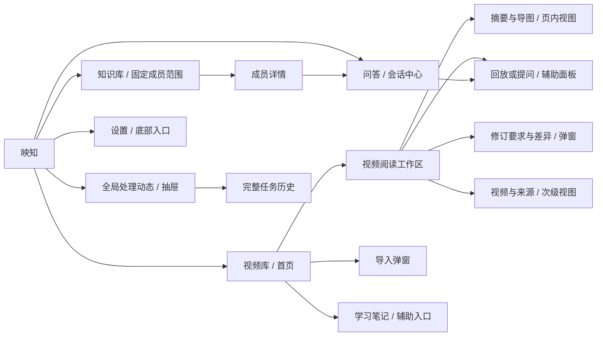

# 映知 VidLens：以摘要阅读为中心的整站 UI 方案

日期：2026-10-10。范围：桌面 Web，1440×900 / 1024×800。交付：源码与实际页面审查、整体设计、独立 HTML 原型。没有修改业务代码，没有提交、推送、部署或发起真实模型调用。

推荐：**三个一级入口——视频库、问答、知识库；一个单视频阅读工作区。** 视频库就是首页。历史学习笔记保留独立入口、独立版本与证据模型，降到辅助导航。任务成为全局“处理动态”，完整历史页面保留。正文、回放、提问与修订围绕同一视频、同一有效摘要版本组织。

## 1. 已确认的上下文与证据边界

### 1.1 核查记录

- 已读用户指定的产品规划、实施指南、10 月 10 日交付进度、前端原型 brief 与桌面 v2 README。昨天文档中的“拟新增/待实施”不是当前能力结论。
- 关联会话 `01a123b7-28a1-7713-ac33-be2267b618c8` 最近四轮：七项真实首导入问题涉及摘要质量、导图信息量、配图、标题、分类、布局、完整链路；关联会话仍在处理这些实现任务。本轮没有向其发消息，也没有恢复 Goal。
- 开始核查 HEAD：`12162b5d8a20e463a71dccbb4c84c9080e4f5e66`；审查中另一会话将 HEAD 推进至 `204694184112454e67b15577a82dcc7dbe1d1907`。收尾 HEAD 又推进至 `f7ce97ec7907e9819c13569d5590120d9c2c6dfc`。这些是并行工作观察，不是本轮提交。已再次核对受影响前端并重新打开实际 task 6；后端进程和历史摘要不一定随新源码重生成。
- 初始 WIP 包含后端生成预算/grounding、交付进度、docker、依赖与简历；已有 `2026-10-10-ui-redesign.md` 和旧原型目录也未提交。本轮不覆盖已有设计稿，使用新路径 `summary-ui-studio-v3`。过程中旧原型目录被其他工作移除，本轮没有操作它。
- 实际浏览：同源已登录账号 `127.0.0.1:5175`；工作台、库、task 6 摘要、问答辅助区、导入弹窗、高级展开、全局问答、知识库空态、学习成果空态、任务、设置。1440 与 1024 两种宽度均观察。未执行真实导入、提问、修订、配置保存、删除等写动作。
- 1024×800 导入展开：弹窗范围 y=40–760；提交按钮 y≈766–803，被滚动区域裁切。这是实测布局问题。
- task 6 实际正文仍有 `asr-window…` 内部编号；摘要标题已显示内容标题，面包屑/卡片仍显示随机文件名；正文可读、配图未完成、两条平铺章节导图。不能据此宣称最新生成修复失败或已通过，因为后端与来源正在更新。
- 收尾重新打开 task 6，确认实际标题“传统项目中Agent落地与架构升级分析”、来源“音频转写”、配图限制收进详情，正文仍有45处旧 `asr-window`引用。这些旧内容不能用来判断最新修复的重新生成效果。
- 当前账号没有知识库和学习笔记；有内容的知识库、画布、历史版本、只读账号、断线、在途后台全过程按源码审查，尚未完成真实浏览器验收。问答入口一度显示列表加载失败，关联服务同期更新，不能直接归因为永久业务缺陷。
- 附件实际收到 **3 张**；用户提到的工作台卡片例子通过共享 `VideoCard` 源码和实际卡片核对，没有凭空补出第四张图。

### 1.2 功能边界

| 能力 | 已确认现状 | 对本方案的约束 |
|---|---|---|
| 本地/链接导入 | import-options、分片校验/续传/合并、upload-url、冻结自动摘要选项与幂等键已有 | 本地上传完成前需留页；链接受理后可离开；只展示当前服务开放的入口 |
| 字幕优先与 ASR | 不可变 source/cue、B 站分 P、语言匹配、来源刷新已有；完整接力仍按进度文档验收 | “平台字幕”不等于人工校对；没有真实时间不提供假回放 |
| 摘要生成 | v2 结构、Markdown 投影、text/result/visual 状态、生成快照/事件已有 | 文字可读和整个 run 完成分别表达；运行不依赖浏览器继续编排 |
| 截图 | 授权截图、视觉补充与独立 visual-retry 契约已有 | 重试受 generation/source/version/profile/预算约束；不承诺一键解决任何错误 |
| 导图 | 从当前 summary blocks 层级派生，复用 StudyMap 渲染 | 内容只有两章时图就只有两章；不能用 UI 编造更丰富概念或关系 |
| 标题 | 阅读页当前优先 task.title，其次摘要标题与文件名兜底；实测已显示内容标题，面包屑仍显示文件名 | 建立统一显示规则；保留原文件名于来源详情，不伪造自动改名能力 |
| 分类 | 用户词表、别名、CAS、合并、候选拒绝、人工优先、AND/OR 全库筛选已有 | 标签只分类，不建立 KB 成员、不改变权限或检索范围 |
| 单视频问答 | 摘要/转写快速问答、Agent、历史、结构化选段、版本/hash校验已有 | 普通问答不写摘要；截图引用目前是经验证图注，不等于给模型附原图 |
| 修订 | 全文/选块 preview/apply/undo、冲突处理、术语规则、导出已有 | 明确基线与结果版本；应用前正文不变；撤销是新修订身份 |
| 跨视频问答 | video_library / knowledge_base 既有会话、RAG、证据与反馈已有 | 现有就绪/当前模型要求必须保留；不能默认回答未索引资料 |
| S5B | KB 标签 selector、集合全文/混合择路未完成 | 原型不提供“按当前标签问所有视频”这一假能力 |
| 学习笔记 | Artifact study body/relations、知识画布、独立版本、manifest证据、回答导入、学习位置已有 | 不能等同 SummaryRevision，也不能后台双写同一摘要 |
| 阅读续接 | 摘要临时态是内存 Map，6 小时、20 tasks / 40 sessions；账号/视频/会话隔离；注销清空 | 同 SPA 切换已有基础；刷新/关闭后恢复摘要草稿、锚点、播放器时间需要补齐持久方案 |
| 全局任务 | `/tasks` 投影混合 video_processing 与 artifact_generation；摘要另有 generation API | 全局“处理动态”不能只接当前 tasks 投影，否则会漏摘要补图/修订 |

证据入口：`frontend/app/router.tsx`、`components/shell/{AppShell,ShellFrame}.tsx`、`components/{VideoCard,VideoPoster,UploadModal}.tsx`、`components/summary/*`、`lib/{summaryExperience,summaryViewState,summaryTags,api}.ts`、`lib/artifacts/{api,schema}.ts`、`components/chat/*`、`components/settings/*`。后端 `handler/summary_revision.go`、`model/{summary_revision,artifact}.go` 与最新生成 service 验证资源/版本边界。

### 1.3 页面职责、独有价值和入口/出口

| 现有页面 | 独有能力 | 重复与问题 | 推荐职责 / 进入与退出 |
|---|---|---|---|
| `/` 工作台 | 首跑指导、最近对象、学习位置聚合 | 库/会话/成果/任务四份重复；文案仍围绕学习笔记 | 合并到库首页“继续阅读”；`/` replace 到 `/library`，不额外占后退栈 |
| `/library` | 全库搜索、标签AND/OR、状态、分页、列表/卡片 | 不展示有效摘要预览；卡片过程过长 | 全部视频与继续阅读；打开视频时保存完整筛选 URL 和列表位置 |
| `/video/:id` | 摘要、导图、回放、选段、修订、标签 | 独立问答重复 shell；管理仍混入阅读 | 单视频工作区；默认摘要，回放/问答辅助区；返回实际来源页面 |
| 视频与来源视图 | 下载、转写、来源刷新、视觉证据、检索维护 | 多种处理动作和摘要生成同时突出 | 二级页面内视图；显示“返回摘要”；深链可刷新 |
| `/chat` | 范围选择、最近会话 | 历史被大入口卡与单视频列表推后 | 会话中心；新建问答先明确范围；单视频会话在阅读工作区打开 |
| `/chat/library`、`/chat/kb/:id` | 跨视频回答、证据、Agent、反馈 | 研究页/检索页有多套命名与导航 | 统一问答工作区，范围芯片始终可见，范围变化新会话 |
| `/kb`、`/kb/:id` | 显式成员集合、元数据、整库就绪检查 | 与标签看起来都像分类，实际语义不同 | 保留“知识库”；成员主视图、就绪状态和进入问答；返回列表恢复位置 |
| `/kb/:id/retrieval` | 检索测试与运行详情 | 对普通用户过于技术 | 知识库“更多→检索诊断”，保留旧深链 |
| `/artifacts`、`/:id` | 学习笔记、关系画布、证据清单、独立版本、回答导入 | 正文/导图/修订/导出与摘要外观重叠 | 辅助入口“学习笔记”；视频更多里“关联笔记”；历史链接原样有效 |
| `/tasks` | 分页历史、run深链、取消/恢复/重试能力旗标 | 固定阶段容易把未执行当等待；结果可读状态不一致 | 全局处理动态抽屉 + 完整历史页；按真实对象类型分组 |
| `/settings` | 外观、AI profiles、能力、记忆治理、提示词 | 外观大卡占首屏，配置状态不够面向操作 | 底部入口；默认“服务可用性”，外观/记忆/提示词为二级标签 |
| `/login`、`/docs`、`/intro`、错误页 | 登录、帮助、介绍、恢复 | 用户产品描述与最新主线不一致 | 保留公共路由；帮助跳到相关任务，不把介绍占工作首页 |

### 1.4 已核对的接口与交互对应

路径以下省略 `/api/v1`，均来自当前前端调用；存在接口不等于本轮完成真实写链验收。

| 实际契约 | 支持的界面行为 | 必须保留的边界 |
|---|---|---|
| `GET /media/import-options`；`POST /media/upload-url`；`GET /media/check-upload`；分片上传与 `POST /media/merge-chunks` | 来源可用性、链接受理、真实上传进度、合并后后台处理 | 自动摘要选项在提交冻结；分片合并幂等；选文件准备与提交开始分离需调整前端 |
| `GET /media/list`（keyword/activity/tag_ids/tag_match） | 现有全库筛选与分页 | 摘要短预览、人工标题身份、结果/run双轴状态的批量返回仍需扩充或核对，不能靠文件名正则推断人工标题 |
| `GET /media/task/:id/summary` | 当前有效文档、个人修订和导出 | 以有效版本为正文权威；不同于媒体处理完成 |
| `GET /media/task/:id/summary/generation` 与 `…/generation/:generation/events?after_seq=` | 快照、增量活动、重连补读 | seq游标、generation身份；断线不重新发起任务 |
| `POST /media/task/:id/summary/visual-retry` | 文字保留、单独补图 | 真实可用旗标、来源/版本/预算与幂等键；失败原因不同不能同一按钮一概恢复 |
| `GET /media/task/:id/summary/blocks/:block/context?version_ref=`；授权截图GET | 选段与图片来源上下文 | exact版本及digest验证；cue无时间不能造回放；图注上下文不等于原图入模型 |
| `POST …/summary/edit-runs`；GET operation/latest；POST operation/apply、undo；`resolve-base` | 预览、应用、撤销、基线冲突恢复 | expected_revision/content_digest/version_ref、幂等；latest不是任意历史版本列表 |
| `GET/PATCH /media/task/:id/tags`；tag-suggestions decision；`/tags`别名与merge | 阅读标签、管理关系、人工保留与拒绝 | CAS、来源和人工优先；标签筛选不改变KB范围 |
| `GET /artifacts/:id/versions`、具体version；canvas-layout、block context、answer-preview/import | 历史笔记版本、画布、独立证据和问答导入 | Artifact身份与SummaryRevision分离；旧笔记深链继续访问 |

## 2. 核心旅程与当前阻碍

| 旅程 | 推荐体验 | 当前阻碍 / 验证点 |
|---|---|---|
| 首次导入 | 先来源，再可选关注点；默认自动摘要；固定提交 | 关键输入在高级配置后；本地选文件立即上传，修改选项时机不明确 |
| 等待 | 库中同一对象固定状态行：等待→整理→可阅读→完成/局部失败 | 视频处理完成不等于摘要/配图完成；完成后过程区消失，阅读入口没接替 |
| 开始阅读 | 内容标题→短概览→正文；标签/目录紧凑 | 标题身份不一致；内部引用破坏可读性；导图抢首屏而信息少 |
| 回放核查 | 正文旁时间按钮打开同一播放器；显示所核查段落 | 时间缺失不可伪造；旧摘要只可播放视频，不承诺定位原段 |
| 选段提问 | 选入引用→输入问题→显式发送；引用显示版本 | 空聊天像首页；嵌套视频/过程栏重复占位；引用过期需可恢复提示 |
| 修改 | 独立“修改摘要”模式→要求→基线与差异→应用→可撤销 | 旧修订表单位于阅读流；版本和普通问答边界难理解 |
| 再次打开 | 同版本恢复块与偏移；版本变更解释回退；播放暂停恢复时间 | 当前摘要临时态刷新会丢；学习笔记位置不能冒充摘要位置 |
| 跨视频问答 | 问答页会话为主体；范围注明可用集合 | 范围卡大、历史较深；KB 任一成员未就绪会阻止整库问答 |
| 失败恢复 | 一行结果影响 + 适用动作；详细错误/attempt在抽屉 | 技术错误和处理状态混杂；无法证明重试可用时不应显示通用重试 |

## 3. 整站问题清单与优先级

P0：主路径阻断/错误含义；P1：持续降低阅读与操作效率；P2：一致性、长内容和边界品质。来源“页面”是本轮观察；“源码”是未实测状态；“附件”可能早于最新布局。

| ID / 位置 / 证据 | 影响与严重程度 | 共性原因 | 建议 |
|---|---|---|---|
| U01 导入展开，页面/附件1 | 主按钮被裁切，P0 | 操作与内容共用滚动容器 | 只滚 body；头尾固定；最大高 min(760px,视口−64px) |
| U02 导入输入顺序，页面/源码 | 用户先做非必要决策，P0 | 按配置对象组织表单 | 来源第一，关注点第二，高级三个分组最后 |
| U03 task6正文，页面 | 内部 cue 编号连续占行、难读且无法回查，P0 | 生成/渲染缺少公开引用边界 | 引用必须解析成真实来源按钮；不识别的内容显示为历史未核对，不能藏掉后冒称有引用；新输出校验在关联任务修 |
| U04 tasks 与摘要，页面/源码 | “完成”但配图失败，P0 | 单一 status混淆结果与运行 | 独立显示“摘要可读 / 配图未完成”；从结果进入而非诊断开始 |
| U05 KB未就绪，源码 | 单个成员阻止整库，失败无清晰恢复路线，P0 | 后端all-members规则在正文警告解释 | 成员就绪计数 + 一处阻断提示 + 定位失败成员；不能前端偷偷排除后宣称整库 |
| U06 6个一级入口，页面 | 用户不知道摘要属于哪，P1 | 历史功能增量各自占路由 | 三主入口，阅读内部工具，学习笔记次级 |
| U07 工作台，页面 | 导入/最近视频/成果重复，学习笔记仍主导，P1 | “学习平台”旧旅程未重排 | 合并首页；继续阅读使用摘要自身位置 |
| U08 VideoPoster/VideoCard，源码/页面 | 无封面重复长文件名；加载前后卡片跳，P1 | 把标题做成封面，媒体加载驱动展示 | 固定小媒体区域、无封面平面符号；标题仅一个；长标题两行/全文tooltip |
| U09 卡片进度，源码 | 转写分片/并发/视觉配置堆成报告，完成即消失，P1 | 完整进度组件复用于概览 | 状态固定一行，details入口稳定；完整数据进动态抽屉 |
| U10 卡片主信息，页面/源码 | 有摘要却显示“转写可阅读”，P1 | Task readiness驱动而非effective summary | 当前有效摘要短预览与可读状态聚合投影；服务未支持先显示确认状态 |
| U11 阅读顶部，附件2/3；最新已用details与更多收拢 | 附件中多动作同权重、正文起点难找；最新有所改善，仍需整站统一工具与状态层级，P1 | 平行操作无主次 | 回放、提问优先；修改为低强调工具；版本/来源/导出进更多 |
| U12 阅读标题，页面 | H1内容名与面包屑/库文件名矛盾，P1 | 多组件自行选title | 统一优先级：人工视频title→有效摘要title→文件名；来源保留原名；不自动改实体名 |
| U13 空问答，页面 | 大空态、模式和技术说明挤占区域，P1 | 复用完整ChatWorkspace再套视频侧栏 | 抽composer/history/trace共享基础，嵌入模式禁用第二套播放器和全局shell |
| U14 导图，页面 | 两节点占160px；大字体长标题断行，P1 | 渲染能力被误当内容质量 | 常驻文字目录+80–100px结构预览；完整导图页内tab；结构不足明确“章节结构” |
| U15 标签，附件/最新页面 | 附件管理按钮破坏阅读；最新已收进“管理分类”，仍需多标签折叠与一致关系管理，P1 | 关系维护和阅读混合 | 3个+“另N个”，展开全部；管理弹窗区分自动/人工/候选；维持拒绝与CAS |
| U16 全局问答，页面/源码 | 范围入口比历史重要；失败只能刷新，P1 | 新建动作占整页 | 左会话列表，右当前会话；新建范围弹窗；各区独立重试 |
| U17 刷新续接，源码 | 草稿/位置/播放状态刷新丢失，P1 | 仅内存视图缓存 | 明确持久边界，账号隔离本地临时态或服务端draft，禁止承诺已实现 |
| U18 库工具栏，页面 | 搜索+5状态+视图+词表+常用标签过密，P1 | 所有筛选同权重 | 搜索一行，3常用状态+更多；标签popover；管理词表不常驻工具栏 |
| U19 窄桌面阅读，源码/页面 | 224侧栏仍全宽，打开助手正文过窄，P1 | breakpoints不一致 | 1100以下导航64px，助手切换为页内辅助视图；保留底层正文位置，提供返回阅读，不让半行正文被遮住 |
| U20 进度阶段条，页面/源码 | 未执行/等待/已完成并排，容易理解为既定流程，P1 | 固定pipeline用于概览 | 当前真实动作 + 已发生历史；高级诊断才展示依赖图 |
| U21 知识库空态，页面 | “新建”重复，且“越聚焦越准确”缺证据，P2 | 营销解释替代操作 | 一句“把相关视频组织为固定提问范围”；一个主按钮 |
| U22 成果，页面/源码 | 用户担心旧内容消失；界面似摘要，P1 | 数据模型和导航名称混同 | 保留独立学习笔记与画布；显式来源视频、独立版本；不并库迁移 |
| U23 任务标题/深链，页面/源码 | 文件名主导、不同对象恢复能力不同，P2 | 扁平任务列表 | 对象标题+对象类型+影响+稳定CTA；尊重can_*字段 |
| U24 设置，页面/源码 | 外观和Free API长介绍先于可用性，P2 | 配置参数优先 | 摘要/识别/画面/检索可用性概览；缺项定位到对应配置，保留详细profile |
| U25 全站表面/字体，源码 | 暖炭、固定paper、证据绿与多套CSS混用，P1 | 功能独立演进无公共规格 | 一套主题token；阅读使用同主题表面；视频原色保持；UI与正文默认同sans |
| U26 公共弹窗，源码 | 关闭依赖window.confirm、嵌套Esc可能都触发，P2 | Overlay各自挂全局事件 | overlay栈处理最上层；draft保留；明确保存/放弃；保留现有焦点圈与Tab约束 |
| U27 错误与loading，源码/观察 | 回退空态易与“无内容”混淆，切换标题短暂残留，P2 | 多独立请求无区域策略 | 保留已有数据并标记刷新失败；初次失败独立重试；骨架只占最终区域 |
| U28 公共介绍/帮助，源码 | 简介仍介绍并列的学习产出，P2 | 产品主线没有同步 | 导入→摘要→回查指导；帮助深链返回原任务 |

根因不是琥珀配色：导航沿旧功能树增长；数据模型边界没有变成用户可理解的页面边界；运行状态抢正文；同一组件嵌入时保留完整外壳；视图状态与服务端事实混合。先修这些，再做视觉细节。

## 4. 信息架构与旧入口映射



| 旧入口 | 新入口与迁移规则 |
|---|---|
| 工作台 `/` | `/library`首页：继续阅读、全部视频；保留旧URL redirect；不删除历史对象 |
| 视频库 `/library` | 保留；筛选全部进URL；支持原分页链接 |
| 单视频问答 `/chat/v/:id?session=` | 兼容跳到 `/video/:id?pane=ask&session=`，保留单视频会话/摘要选段；旧artifact上下文参数继续走笔记兼容适配，不混成摘要引用 |
| 跨视频/KB问答 | 原路径继续有效，进入同一会话中心外壳；scope始终可见 |
| 知识库 | 保留；标签不等于成员集合；一个视频可有多个标签和多个KB归属 |
| 成果 | “学习笔记”辅助导航、库内辅助入口、视频更多“关联笔记”；`/artifacts/:id?version=&block=`原样有效 |
| 任务 | 顶栏处理动态抽屉，完整历史 `/tasks` 保留；`?run=`仍打开确切run |
| 转写/索引/来源 | `/video/:id?view=source`；回阅读保留同一对象状态 |
| 版本/标签/导出 | 页面内工具；版本抽屉、标签弹窗、更多菜单；不新增一级入口 |

学习笔记独立价值：人工组织的concept/example/note、显式related/depends/contrast关系与自由画布，manifest证据、回答导入与学习位置。摘要只有同视频的有效文档与用户修订。**复用读图、证据、差异和按钮组件，数据与API分别适配；不把Artifact改名为Summary。** 保守替代只在有频繁笔记使用证据时让“学习笔记”恢复第四主入口；不因历史数量零就删除功能。

## 5. 视觉和公共组件规则

### 5.1 方向：安静的阅读桌面

保留映知/VIDLENS和暖炭/琥珀。用窄导航、细分隔、平面内容区与有限的小媒体建立秩序。正文不包大卡片；琥珀只用于主操作、当前导航和正在做的真实动作。库可用紧凑行/低封面卡切换。默认深色，浅色同结构。

| 规格 | 推荐值 |
|---|---|
| 字体 | UI与正文：system-ui / -apple-system / PingFang SC / Microsoft YaHei；代码ui-monospace。宋体只作为未来阅读偏好，不默认强制 |
| 字级 | 页标题28/1.3、阅读标题26/1.4、章节20/1.5、正文17/1.85、UI14/1.5、元信息12/1.5；正文不低于16px |
| 行宽 | 阅读正文600–680px，约35–40个汉字；问答最大680px；宽图可到正文宽，完整导图独立视图 |
| 密度 | 4px基础：4/8/12/16/24/32/48；页边32，窄桌面24；章节间32；段落间14–16 |
| 框架 | 1440导航184–196、头栏56、助手320–340；1024导航64、正文不因助手打开被压缩；助手暂时切换阅读区域为宽辅助视图，可关闭回阅读 |
| 深色 | 背景#171614、导航#1c1a17、面板#211f1b、输入#191815；主字#eeeae1、辅字#b8b1a6；线#3a3731；accent#e4b369、accent-ink#241b0f |
| 浅色 | 背景#faf8f3、导航#f2efe8、面板#ffffff、输入#f7f4ee；主字#28251f、辅字#676158；线#ddd7cd；accent#8b5d1b，主按钮浅琥珀底+深字 |
| 圆角 | 控件8、媒体10、弹窗12；标签4–6；避免所有控件胶囊化 |
| 图标 | 统一20px、1.5px线宽；按钮图标16px；有文本标签/aria-label，不用emoji承担业务含义 |
| 按钮 | 每个区域一个主动作；高36/40px；次按钮细边，辅助动作ghost；危险动作只在菜单/确认层用红 |
| 表单 | label14、helper12；输入高42、padding12；关注点3行；分组标题14；依赖项靠近控制项，不仅禁用还说明原因 |
| 状态 | 成功#9ebca2、警告#e4b369、错误#e59a8f、信息#9eb7cf；必须有文字/图标；颜色不承担唯一语义 |

常规文字对比目标≥4.5:1，大字≥3:1；实际色对需测，不以色板表替代验收。[W3C对比说明](https://www.w3.org/WAI/WCAG22/Understanding/contrast-minimum)。主交互靶区推荐36px以上；焦点2px琥珀、offset3，不被sticky层遮住。

### 5.2 状态与动效

hover用一档表面，selected用浅accent+选中标记；pressed即时反馈；disabled保留足够可辨识度并给原因，不仅透明50%。提交busy固定按钮宽度、文字变“正在提交”，防重复。错误就近显示，页顶仅聚合重要阻断；成功在原对象位置稳定显示并可用短toast辅助。

操作反馈100–140ms，浮层opacity160ms；不对正文height/布局做过渡。只有一个当前活动小点轻呼吸，断线/终态停止；减少动态效果时去呼吸/滑入，状态文字与图标保持。图片预留已知比例；未知比例用固定局部占位，用户阅读上方不自动插图：提示“有新画面，查看更新”，在明确应用/再次打开时合并。

### 5.3 公共组件调整

- ShellFrame：三级信息权重、统一显示标题函数、route-based breadcrumb、global activity入口、窄桌面rail。
- VideoCard/LibraryRow：标题/摘要短预览/少量标签/固定状态行/CTA同一投影；媒体无title占位、失败不扩高。
- StatusLine/ActivityPanel：结果、run与connection分离；列表/摘要/任务共享展示适配器，不共享一套错误状态。历史按对象、run、attempt、seq。
- Modal：固定head/footer + body滚动，overlay栈；打开焦点到关键输入，Tab约束、Esc只关最上层、关闭返焦。已有Modal焦点功能保留。[W3C Dialog](https://www.w3.org/WAI/ARIA/apg/patterns/dialog-modal/)。
- AssistantPanel：播放器与问答互斥，保留实例；嵌入ChatWorkspace去除完整页面壳、第二播放器和空trace区域。
- SectionActions：hover/focus可见但键盘永远可达；回放时间直接可见，引用/修改在更多，避免点击正文即触发。
- RevisionPreview：基线标签、范围、差异、预览待应用、应用失败/冲突、撤销可用性共用模式；摘要/Artifact API分离。
- TagDisplay/TagEditor：阅读只名称；全部展开后换行，管理才有删除/保留/来源/候选；别名合并影响与版本冲突显式显示。
- AsyncRegion：初次loading/empty/error分离；后台刷新保留正文；多个错误聚合“2项未完成”，展开逐项恢复。

## 6. 关键布局草图

### 6.1 视频库 / 首页

```text
导航196 │ 视频库                         原型标识 / 处理动态
         │ 视频库 · 6个视频                     + 导入视频
         │ 继续阅读：内容标题 / 上次章节        继续阅读 →
         │ 搜索……………………  全部 / 可阅读 / 处理中 / 更多
         │ 标签：Agent / 架构 / 全部标签          列表 / 卡片
         │ 小媒体 │ 标题+两行摘要 │ 标签 │ 可阅读 │ 阅读 →
         │ 小媒体 │ 长标题……     │      │ 整理中 │ 进度 →
         │        （每项状态始终占固定位置）
```

空库只有“导入第一个视频”与一句主线说明；无结果保留筛选并提供清空，不把无结果当空库。继续阅读没有真实持久记录时不显示假“上次读到”。排序/筛选更新保留视图，搜索replace避免每字符占后退栈，点击筛选可push。

### 6.2 导入

```text
固定头：导入视频                                     ×
滚动体：[视频链接 | 本地文件]
         B站链接输入 / 文件选择与待上传列表
         分P说明 / 本地需保持页面打开
         关注点（可选） 3行
         [✓ 按需配图] [✓ 自动标签]
         ▸ 更多选项：文字来源 / 表达形式 / 生成与整理
         inline validation / 配置缺失及处理影响
固定尾：受理后后台继续（文件上传阶段另说明）  导入并生成摘要
```

默认可用链接优先，未开放时本地第一。文件选取只准备队列，点击主按钮才冻结选项并上传。本地隐藏字幕偏好；只展示语音转写依赖。关闭补图后图文/关键帧偏好回到文字；仅导入关闭摘要附属选项但保留草稿，下次开启恢复。缺Vision仍能文字摘要；缺ASR不会一概阻止链接字幕路径。标题、分P信息只用服务真实解析结果；当前无预解析接口时用URL中的p说明“提交后核对”，不伪装已校验来源。

### 6.3 阅读工作区

```text
全局导航 │ 视频库 / 摘要                      处理动态
          │ 内容标题（最多2行）       回放  提问  修改  更多
          │ 平台字幕 · 15:04 · 当前版本v1    文字可读/配图状态
          │ 摘要 | 导图
          │ 章节目录140 │ 正文600–680          │ 助手320
          │ 01痛点     │ 短概览、3个标签+N     │ 回放 | 提问
          │ 02结构     │ 紧凑结构预览           │ 播放器/会话
          │ 03案例     │ 章节标题+时间引用       │ 当前核查片段
          │ 04反馈     │ 段落、相关截图、图注    │ 输入固定底部
```

1024目录收进“章节”popover；打开助手暂时切换阅读区域为居中的辅助视图，底层正文隐藏并保留位置，避免压窄或遮住半行正文。显式“返回阅读”回到原阅读位置；不是为了空聊天预留半屏。导图tab与正文相互定位，图只读同版本文档；历史只有Markdown时显示文字目录，不冒称概念关系。

### 6.4 问答 / 知识库 / 学习笔记 / 设置

问答：240px会话列表 + 当前会话；顶部范围“视频库中可用的视频”或确切KB；新建范围弹窗；来源结果可跳视频并返回原会话。单视频在该视频助手打开，历史中心保留可发现入口。

知识库：列表以名称、说明、成员与可用数为主；详情成员表 + 一处就绪阻断 + 主动作“在此知识库提问”；管理成员弹窗；检索诊断更多。历史会话入口不用重复整套问答首页。

学习笔记：辅助导航始终可见，列表说明“独立于视频摘要”；正文/导图/画布三视图保留，版本与证据可开；来源旧/缺失只影响回查，不无故隐藏已保存正文。

设置：侧级导航“AI服务 / 外观 / 记忆 / 提示词”；AI首页能力清单+当前默认profile；具体模型和预算按需展开；从缺配置的任务进入时携带returnTo，保存后回原任务，不自动新发请求。

## 7. 状态变化与上下文保留

### 7.1 双轴状态

| 实际状态 | 固定状态位文字 | 主动作 / 布局 |
|---|---|---|
| 受理等待、无结果 | 已加入，等待整理 | 查看进度；已受理可离开；不列未发生步骤 |
| processing、无结果 | 真实当前动作，如“整理字幕内容” | 查看进度；摘要空区保留最终版式 |
| text ready / visual running | 文字摘要可读 · 正在补充画面 | 阅读摘要；活动小状态位，不在正文前加报告 |
| result ready / completed | 摘要已就绪 | 阅读摘要；过程入口仍在更多/全局动态 |
| text ready / visual failed | 摘要可读 · 配图未完成 | 阅读；若visual_retry_available才“补充画面” |
| failed无结果 | 摘要未生成 · 短原因 | 在原位置重试相关阶段；保留已保存媒体/转写 |
| 新run失败、有旧结果 | 正在阅读旧结果 · 本次生成失败 | 继续旧内容；详情明确旧结果版本与本次run身份 |
| 缺配置 | 需配置语音/摘要/画面能力 | 指向具体配置并可返回；只阻止相关动作 |
| 来源不可用 | 正文保留 · 来源暂不可回查 | 不假装播放可用；授权/网络/已删除分别解释 |
| 断线 | 状态连接中断 · 正在恢复 | run不变failed；停呼吸；快照/游标恢复，不重发生成 |
| 修订running | 正在准备修改预览 | 原文继续可读；活动属于edit operation |
| proposed | 修改预览已就绪 · 未应用 | 差异 + 基线版本 + 应用；不再显示执行中 |
| committed / undo | 当前修订v2 / 撤销产生v3 | 同步正文/图/导图/导出；引用旧版本标识失配 |
| legacy | 历史摘要 | 阅读/原有修订/导出；无cue不提供假时间 |
| readOnly | 只读 | 阅读/导图/回查/已有历史可用；写操作禁用且解释 |

图补充、新生成、后台标签不能直接改变正在阅读的正文几何或覆盖人工内容。新版本就绪后提示“查看更新”，用户预览并应用；在途问答绑定发送时冻结快照。

### 7.2 路由与状态权威

| 项目 | 存储与规则 |
|---|---|
| 列表搜索/状态/标签匹配/页/视图 | URL；返回保留URL与列表锚点；无匹配不清条件 |
| 阅读当前view/pane/session/版本/块深链 | URL，显式跳转push；面板开关replace或本地；返回来源链接可用，不依赖存在history |
| 阅读位置 | user/task/有效version+digest/blockID/offset；同版本恢复；变版只在可验证块映射时恢复，否则提示并回到概览 |
| 播放时间 | user/task/media_revision/time；返回暂停不自动播放；媒体变更不沿用时间；签名URL重新取，不落盘保存 |
| 未发送问题/选段 | user/task/session隔离；选段保存exact version_ref、digest、块、unicode范围；切换scope新会话不复制 |
| 引用返回 | task/version/digest全部匹配才定位；撤销后即使文字相同也不能当旧revision；失配显示保存快照/重新选段 |
| 修订草稿/预览 | edit_operation/base_revision；关闭可保留draft；apply需CAS；冲突保留要求与差异，不静默基于新正文应用 |
| 运行/已发送消息/已应用版本 | 服务端权威；视图切换不重发、不取消；取消仅按真实can_*接口确认 |
| 页面刷新 | URL解析后读授权事实；当前内存草稿不能声称已恢复；新持久方案必须清理注销和账号切换，限制容量/时效 |
| 浏览器后退 | 回到上一个对象/范围；关闭小弹窗不创建无意义多级后退；有dirty的设置/笔记保留leave guard |
| 直接链接 | 缺session打开新会话但不发送；版本不存在显示可读错误+当前摘要入口；returnTo只允许站内 |

历史生成原稿不保证任意旧generated_version可获取；已有修订可验证读取与旧消息快照要分开。**没有统一摘要历史浏览API，就先提供已有修订状态/冲突恢复，不做任意时间旅行按钮。** 原型中的版本演示是本地模拟，专门展示引用失配如何处理。

## 8. 接口依赖与分阶段改造

| 阶段 | 改造 | 已可复用 / 需补齐 | 退出标准 |
|---|---|---|---|
| D0 本轮 | 审查、规则、HTML原型 | 本地fixture；不接业务写操作 | 1440/1024、导入固定尾、阅读/问答/修订/返回可体验 |
| D1 公共框架与主旅程 | Shell、库首页、来源优先导入、固定modal、紧凑status | import-options/上传/摘要已有；新能力检查应根据所选来源/动作，不在打开弹窗前一概阻断 | 首次导入源输入先可见；键盘可完成；已有WIP无回退 |
| D2 统一阅读与助手 | 标题规则、正文宽、目录/导图、嵌入问答、标签阅读态 | summary/effective文档、block context、Chat API已有；从完整Chat抽shared基础 | 首屏概览和正文可达；1024开助手不压正文，关闭恢复同一位置；无双播放器 |
| D3 状态与恢复 | 全局动态、局部恢复、引用冲突、修订差异 | generation/events/edit operations已有；需合并task/generation/artifact读投影；摘要列表短预览/准确状态接口需核对补齐 | completed/partial/failure不跳高，旧结果与本次run明确 |
| D4 会话与历史整理 | 会话中心、KB成员页、学习笔记辅助入口、兼容路由 | 现有sessions/KB/artifacts复用，不迁移内容；历史分页/范围量大时需服务端搜索分页 | 每个旧深链有明确落点，范围/版本不被混用 |
| D5 持久续接与验收 | 摘要位置/草稿/播放跨刷新，服务配置回任务 | 当前Map仅临时；learning-position专为笔记，扩展需类型化；本地存储方案需账号/版本隔离 | 刷新/后退/重开保留范围和可验证引用；媒体失配有恢复 |

缺口单独登记：①有效摘要列表短预览与result/run双轴批量投影，不能每张卡片发整篇GET；②全局动态准确摘要汇总与历史分页；③摘要刷新持久续接；④完整摘要历史读取与版本列表（已有edit operation不等于history浏览）；⑤B站提交前标题/分P预解析（目前不依赖）；⑥KB标签selector与全文择路S5B；⑦任何PDF/HTML多格式导出、任意视频上传平台、图像直接入问答均不在已确认能力。现有Markdown导出继续使用已保存有效版本。

## 9. 待决策与验证

本轮无阻塞问题，按以下默认完成设计。正式接入前两项需要用户决定：

1. 摘要的草稿/阅读位置是否只在本机保存，还是跨设备保存？推荐先本机、账号隔离与明确提示；跨设备需服务端类型化资源与隐私/容量策略。原型只展示本机。
2. 学习笔记是否以后继续新增生成入口？推荐保留辅助入口及生成，待实际使用频率决定是否进一步收敛；不能为精简导航停止访问历史。

其他采用默认：三个主入口、深色默认浅色可切换、默认摘要自动选择表达、按需补图与自动标签开启、普通问答不改正文、所有修订先预览。来源标题同步遵循人工优先，不擅自覆盖手工title。后续若要概念关系导图超出章节点树，需新增有依据的生成结构契约，不是UI局部画线。

### 验收场景

- 真内容边界：120字标题、随机文件名/无封面、15000字摘要、20标签、空会话、多个局部错误、legacy无cue、当前来源已变。
- 从空库完成链接导入 / 本地选择与提交；高级展开、错误字段、键盘和关闭草稿；已受理后离开，上传未完保护。
- 无总量不显示百分比；只有上传可用真实字节进度；各活动来自已发生事件，输出与trace并行；断线不改run终态。
- 1440/1024以及200%缩放：正文舒适行宽，h1不裁掉关键内容，弹窗尾始终可见，主按钮易找；无全页横向滚动。
- 选段→输入→发送→返回原段；v1引用在应用/撤销后拒绝定位v2/v3；草稿保留且不自动发送。
- 修订只preview不改变；apply/CAS失败/undo；正文、图、导图、导出同版本；新版未应用不覆盖旧内容。
- 切页/放大/收起/后退/刷新/直接链接；不重新提交；还原阅读和播放状态时解释失配。
- 只读账号不提供写操作，已有内容仍能读；缺配置指向具体能力并能回任务；无索引快速单视频和跨视频范围边界明确。

原型验收记录与运行方式见 [HTML原型说明](../prototypes/summary-ui-studio-v3/README.md)。模拟通过证明布局与交互可以评审，不能证明真实摘要质量、Agent执行、字幕获取、收费调用、后台断线恢复或上线就绪。
