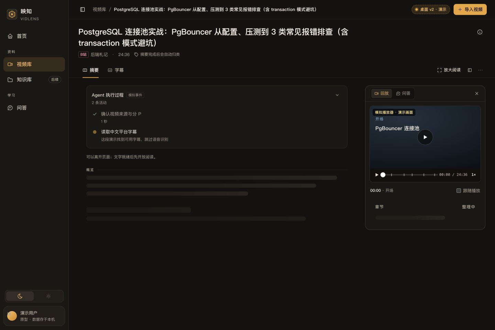
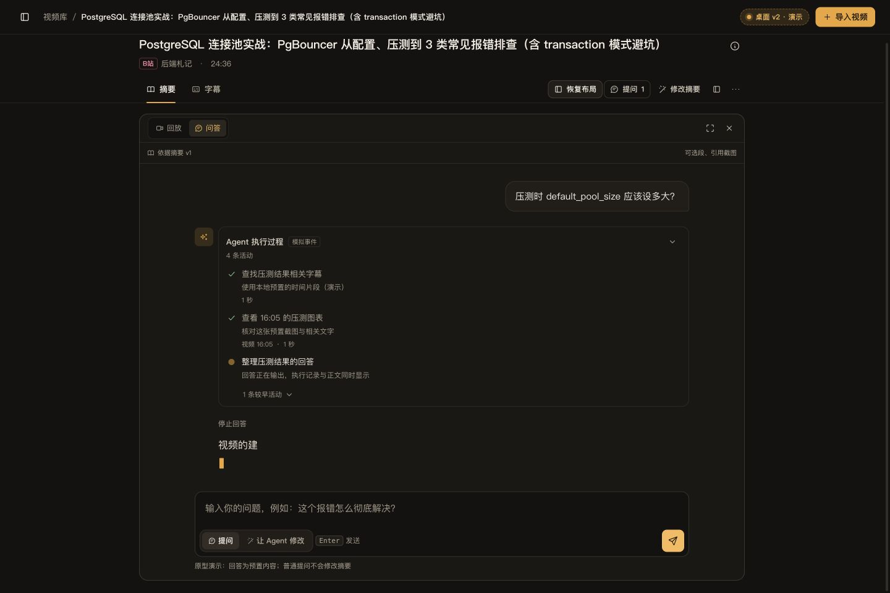
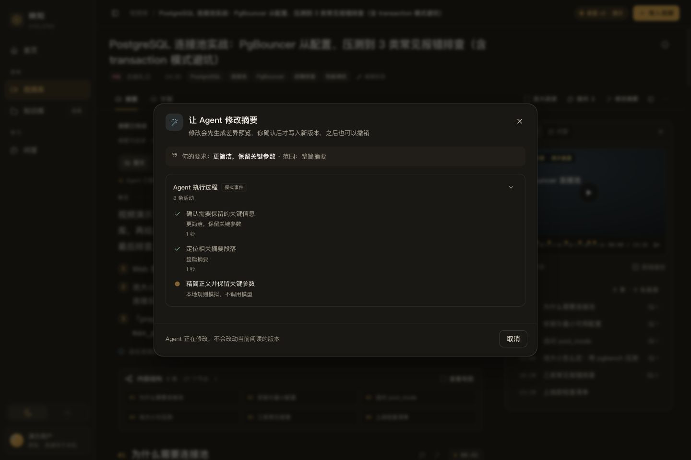

# VidLens 视频摘要体验 · 桌面 Web 原型

本原型用于评审视频摘要、按需配图、导图、分类、选段问答和修订的桌面体验。沿用暖炭／琥珀深色主题。正式业务前后端尚未接入本原型；本轮不新增手机布局。

配套阅读：[产品规划](../../planning/2026-10-09-summary-product-plan.md)、[实现与验收指南](../../planning/2026-10-09-summary-implementation-guide.md)、[前端设计与交互要求](../../design/2026-10-09-frontend-prototype-brief.md)。

## 打开方式

在仓库根目录运行：

```sh
python3 -m http.server 8899 --bind 127.0.0.1 --directory docs/prototypes
```

打开[示例图文摘要](http://127.0.0.1:8899/summary-experience-desktop-v2/#/v/pg)、[视频库](http://127.0.0.1:8899/summary-experience-desktop-v2/#/library)或[导入首页](http://127.0.0.1:8899/summary-experience-desktop-v2/#/)。本文件夹的 `index.html` 是静态入口，不参与生产构建。

状态使用独立 localStorage 键 `vidlens-summary-proto-public-activity-v1`，与早期原型隔离。演示版本、草稿与引用保存在当前浏览器；阅读位置与布局用于同一次页面会话。右上角「桌面 v2 · 演示」可重播生成、选择失败场景、重置演示数据。修改文件后刷新页面查看更新。

## 动态 Agent 活动

摘要生成、单轮问答、摘要修改共用 `ActivityView`。列表从已经开始的动作建立，默认显示最近 3 条；完成变勾，当前一条轻微呼吸，终态停止循环并收起，完整历史可展开。没有预设的未来步骤清单。

- 生成时按本轮输入出现接收／字幕或转写、具体章节整理、候选画面和标签动作；关闭画面后不会出现选帧活动。
- 问答按问题和引用决定模拟分支。问「压测时 default_pool_size 应该设多大」会查看 16:05 图表；普通文字问题跳过画面。回答逐字出现时，活动区仍可见；停止保留已收到的正文与记录。
- 修订按「更简洁」或「整理成步骤」等要求产生不同短标题；没有开始的动作不提前显示。生成结束后显示差异预览，等待应用时停止动效。应用产生版本，撤销恢复旧内容。
- 画面失败可单独重试，追加一条新活动；历史错误保留。刷新会中断问答模拟，记录标为停止；生成计时器按已保存的模拟任务状态继续，完成后补图重试途中刷新会保留重试入口。

这些短标题来自本地规则和数据，计时器重放模拟事件。没有自主模型决策、真实工具或真实事件服务。实际生产将复用已有 Chat progress／step／工具事件，并扩展拟新增 `public_title`；工具生命周期决定完成。乱序归并、外部事件游标重连、后端取消确认仍属于实现指南中的生产接入目标。

## 布局与操作

- 首屏压缩标题、标签和操作区，概览与关键结论优先；完整来源信息按需查看。
- 摘要主栏旁的共享辅助区切换「回放／问答」，避免同时堆叠播放器和聊天。
- 「放大阅读」「放大问答」「恢复布局」保留草稿、引用与阅读位置。
- 章节、选中文字、截图可加入问题的引用，引用可移除、展开和定位。普通问答不修改摘要。
- 导图从同一摘要结构派生，默认显示章节，支持展开、大尺寸查看与正文定位。
- 视频库显示常用 6 个标签及全部已选标签；其余标签可搜索名称／别名、多选，支持同时包含／包含任一匹配。

## 推荐体验顺序

1. 打开示例摘要，查看概览、内容结构、图文和回放。
2. 输入草稿，切换回放／问答以及放大／恢复，检查草稿和阅读位置。
3. 提问「压测时 default_pool_size 应该设多大」，观察活动逐条出现和回答输出；展开较早记录。再问纯文字问题比较活动分支。
4. 回到摘要，将截图引用加入问题；检查缩略图、引用版本和定位。
5. 点击「修改摘要」，输入「更简洁，保留关键参数」，观察动态标题、预览、应用及撤销；再尝试「整理成编号步骤」。
6. 从演示控制台重播摘要生成，观察文字先就绪、随后候选画面。默认有一张画面失败，定位并重试。
7. 在导入高级选项中关闭补图，或选择文字形式，导入本地演示文件；确认没有选帧活动。
8. 视频库搜索标签别名，选中罕用标签应用后，检查它仍显示在筛选栏。

检查尺寸为 1440 × 960 和 1024 × 900 桌面；窄桌面收窄导航，辅助区可收起。减少动态效果设置下停止呼吸，保留状态文字和图标。

## 本地检查范围

2026-10-09 在浏览器中检查了以下静态原型行为：

- 摘要重播从第一条实际模拟活动开始，文字先开放阅读；配图失败可单独重试，成功后保留历史异常记录。
- 画面问题出现查看截图的活动，普通文字问题跳过画面；回答输出时仍显示执行记录，停止后可继续提问。
- 回答处理中重播摘要会取消旧回答，避免旧任务写入新摘要或锁住输入。
- 修订按要求追加短标题，结束后停止动效并显示差异；应用生成 v2，撤销恢复 v1。
- 1440 × 960 与 1024 × 900 桌面无横向溢出；1024 宽度下放大问答的输入区在视口内，Esc 可恢复布局。

7 个 JavaScript 文件通过语法检查，浏览器检查未见警告或错误；公开相对文档链接与本地资源引用有效。业务 API、真实 B 站字幕、Agent 配图质量及生产事件恢复不在该验证结果中。







## 文件职责

| 文件 | 职责 |
| --- | --- |
| `index.html` | 静态入口 |
| `styles.css`、`desktop.css` | 主题、桌面布局、专注、辅助区与阅读样式 |
| `activity.js`、`activity.css` | 三个场景共用的事件活动状态与列表 |
| `core.js` | 演示存储、摘要模拟动作、版本与播放时间轴 |
| `views.js` | 页面、引用、问答模拟动作、修订与布局切换 |
| `progress.js` | 将生成活动、候选画面和结果状态呈现在摘要中 |
| `map.js` | 导图节点及布局 |
| `library.js`、`library.css` | 常用标签栏与可搜索标签选择 |
| `data.js`、`assets/` | 虚构视频、摘要、标签和示例截图 |

## 模拟边界

视频、字幕、ASR、摘要、模型回答、工具事件与截图均为本地预置数据。播放器只模拟画面和时间轴，没有真实视频播放。原型不会真正上传文件、下载 B 站内容、请求模型或访问外部服务。

后续实现以配套规划和真实源码为准；保留已有的版本、运行、预算、权限和来源边界。不要将演示计时器或规则回答移植为生产的执行逻辑，也不要把此原型写成真实质量提升或生产能力证明。
